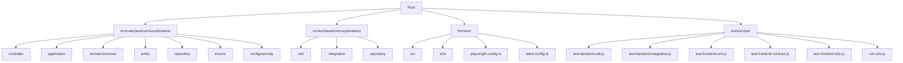
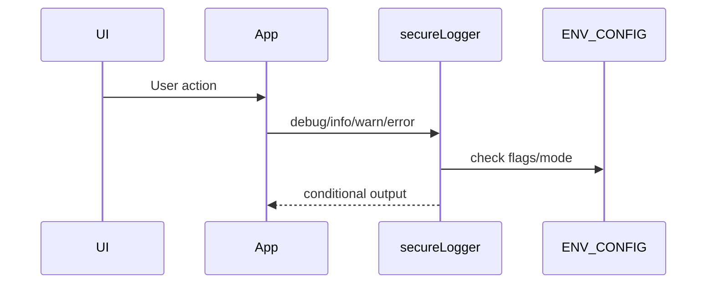

## Project Overview (Baseline v1)

CATAMS (Casual Academic Time Allocation Management System) manages timesheets and approval workflows for Tutors, Lecturers, and Admins. Backend: Spring Boot (DDD-oriented). Frontend: React/Vite with Playwright E2E. Orchestration: Node scripts.

## Project Structure



## Frontend Updates (2025-09-24)

### Logging Standardization
- Centralized `secureLogger` at `frontend/src/utils/secure-logger.ts` wraps console methods.
- Output controlled via Vite flags: `__DEBUG_LOGGING__`, with production-safe sanitization.
- Replaced raw `console.*` across app and test-utils with `secureLogger`.

### Import Path Casing & File Naming
- UI primitives normalized to kebab-case under `frontend/src/components/ui/`:
  - `button.tsx`, `input.tsx`, `card.tsx`, `badge.tsx`.
- Updated all imports to match exact filesystem casing, e.g., `import { Button } from './ui/button'`.

### Tutor Dashboard Consolidation
- Merged unique logic from `TutorDashboard.enhanced.tsx` into `TutorDashboard.tsx` and removed the enhanced file to enforce SSOT.

### Vitest Setup Unification
- Removed deprecated `frontend/src/test/setup/vitest-setup.ts`; `frontend/src/test-setup.ts` is the single setup point.

### Diagrams
```mermaid
graph TD
  UI[UI Components (kebab-case)] --> App[App]
  App --> SecureLogger[secureLogger]
  App --> Env[ENV_CONFIG]
  App --> Dashboards
  Dashboards --> TutorDashboard
  Dashboards --> LecturerDashboard
  Dashboards --> AdminDashboard
```



## Core Components & Logic

- ApprovalStateMachine
  - Purpose: SSOT for approval transitions.
  - Key transitions: DRAFT → SUBMIT → PENDING_TUTOR_REVIEW → APPROVED_BY_TUTOR → FINAL_APPROVAL → APPROVED_BY_LECTURER_AND_TUTOR → HR APPROVE → FINAL_APPROVED; REJECT/REQUEST_MODIFICATION where applicable.

- Timesheet (Aggregate Root)
  - Invariants: week starts Monday; hours/rate thresholds validated; monetary precision preserved.
  - Key methods: submitForApproval, approve, finalApprove, reject, requestModification.

- GlobalExceptionHandler
  - Maps business errors to 400; auth/access 401/403; unknown 500.

## Testing (Baseline v1 — 2025-08-11)

- Backend
  - Unit: PASS
  - Integration (Testcontainers PostgreSQL, profile=integration-test): PASS
- Frontend
  - Unit (Vitest): 104/104 PASS → `frontend/coverage/test-results.json`
  - Contract/API (Vitest): 17/17 PASS → `frontend/coverage/test-results.json`
  - E2E (Playwright, all projects): 54/54 PASS → `frontend/playwright-report/results.json`
- Reference: `docs/testing/CONFIG_MOCK.md` documents the Playwright config mock contract and required alignment with design tokens.

## Orchestration Rules

- Node-only scripts; non-interactive; always print `[TASK_DONE]`.
- Windows-safe Gradle: `cmd /d /s /c call gradlew.bat ...`.
- SSOT for params: `scripts/test.params.json`, `frontend/scripts/e2e.params.json`.
- Playwright JSON reporter configured in `frontend/playwright.config.ts`.
- Tests avoid magic values: enum names over raw strings; BigDecimal via `compareTo`; thresholds injected from properties.

## How to Run (2025-01-14 refresh)

### Backend (Spring Boot)
- Full suite / CI parity: `./gradlew test`
- Targeted unit slice: `node scripts/test-backend-unit.js`
- Selective unit tests: `node tools/scripts/test-backend-unit-select.js --tests="*TimesheetTest*"`
- Selective integration tests: `node tools/scripts/test-backend-integration-select.js --tests="*IntegrationTest*"`

### Frontend (React/Vite)
- Complete coverage run (Vitest): `npm run test:coverage`
- Unit-only focus: `npm run test:unit`
- Component harness: `npm run test:component`
- Contract/API schema checks: `npm run test:contract`

### End-to-End (Playwright Orchestrated)
- Full pipeline with data reset: `npm run test:e2e`
- Mock-only fast pass: `npm run test:e2e:mock`
- Backend-integrated scenarios: `npm run test:e2e:real`
- Visual regression sweeps: `npm run test:e2e:visual`
- Tag filters: `npm run test:e2e:smoke | npm run test:e2e:critical | npm run test:e2e:integration`
- Launch reporter UI for latest run: `npm run test:e2e:report`
- Disable data reset: `E2E_DISABLE_RESET=true npm run test:e2e`

### Utilities
- Cross-platform port cleanup: `node scripts/cleanup-ports.js --ports=8084,5174`
- Comprehensive cleanup: `node tools/scripts/cleanup.js [gentle|normal|full|emergency]`
- AI smart test runner: `npm run test:ai` (pyramid strategy)

## Report Locations

- Backend JSON summaries: `results/ut-summary.json`, `results/it-summary.json`
- Frontend Vitest JSON: `frontend/coverage/test-results.json`
- Playwright JSON: `frontend/playwright-report/results.json`

## Design Principles (Concise)

- DDD with high cohesion, low coupling; controllers thin; services orchestrate; domain enforces invariants.
- Design by Contract; fail fast; exhaustive enum handling; no secrets in code.
- SSOT for rules and configuration; composition over inheritance.

## VCS Ignore Rules (Baseline v1)

- Do not commit build caches, generated artifacts, or local assistant/IDE caches.
- Ignored paths (root or nested):
  - .gradle/
  - node_modules/ (any depth)
  - build/, target/
  - dist/ (including frontend/dist)
  - .cache/
  - generated/
  - out/
  - coverage/
  - logs/
  - .cursor/, .claude/, .gemini/, .bamd/

## Baseline

- Version: v1
- Date: 2025-08-11
- Scope: This document reflects the current green baseline. Future, exploratory, or microservices-oriented documents are marked as "future (not adopted in baseline v1)" to avoid confusion.


## Frontend Maintenance Cleanup (2025-09-28)

- Removed unused dev dependencies (`@vitest/ui`, `tsx`) to shrink install footprint; retained `@vitest/coverage-v8` for coverage reports.
- Deleted legacy scripts (`scripts/claude-code-preflight.*`, `scripts/start-test-infrastructure.js`) and the redundant `test:e2e:ai-legacy`/`test:clean` npm commands to reduce duplicate orchestration paths.
- Dropped stale assets and generated artifacts (`src/assets/react.svg`, nested `frontend/frontend/`, `playwright/.cache`) that were no longer referenced.
- Simplified `vite.config.ts` manual chunk config to match the active dependency graph.
- Added this maintenance note so future engineers know the redundant tooling was intentionally removed.

## Workspace Hygiene Update (2025-10-11)

- Introduced `.devtools/` to house AI assistant configurations formerly at the repository root.
- Documented task matrix (`docs/tasks.md`) and translation charter (`docs/governance/translation-charter.md`) to standardise English-only assets.
- Seeded `infra/` as the landing zone for future deployment/IaC assets; see `docs/adr/0001-root-hygiene-and-contract-pipeline.md`.
- Added `CONTRIBUTING.md` and `.github/CODEOWNERS` for governance.
- Established contract-first workflow (`tools/scripts/contracts-pipeline.js`) producing Java/TypeScript artifacts and the `schema/contracts.lock` drift gate.
- Codified quick command references and workspace map in `README.md`.

## Script Cleanup (2025-01-14)

- Removed over-engineered and redundant scripts (~1,800 lines deleted)
- Merged E2E data reset functionality into main E2E runner
- Standardized script organization following SSOT principles
- Cleaned up: `test-frontend.js` (1272 lines over-engineered), `run-e2e.js` (outdated), experimental files, temporary scripts
- Unified test runner library (`test-runner-fixed.js` → `test-runner.js`)
- Updated `frontend/scripts/run-e2e-tests.js` with data reset capabilities
- Removed `test:e2e:ai` npm script (functionality merged into `test:e2e`)
- See detailed report: `docs/SCRIPT_CLEANUP.md`
