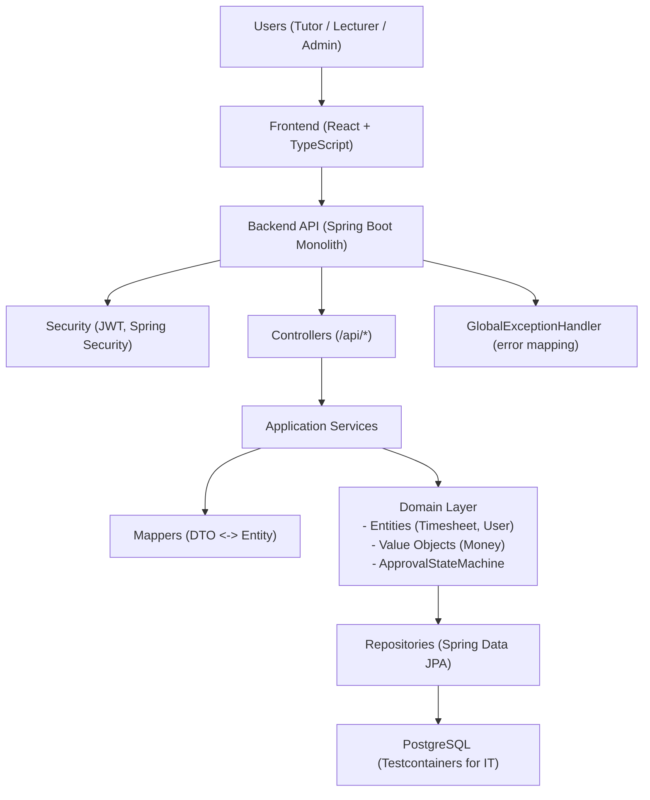
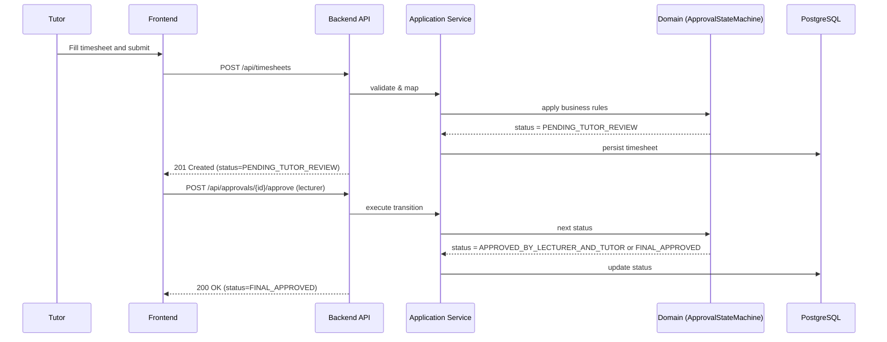
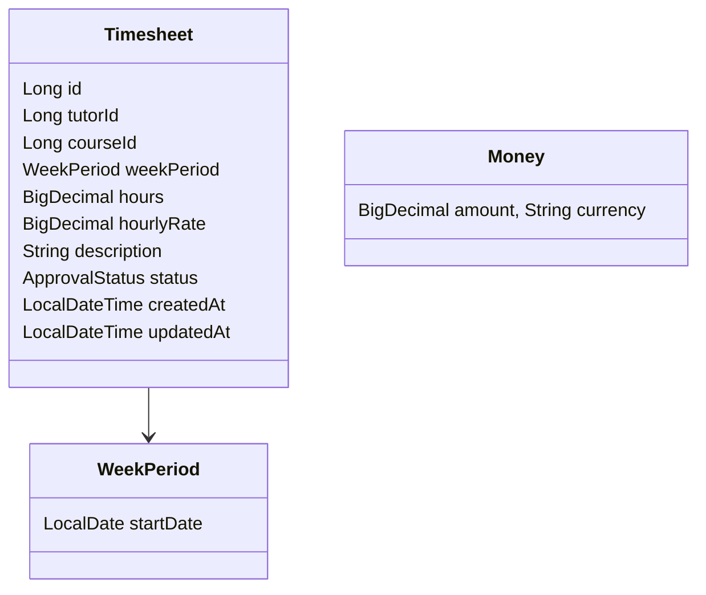

# CATAMS - Casual Academic Time Allocation Management System (Baseline v1)

CATAMS manages timesheets and approval workflows for Tutors, Lecturers, and Admins. Baseline v1 documents the current monolithic backend (Spring Boot + DDD) and React frontend. This README stays human-oriented and concise. Deep-dive documentation lives under `docs/` (see [`DOCUMENTATION_INDEX.md`](docs/DOCUMENTATION_INDEX.md)).

## Workspace Map

| Path | Purpose |
| --- | --- |
| `src/main/java/com/usyd/catams` | Spring Boot monolith (DDD layers) |
| `src/test/java/com/usyd/catams` | Unit + integration test suites |
| `frontend/` | React + Vite application, Vitest, Playwright |
| `schema/` | Canonical JSON Schemas for contract-first flow |
| `docs/` | Architecture, ADRs, governance, testing references |
| `tools/scripts/` | Authoritative automation entry points |
| `infra/` | Deployment, IaC, and platform runbooks |
| `.devtools/` | AI/assistant configuration (kept out of runtime paths) |

## Quick Commands

Everyday workflows live in [`docs/tasks.md`](docs/tasks.md). Highlights:

- Full backend verification: `./gradlew clean test`
- Backend integration slice: `./gradlew integrationTest`
- Frontend verification: `cd frontend && npm ci && npm run test:ci`
- Mock E2E sweep: `cd frontend && npm run test:e2e:mock`
- Real E2E sweep (requires backend on :8084): `cd frontend && npm run test:e2e:real`
- Contract pipeline: `./gradlew generateContracts && ./gradlew verifyContracts`

## Features

- Timesheet lifecycle: create, update, submit, review, approve, reject
- Role-based access with JWT (Tutor, Lecturer, Admin)
- Validation with Single Source of Truth (SSOT) for thresholds (hours, rates)
- Dashboards and summaries per role
- End-to-end automated testing (unit, integration, E2E)

## Service Architecture Overview



### Timesheet Approval Sequence (Happy Path)



### Domain Model (Core)



## Project Structure

```mermaid
graph TD
  A[Root]
  A --> B[src/main/java/com/usyd/catams]
  B --> B1[controller]
  B --> B2[service]
  B --> B3[repository]
  B --> B4[entity]
  B --> B5[dto/response]
  B --> B6[enums]
  B --> B7[config/security]
  A --> C[src/test/java/com/usyd/catams]
  C --> C1[unit]
  C --> C2[integration]
  C --> C3[repository]
  A --> D[frontend]
  D --> D1[src]
  D --> D2[e2e]
  D --> D3[playwright.config.ts]
  D --> D4[vitest.config.ts]
  A --> S[scripts]
  S --> S1[test-backend-unit.js]
  S --> S2[test-backend-integration.js]
  S --> S3[test-backend-unit-select.js]
  S --> S4[test-backend-integration-select.js]
  S --> S5[test-frontend-unit.js]
  S --> S6[test-frontend-contract.js]
  S --> S7[test-frontend-e2e.js]
  S --> S8[run-e2e.js]
```



## Technology Stack

- Backend: Java 21, Spring Boot 3, Spring Security (JWT), Spring Data JPA, PostgreSQL
- Domain: DDD-aligned aggregates and state machines (ApprovalStateMachine), value objects (Money)
- Frontend: React 18, TypeScript, Vite, Axios, Playwright, Vitest
- Testing: JUnit 5, Testcontainers; Node-based orchestration

## Getting Started

### Prerequisites

- Java 21+, Node.js 18+, Docker (for integration tests)

### Run Backend (dev)

```bash
./gradlew bootRun
```

### Run Frontend (dev)

```bash
cd frontend && npm install && npm run dev
```

## Testing

### Full suites

```bash
node scripts/test-backend-unit.js
node scripts/test-backend-integration.js
node scripts/test-frontend-unit.js
node scripts/test-frontend-contract.js
node scripts/run-e2e.js --project=all
```

#### Cross-platform Cleanup

Use the provided cleanup utility to terminate lingering dev/test processes and free ports (Windows/PowerShell and Linux/macOS supported):

```bash
node scripts/cleanup-ports.js
# or specify ports explicitly
node scripts/cleanup-ports.js --ports=8084,5174
```

### Selective (faster iteration)

```bash
node scripts/test-backend-unit-select.js --tests="*TimesheetServiceUnitTest*"
node scripts/test-backend-integration-select.js --tests="*TimesheetIntegrationTest*"
node scripts/test-frontend-unit-select.js --pattern="auth.*.spec"
```

### Reports

- Backend JUnit XML: `build/test-results/test/`
- Backend JSON summaries: `results/ut-summary.json`, `results/it-summary.json`
- Frontend Vitest JSON: `frontend/coverage/test-results.json`
- Playwright JSON: `frontend/playwright-report/results.json`

## Configuration & Profiles

- Profiles: `application.yml`, `application-integration-test.yml`
- Validation thresholds via `TimesheetValidationProperties` (hours/rates)
- DB: PostgreSQL (Testcontainers for IT), H2 fallback when configured

## API Overview

- OpenAPI specs: `docs/openapi/`
- Status enum baseline: `DRAFT`, `PENDING_TUTOR_REVIEW`, `APPROVED_BY_TUTOR`, `APPROVED_BY_LECTURER_AND_TUTOR`, `FINAL_APPROVED`, `REJECTED`, `MODIFICATION_REQUESTED`

## Orchestration Notes

- All one-shot Node scripts emit `[TASK_DONE]` and exit non-interactively.
- Windows: Gradle is invoked via `cmd /d /s /c call gradlew.bat ...` (handled by scripts).

## Contributing & Governance

- Follow the guidelines in [`CONTRIBUTING.md`](CONTRIBUTING.md).
- Ownership map lives in [`.github/CODEOWNERS`](.github/CODEOWNERS).
- Language and glossary rules: [`docs/governance/translation-charter.md`](docs/governance/translation-charter.md).
- Structural decisions and migrations are tracked in [`docs/adr/`](docs/adr).

## Baseline

- Version: v1
- Date: 2025-08-11
- Scope: This README reflects the current monolith implementation. Future or experimental docs under `docs/` are reference-only unless explicitly adopted.
