# CATAMS

> **Casual Academic Time Allocation Management System**

A full-stack enterprise application for managing casual academic timesheets and approvals,
aligned with the University of Sydney Enterprise Agreement 2023-2026.

[English](README.md) | [简体中文](README.zh-CN.md)

---

## Table of Contents

- [Overview](#overview)
- [System Architecture](#system-architecture)
- [Technology Stack](#technology-stack)
- [User Roles & Workflows](#user-roles--workflows)
- [Domain Model](#domain-model)
- [API Reference](#api-reference)
- [Business Rules](#business-rules)
- [Database Schema](#database-schema)
- [CI/CD Pipeline](#cicd-pipeline)
- [Local Development](#local-development)
- [Docker Deployment](#docker-deployment)
- [Testing](#testing)
- [Latest Playwright Verification (2026-03-19)](#latest-playwright-verification-2026-03-19)
- [Repository Hygiene](#repository-hygiene)
- [Project Structure](#project-structure)
- [Documentation](#documentation)
- [Contributing](#contributing)
- [Troubleshooting](#troubleshooting)

---

## Overview

CATAMS provides a comprehensive solution for managing casual academic staff timesheets
with full compliance to the University of Sydney Enterprise Agreement (EA) Schedule 1
payment rules.

### Key Features

| Feature | Description |
|---------|-------------|
| **Timesheet Management** | Create, edit, and submit timesheets with EA-compliant calculations |
| **Quote Engine** | Real-time calculation of payable hours and amounts |
| **Approval Workflow** | Multi-stage approval (Tutor → Lecturer → HR) |
| **Role-Based Dashboards** | Tailored views for Tutors, Lecturers, and Administrators |
| **Audit Trail** | Complete history of changes and approvals |
| **Policy Management** | Version-controlled EA rate tables with effective dates |

### Compliance

- **Tutorial**: Fixed 1.0h delivery; associated caps (standard ≤2.0h, repeat ≤1.0h)
- **ORAA/DEMO**: Hourly rates with high/standard bands
- **Marking**: Hourly for non-contemporaneous work
- All calculations use `Schedule1Calculator` as the single source of truth

---

## System Architecture

### High-Level Architecture (C4 Context)

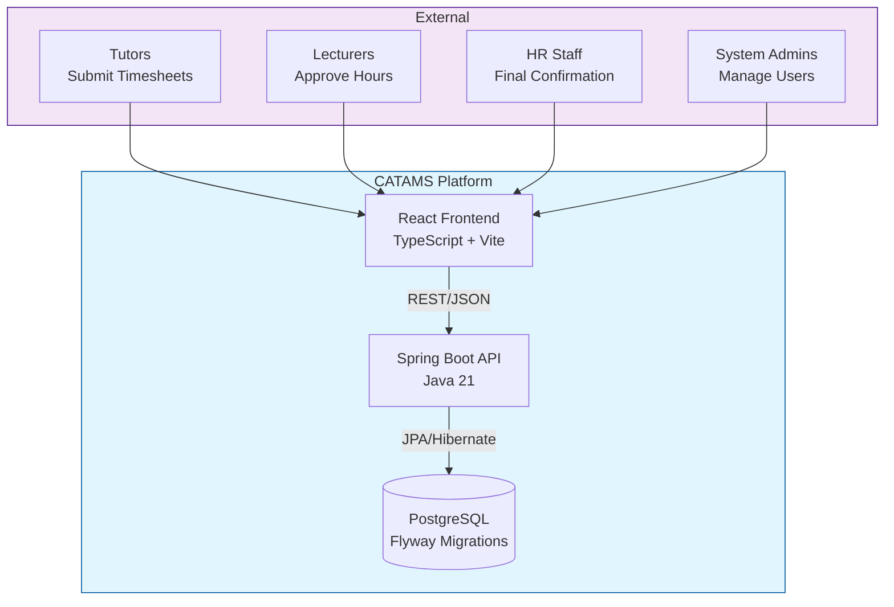
```mermaid
graph TB
    subgraph External
        Tutors[Tutors<br/>Submit Timesheets]
        Lecturers[Lecturers<br/>Approve Hours]
        HR[HR Staff<br/>Final Confirmation]
        Admin[System Admins<br/>Manage Users]
    end

    subgraph CATAMS["CATAMS Platform"]
        FE[React Frontend<br/>TypeScript + Vite]
        API[Spring Boot API<br/>Java 21]
        DB[(PostgreSQL<br/>Flyway Migrations)]
    end

    Tutors --> FE
    Lecturers --> FE
    HR --> FE
    Admin --> FE
    
    FE -->|REST/JSON| API
    API -->|JPA/Hibernate| DB

    style CATAMS fill:#e1f5fe,stroke:#01579b
    style External fill:#f3e5f5,stroke:#4a148c
```

### Layered Architecture


```mermaid
graph LR
    subgraph Presentation["Presentation Layer"]
        Controllers[REST Controllers<br/>DTO Validation]
        Security[Spring Security<br/>JWT Auth]
    end

    subgraph Application["Application Layer"]
        AppServices[Application Services<br/>Use Case Orchestration]
        Approval[Approval Service<br/>Workflow Management]
    end

    subgraph Domain["Domain Layer"]
        Calculator[Schedule1Calculator<br/>EA Rules Engine]
        Policy[PolicyProvider<br/>Rate Resolution]
        Aggregates[Domain Aggregates<br/>Timesheet, Approval]
    end

    subgraph Infrastructure["Infrastructure Layer"]
        Repositories[JPA Repositories<br/>Data Access]
        Migrations[Flyway Migrations<br/>Schema Management]
    end

    Presentation --> Application
    Application --> Domain
    Domain --> Infrastructure

    style Presentation fill:#bbdefb,stroke:#1976d2
    style Application fill:#c8e6c9,stroke:#388e3c
    style Domain fill:#fff9c4,stroke:#fbc02d
    style Infrastructure fill:#ffccbc,stroke:#e64a19
```

### Request Flow

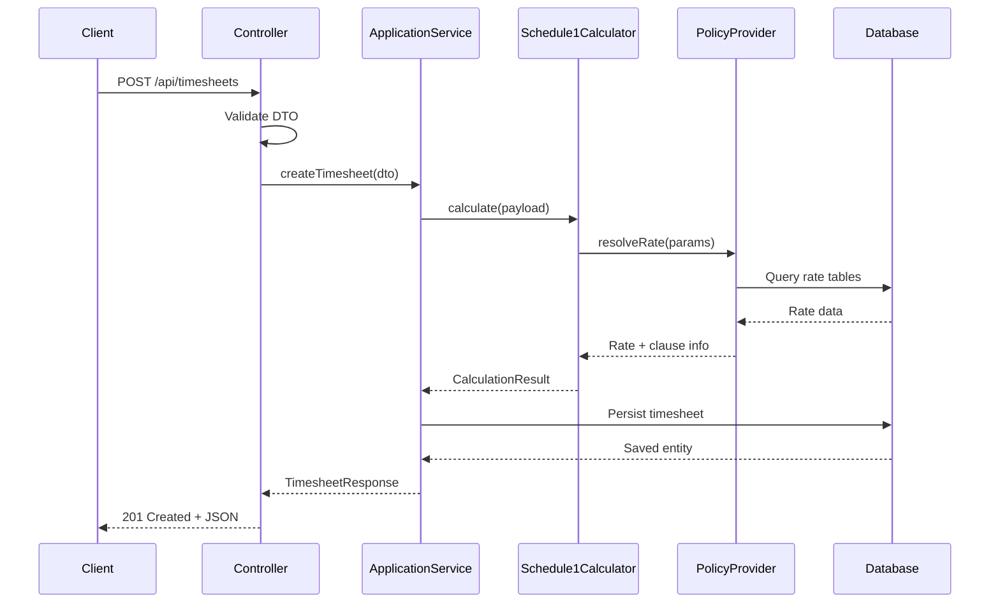
```mermaid
sequenceDiagram
    participant C as Client
    participant Ctrl as Controller
    participant Svc as ApplicationService
    participant Calc as Schedule1Calculator
    participant Policy as PolicyProvider
    participant DB as Database

    C->>Ctrl: POST /api/timesheets
    Ctrl->>Ctrl: Validate DTO
    Ctrl->>Svc: createTimesheet(dto)
    Svc->>Calc: calculate(payload)
    Calc->>Policy: resolveRate(params)
    Policy->>DB: Query rate tables
    DB-->>Policy: Rate data
    Policy-->>Calc: Rate + clause info
    Calc-->>Svc: CalculationResult
    Svc->>DB: Persist timesheet
    DB-->>Svc: Saved entity
    Svc-->>Ctrl: TimesheetResponse
    Ctrl-->>C: 201 Created + JSON
```

---

## Technology Stack

### Technology Overview

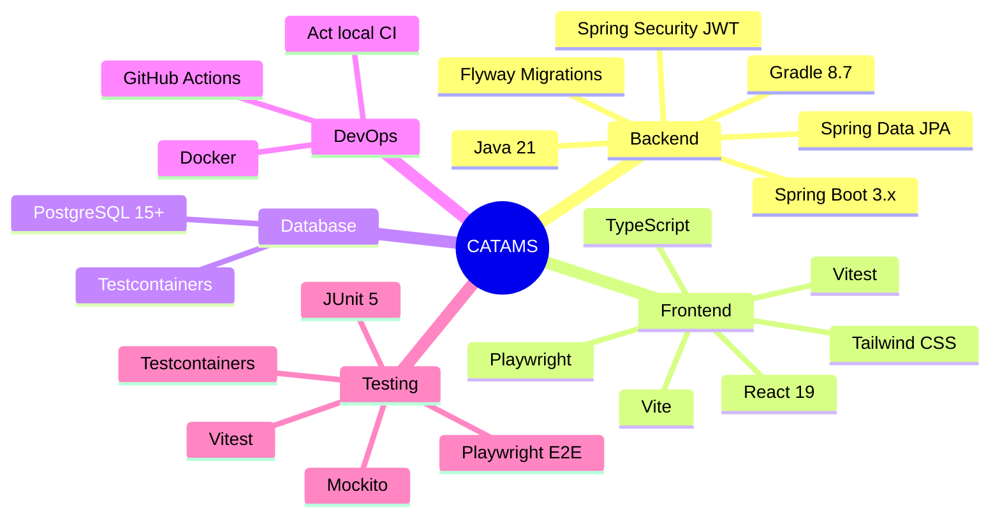
```mermaid
mindmap
  root((CATAMS))
    Backend
      Java 21
      Spring Boot 3.x
      Spring Security JWT
      Spring Data JPA
      Flyway Migrations
      Gradle 8.7
    Frontend
      React 19
      TypeScript
      Vite
      Tailwind CSS
      Vitest
      Playwright
    Database
      PostgreSQL 15+
      Testcontainers
    DevOps
      Docker
      GitHub Actions
      Act local CI
    Testing
      JUnit 5
      Mockito
      Testcontainers
      Vitest
      Playwright E2E
```

### Version Matrix

| Category | Technology | Version | Purpose |
|----------|------------|---------|---------|
| **Runtime** | Java | 21 | Backend runtime |
| **Framework** | Spring Boot | 3.x | Application framework |
| **ORM** | Hibernate/JPA | (Spring managed) | Data persistence |
| **Frontend** | React | 19 | UI framework |
| **Build** | Gradle | 8.7 | Backend build |
| **Package Manager** | npm | 20+ | Frontend dependencies |
| **Database** | PostgreSQL | 15+ | Primary datastore |
| **Container** | Docker | Latest | Containerization |

---

## User Roles & Workflows

### Role Hierarchy

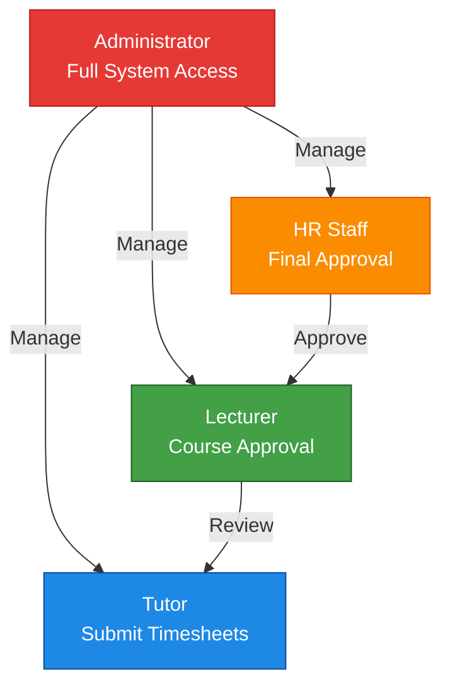
```mermaid
graph TD
    Admin[Administrator<br/>Full System Access]
    HR[HR Staff<br/>Final Approval]
    Lecturer[Lecturer<br/>Course Approval]
    Tutor[Tutor<br/>Submit Timesheets]

    Admin -->|Manage| HR
    Admin -->|Manage| Lecturer
    Admin -->|Manage| Tutor
    HR -->|Approve| Lecturer
    Lecturer -->|Review| Tutor

    style Admin fill:#e53935,stroke:#b71c1c,color:#fff
    style HR fill:#fb8c00,stroke:#e65100,color:#fff
    style Lecturer fill:#43a047,stroke:#1b5e20,color:#fff
    style Tutor fill:#1e88e5,stroke:#0d47a1,color:#fff
```

### Timesheet Lifecycle

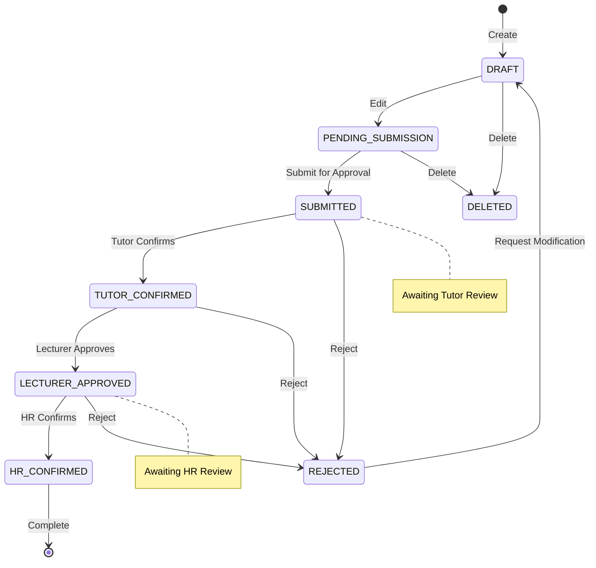
```mermaid
stateDiagram-v2
    [*] --> DRAFT: Create
    DRAFT --> PENDING_SUBMISSION: Edit
    PENDING_SUBMISSION --> SUBMITTED: Submit for Approval
    
    SUBMITTED --> TUTOR_CONFIRMED: Tutor Confirms
    TUTOR_CONFIRMED --> LECTURER_APPROVED: Lecturer Approves
    LECTURER_APPROVED --> HR_CONFIRMED: HR Confirms
    HR_CONFIRMED --> [*]: Complete
    
    SUBMITTED --> REJECTED: Reject
    TUTOR_CONFIRMED --> REJECTED: Reject
    LECTURER_APPROVED --> REJECTED: Reject
    
    REJECTED --> DRAFT: Request Modification
    
    DRAFT --> DELETED: Delete
    PENDING_SUBMISSION --> DELETED: Delete

    note right of SUBMITTED: Awaiting Tutor Review
    note right of LECTURER_APPROVED: Awaiting HR Review
```

### Approval Workflow

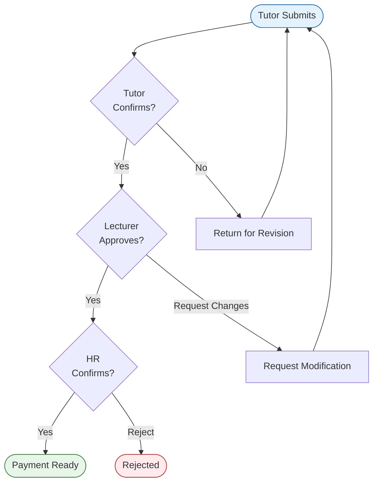
```mermaid
flowchart TD
    Start([Tutor Submits]) --> Review1{Tutor<br/>Confirms?}
    Review1 -->|Yes| Review2{Lecturer<br/>Approves?}
    Review1 -->|No| Revise1[Return for Revision]
    
    Review2 -->|Yes| Review3{HR<br/>Confirms?}
    Review2 -->|Request Changes| Revise2[Request Modification]
    
    Review3 -->|Yes| Complete([Payment Ready])
    Review3 -->|Reject| Rejected([Rejected])
    
    Revise1 --> Start
    Revise2 --> Start

    style Start fill:#e3f2fd,stroke:#1565c0
    style Complete fill:#e8f5e9,stroke:#2e7d32
    style Rejected fill:#ffebee,stroke:#c62828
```

---

## Domain Model

### Core Entities

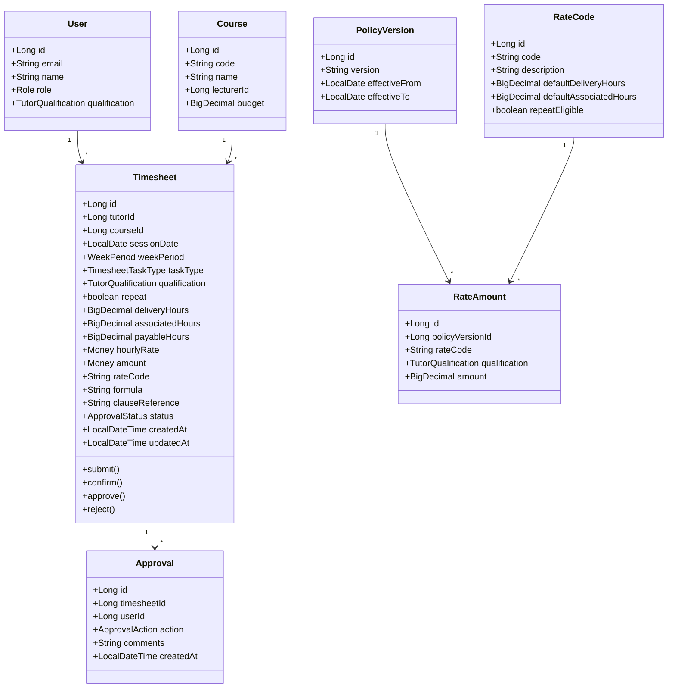
```mermaid
classDiagram
    class Timesheet {
        +Long id
        +Long tutorId
        +Long courseId
        +LocalDate sessionDate
        +WeekPeriod weekPeriod
        +TimesheetTaskType taskType
        +TutorQualification qualification
        +boolean repeat
        +BigDecimal deliveryHours
        +BigDecimal associatedHours
        +BigDecimal payableHours
        +Money hourlyRate
        +Money amount
        +String rateCode
        +String formula
        +String clauseReference
        +ApprovalStatus status
        +LocalDateTime createdAt
        +LocalDateTime updatedAt
        +submit()
        +confirm()
        +approve()
        +reject()
    }

    class Approval {
        +Long id
        +Long timesheetId
        +Long userId
        +ApprovalAction action
        +String comments
        +LocalDateTime createdAt
    }

    class User {
        +Long id
        +String email
        +String name
        +Role role
        +TutorQualification qualification
    }

    class Course {
        +Long id
        +String code
        +String name
        +Long lecturerId
        +BigDecimal budget
    }

    class PolicyVersion {
        +Long id
        +String version
        +LocalDate effectiveFrom
        +LocalDate effectiveTo
    }

    class RateCode {
        +Long id
        +String code
        +String description
        +BigDecimal defaultDeliveryHours
        +BigDecimal defaultAssociatedHours
        +boolean repeatEligible
    }

    class RateAmount {
        +Long id
        +Long policyVersionId
        +String rateCode
        +TutorQualification qualification
        +BigDecimal amount
    }

    Timesheet "1" --> "*" Approval
    User "1" --> "*" Timesheet
    Course "1" --> "*" Timesheet
    PolicyVersion "1" --> "*" RateAmount
    RateCode "1" --> "*" RateAmount
```

### Value Objects

| Value Object | Description | Fields |
|--------------|-------------|--------|
| `Money` | Monetary amount with currency | `amount`, `currencyCode` |
| `WeekPeriod` | ISO week representation | `weekStartDate` |
| `Schedule1CalculationResult` | Calculator output | All financial fields + metadata |

---

## API Reference

### API Surface Overview

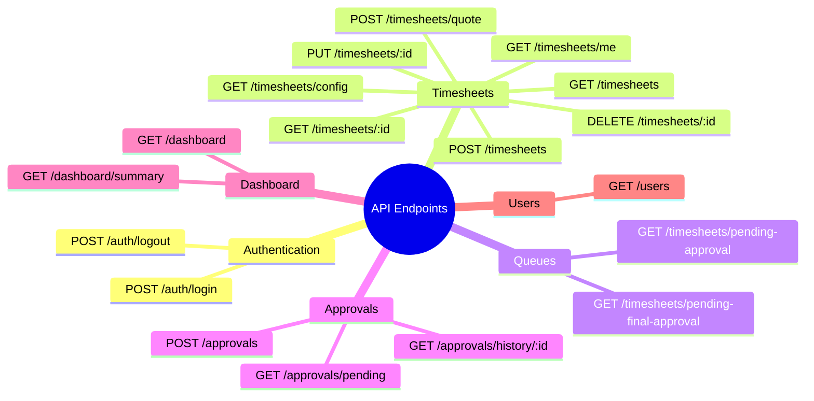
```mermaid
mindmap
  root((API Endpoints))
    Authentication
      POST /auth/login
      POST /auth/logout
    Timesheets
      GET /timesheets
      GET /timesheets/me
      GET /timesheets/:id
      POST /timesheets
      PUT /timesheets/:id
      DELETE /timesheets/:id
      POST /timesheets/quote
      GET /timesheets/config
    Queues
      GET /timesheets/pending-approval
      GET /timesheets/pending-final-approval
    Approvals
      POST /approvals
      GET /approvals/pending
      GET /approvals/history/:id
    Dashboard
      GET /dashboard
      GET /dashboard/summary
    Users
      GET /users
```

### Endpoint Summary

| Endpoint | Method | Description | Auth Required |
|----------|--------|-------------|---------------|
| `/api/auth/login` | POST | Authenticate user | No |
| `/api/auth/logout` | POST | Invalidate session | Yes |
| `/api/timesheets` | GET | List all timesheets (admin) | Admin |
| `/api/timesheets/me` | GET | Current user's timesheets | Yes |
| `/api/timesheets/{id}` | GET | Get timesheet by ID | Yes |
| `/api/timesheets` | POST | Create timesheet | Tutor |
| `/api/timesheets/{id}` | PUT | Update timesheet | Owner |
| `/api/timesheets/{id}` | DELETE | Delete timesheet | Owner |
| `/api/timesheets/quote` | POST | Calculate quote (no save) | Yes |
| `/api/timesheets/config` | GET | UI constraints | Yes |
| `/api/approvals` | POST | Approval action | Yes |
| `/api/dashboard/summary` | GET | Dashboard statistics | Yes |

### Error Response Format

All errors use RFC 7807 Problem Details format:

```json
{
  "success": false,
  "message": "Validation failed",
  "error": "VALIDATION_FAILED",
  "traceId": "abc123def456"
}
```

---

## Business Rules

### Schedule 1 Calculation Flow

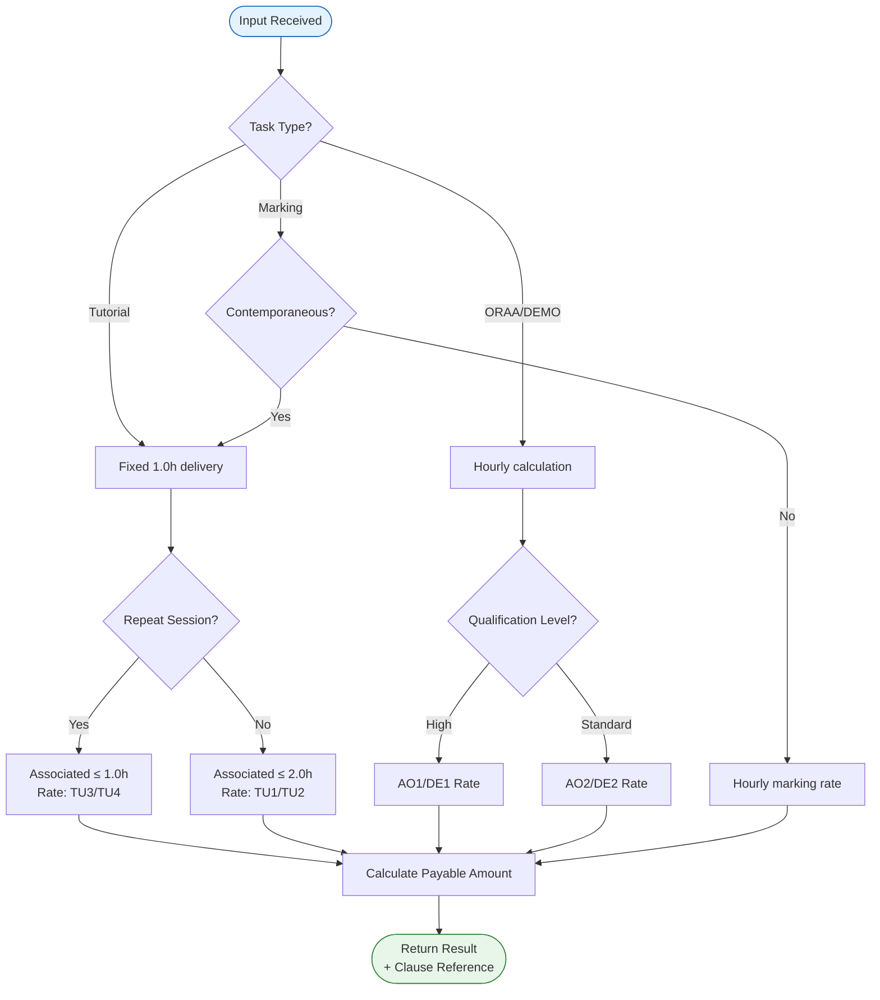
```mermaid
flowchart TD
    Start([Input Received]) --> Type{Task Type?}
    
    Type -->|Tutorial| Tutorial[Fixed 1.0h delivery]
    Type -->|ORAA/DEMO| Hourly[Hourly calculation]
    Type -->|Marking| Marking{Contemporaneous?}
    
    Tutorial --> Repeat1{Repeat Session?}
    Repeat1 -->|Yes| RepeatCap[Associated ≤ 1.0h<br/>Rate: TU3/TU4]
    Repeat1 -->|No| StandardCap[Associated ≤ 2.0h<br/>Rate: TU1/TU2]
    
    Hourly --> Band{Qualification Level?}
    Band -->|High| HighBand[AO1/DE1 Rate]
    Band -->|Standard| StdBand[AO2/DE2 Rate]
    
    Marking -->|Yes| Tutorial
    Marking -->|No| MarkingHourly[Hourly marking rate]
    
    RepeatCap --> Calc[Calculate Payable Amount]
    StandardCap --> Calc
    HighBand --> Calc
    StdBand --> Calc
    MarkingHourly --> Calc
    
    Calc --> Output([Return Result<br/>+ Clause Reference])

    style Start fill:#e3f2fd,stroke:#1565c0
    style Output fill:#e8f5e9,stroke:#2e7d32
```

### Rate Code Mapping

| Task Type | Repeat | Rate Code | Description |
|-----------|--------|-----------|-------------|
| Tutorial | No | TU1/TU2 | Standard tutorial |
| Tutorial | Yes | TU3/TU4 | Repeat tutorial |
| ORAA | - | AO1/AO2 | Oral assessment |
| Demo | - | DE1/DE2 | Demonstration |
| Marking | - | M03-M05 | Assessment marking |

### Validation Rules

- **Session Date**: Must fall on a Monday (week start)
- **Tutorial Delivery**: Fixed at 1.0 hours
- **Associated Hours**: Capped per EA rules
- **Unique Constraint**: One timesheet per tutor/course/week

---

## Database Schema

### Entity Relationship Diagram

```mermaid
erDiagram
    USERS ||--o{ TIMESHEETS : creates
    USERS ||--o{ APPROVALS : performs
    COURSES ||--o{ TIMESHEETS : contains
    TIMESHEETS ||--o{ APPROVALS : has
    LECTURER_ASSIGNMENTS }o--|| USERS : assigns
    LECTURER_ASSIGNMENTS }o--|| COURSES : to
    
    POLICY_VERSION ||--o{ RATE_AMOUNT : defines
    RATE_CODE ||--o{ RATE_AMOUNT : has

    USERS {
        bigint id PK
        varchar email UK
        varchar name
        varchar password_hash
        varchar role
        varchar qualification
        timestamp created_at
    }

    TIMESHEETS {
        bigint id PK
        bigint tutor_id FK
        bigint course_id FK
        date week_start_date
        date session_date
        varchar task_type
        varchar qualification
        boolean repeat
        decimal delivery_hours
        decimal associated_hours
        decimal payable_hours
        decimal hourly_rate
        decimal amount
        varchar rate_code
        varchar formula
        varchar clause_reference
        varchar status
        timestamp created_at
        timestamp updated_at
    }

    APPROVALS {
        bigint id PK
        bigint timesheet_id FK
        bigint user_id FK
        varchar action
        text comments
        timestamp created_at
    }

    COURSES {
        bigint id PK
        varchar code UK
        varchar name
        bigint lecturer_id FK
        decimal budget
    }

    POLICY_VERSION {
        bigint id PK
        varchar version UK
        date effective_from
        date effective_to
    }

    RATE_CODE {
        bigint id PK
        varchar code UK
        varchar description
        decimal default_delivery_hours
        decimal default_associated_hours
        boolean repeat_eligible
    }

    RATE_AMOUNT {
        bigint id PK
        bigint policy_version_id FK
        varchar rate_code FK
        varchar qualification
        decimal amount
    }
```

### Key Indexes

| Table | Index | Columns | Purpose |
|-------|-------|---------|---------|
| `timesheets` | `idx_timesheet_tutor` | `tutor_id` | Tutor lookup |
| `timesheets` | `idx_timesheet_course` | `course_id` | Course filtering |
| `timesheets` | `idx_timesheet_status` | `status` | Queue queries |
| `timesheets` | `uk_timesheet_tutor_course_week` | `tutor_id, course_id, week_start_date` | Uniqueness |

---

## CI/CD Pipeline

### GitHub Actions Workflow

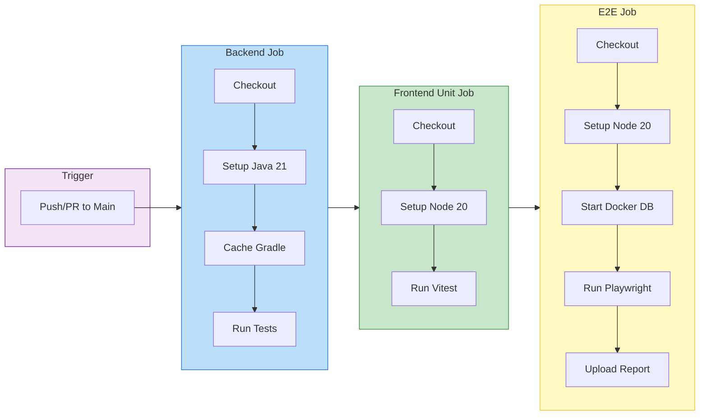
```mermaid
flowchart LR
    subgraph Trigger
        Push[Push/PR to Main]
    end

    subgraph Backend["Backend Job"]
        B1[Checkout]
        B2[Setup Java 21]
        B3[Cache Gradle]
        B4[Run Tests]
        B1 --> B2 --> B3 --> B4
    end

    subgraph Frontend["Frontend Unit Job"]
        F1[Checkout]
        F2[Setup Node 20]
        F3[Run Vitest]
        F1 --> F2 --> F3
    end

    subgraph E2E["E2E Job"]
        E1[Checkout]
        E2[Setup Node 20]
        E3[Start Docker DB]
        E4[Run Playwright]
        E5[Upload Report]
        E1 --> E2 --> E3 --> E4 --> E5
    end

    Push --> Backend
    Backend --> Frontend
    Frontend --> E2E

    style Trigger fill:#f3e5f5,stroke:#7b1fa2
    style Backend fill:#bbdefb,stroke:#1976d2
    style Frontend fill:#c8e6c9,stroke:#388e3c
    style E2E fill:#fff9c4,stroke:#fbc02d
```

### CI Configuration

| Job | Trigger | Duration | Coverage |
|-----|---------|----------|----------|
| `backend` | Always | ~1m | Unit + Integration |
| `frontend-unit` | After backend | ~20s | Component tests |
| `e2e` | After frontend | ~1h | Full user flows |

---

## Local Development

### Development Environment Setup

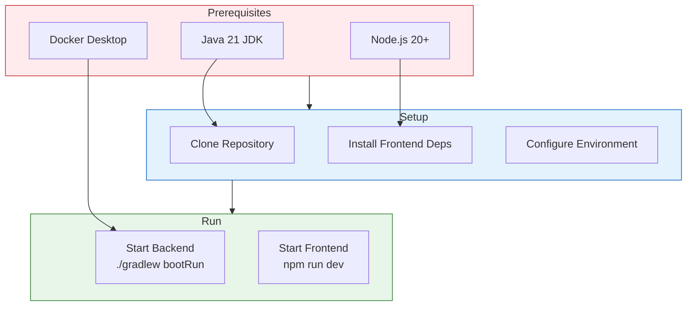
```mermaid
flowchart TD
    subgraph Prerequisites
        P1[Java 21 JDK]
        P2[Node.js 20+]
        P3[Docker Desktop]
    end

    subgraph Setup
        S1[Clone Repository]
        S2[Install Frontend Deps]
        S3[Configure Environment]
    end

    subgraph Run
        R1[Start Backend<br/>./gradlew bootRun]
        R2[Start Frontend<br/>npm run dev]
    end

    Prerequisites --> Setup
    Setup --> Run

    P1 --> S1
    P2 --> S2
    P3 --> R1

    style Prerequisites fill:#ffebee,stroke:#c62828
    style Setup fill:#e3f2fd,stroke:#1565c0
    style Run fill:#e8f5e9,stroke:#2e7d32
```

### Quick Start

```bash
# 1. Clone and install dependencies
git clone <repo-url>
cd Casual-Academic-Time-Allocation-Management-System
npm --prefix frontend install

# 2. Start backend (Testcontainers PostgreSQL)
./gradlew bootRun --args="--spring.profiles.active=e2e-local --server.port=8084"

# 3. Start frontend (in new terminal)
npm --prefix frontend run dev:e2e

# 4. Open browser
open http://127.0.0.1:5174
```

### Environment Variables

| Variable | Required | Default | Description |
|----------|----------|---------|-------------|
| `JWT_SECRET` | Yes | - | JWT signing key |
| `SPRING_PROFILES_ACTIVE` | No | `dev` | Spring profile |
| `SERVER_PORT` | No | `8080` | Backend port |

---

## Docker Deployment

### Container Architecture

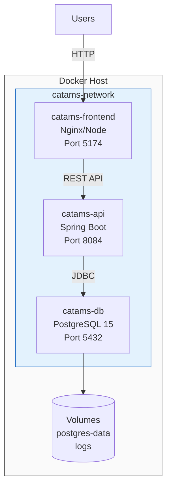
```mermaid
graph TB
    subgraph Host["Docker Host"]
        subgraph Network["catams-network"]
            API[catams-api<br/>Spring Boot<br/>Port 8084]
            DB[catams-db<br/>PostgreSQL 15<br/>Port 5432]
            FE[catams-frontend<br/>Nginx/Node<br/>Port 5174]
        end
        
        Volumes[(Volumes<br/>postgres-data<br/>logs)]
    end

    Users[Users] -->|HTTP| FE
    FE -->|REST API| API
    API -->|JDBC| DB
    DB --> Volumes

    style Host fill:#fafafa,stroke:#424242
    style Network fill:#e3f2fd,stroke:#1565c0
```

### Docker Compose

```bash
# Start all services
docker-compose up -d

# View logs
docker-compose logs -f api

# Stop services
docker-compose down

# Reset with fresh database
docker-compose down -v
```

### Container Services

| Service | Image | Ports | Purpose |
|---------|-------|-------|---------|
| `api` | OpenJDK 21 | 8084:8084 | Spring Boot backend |
| `db` | PostgreSQL 15 | 5432:5432 | Primary database |
| `frontend` | Node 20 | 5174:5174 | React development server |

### Production Considerations

- Use external PostgreSQL instance for production
- Configure proper secrets management
- Enable TLS/SSL for all endpoints
- Set up log aggregation
- Configure health checks and auto-restart policies

---

## Testing

### Test Pyramid

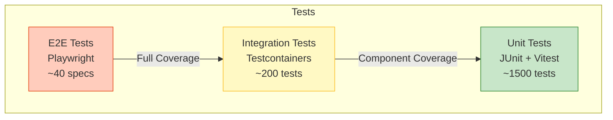
```mermaid
graph TB
    subgraph Tests
        E2E[E2E Tests<br/>Playwright<br/>~40 specs]
        Integration[Integration Tests<br/>Testcontainers<br/>~200 tests]
        Unit[Unit Tests<br/>JUnit + Vitest<br/>~1500 tests]
    end

    E2E --> |Full Coverage| Integration
    Integration --> |Component Coverage| Unit

    style E2E fill:#ffccbc,stroke:#e64a19
    style Integration fill:#fff9c4,stroke:#fbc02d
    style Unit fill:#c8e6c9,stroke:#388e3c
```

### Running Tests

```bash
# Backend unit + integration tests
./gradlew cleanTest test

# Frontend unit tests
npm --prefix frontend test -- --reporter=verbose

# E2E tests
node scripts/e2e-runner.js --project=real

# Run specific E2E specs
node scripts/e2e-runner.js --project=real --grep "@p0|@p1"

# PowerShell-safe single-tag example
node scripts/e2e-runner.js --project=real --grep "@p0"
```

### Test Reports

| Report Type | Location | Description |
|-------------|----------|-------------|
| Backend HTML | `build/reports/tests/` | JUnit HTML report |
| Frontend | Terminal output | Vitest verbose |
| E2E HTML | `frontend/playwright-report/` | Playwright HTML report |
| E2E Traces | `frontend/test-results/` | Screenshots + traces |

### Latest Playwright Verification (2026-03-19)

This repository was validated against the local `5174/8084` stack using the full Playwright `real` suite plus manual browser verification for the key role-based pages.

Environment:
- Frontend: `http://localhost:5174`
- Backend: `http://127.0.0.1:8084`
- Data baseline: `node scripts/e2e-reset-seed.js --url http://127.0.0.1:8084 --token local-e2e-reset`
- Seed accounts: `admin@example.com`, `lecturer@example.com`, `tutor@example.com`
- Full-suite command: `node scripts/e2e-runner.js --project=real`
- Result artifacts: `frontend/playwright-report/results.json`, `frontend/playwright-report/junit.xml`

Validated scope:
1. Route guards: unauthenticated `/dashboard` and `/admin/users` redirect to `/login`
2. Tutor flow: login, tab navigation (`All`, `Drafts`, `In Progress`, `Needs Attention`), confirm action succeeds
3. Lecturer flow: create timesheet and lecturer approval path covered by the passing `real` suite; dashboard rendering manually rechecked
4. Admin flow: pending approvals tab, final approve succeeds
5. Admin users flow: create unique user, deactivate/reactivate succeeds

Outcome:
- PASS: `121` Playwright `real` tests passed with `0 failed`, `0 flaky`, `0 skipped` on March 19, 2026.
- PASS: manual browser verification rechecked `/login`, `/dashboard` (Tutor, Lecturer, Admin) and `/admin/users` with no blocking visual defects.
- Note: expected negative-path `400/401/409` responses still appear in the suite for contract and rule-enforcement scenarios.

Screenshot evidence:

| Login | Tutor Dashboard |
|---|---|
| 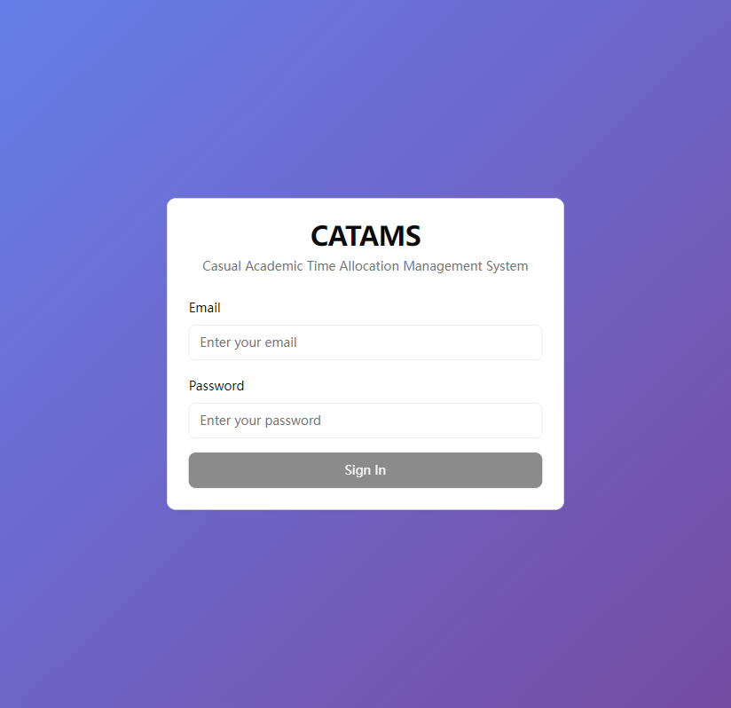 | 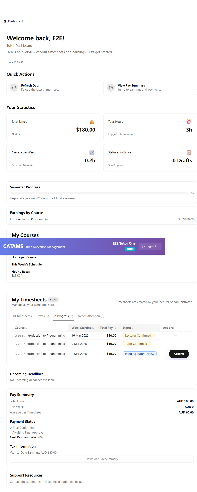 |

| Lecturer Dashboard | Admin Dashboard |
|---|---|
| 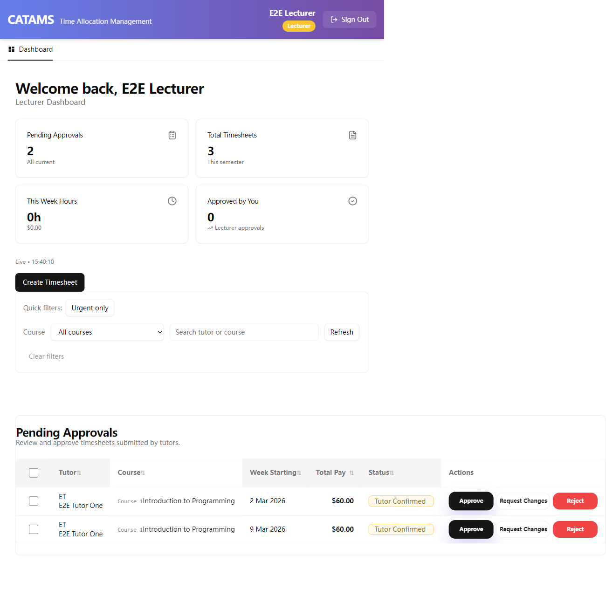 | 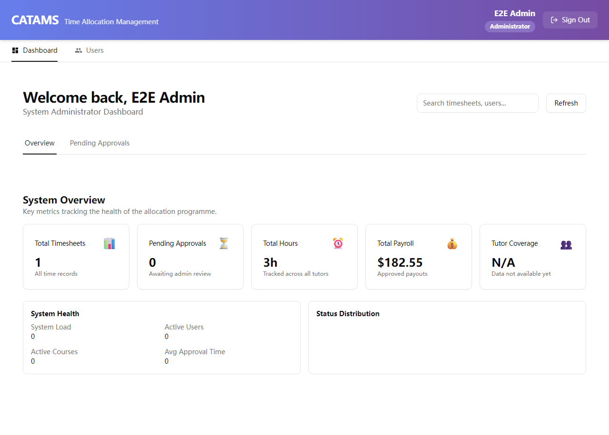 |

| Admin Users |
|---|
| 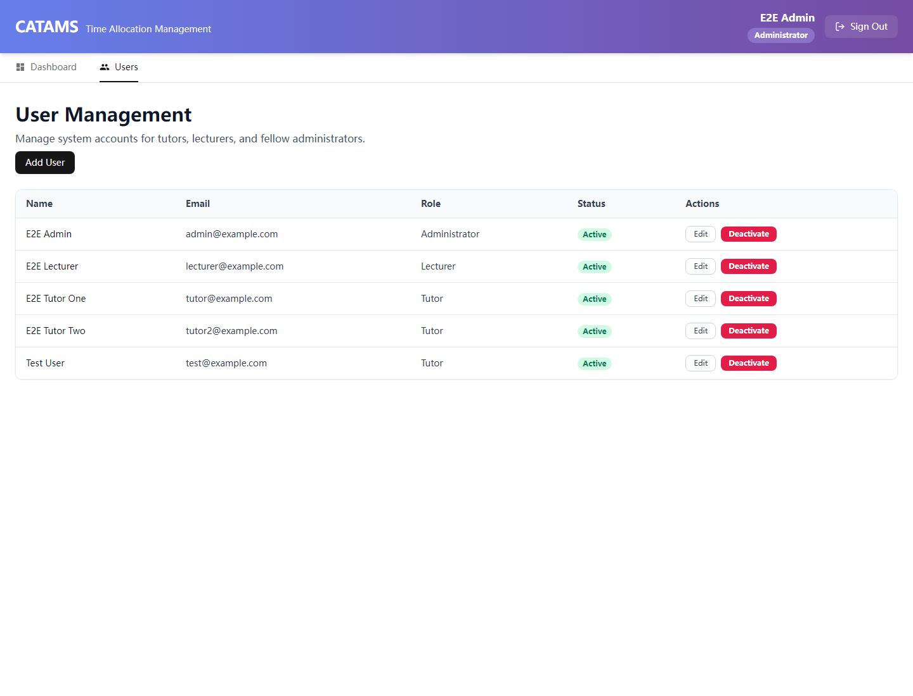 |

---

## Repository Hygiene

### Branch Model

- Long-lived branches are `main` and `codex/dev`.
- Development commits land on `codex/dev`, then merge to `main` via PR.
- Direct pushes to `main` are prohibited.

### Local Gate Parity

```bash
# Configure versioned hooks once
git config core.hooksPath .githooks

# Run the same gates manually when needed
bash tools/ci/check-repo-hygiene.sh
bash tools/ci/run-backend.sh
bash tools/ci/run-frontend-unit.sh
bash tools/ci/run-e2e.sh
```

### Cleanup Commands

Use targeted cleanup to remove transient artifacts without wiping developer state:

```bash
git clean -fdX -- output tmp test-results frontend/test-results frontend/playwright-report frontend/playwright-screenshots frontend/coverage gha-artifacts gha-artifacts-latest build
```

---

## Project Structure

```
├── src/main/java/com/usyd/catams/
│   ├── CatamsApplication.java        # Application entry point
│   ├── application/                   # Application services
│   ├── common/                        # Shared utilities
│   ├── config/                        # Spring configuration
│   ├── controller/                    # REST controllers
│   ├── domain/                        # Domain model
│   ├── dto/                           # Data transfer objects
│   ├── e2e/                           # E2E test support
│   ├── entity/                        # JPA entities
│   ├── enums/                         # Enumerations
│   ├── exception/                     # Exception handling
│   ├── mapper/                        # Entity-DTO mappers
│   ├── policy/                        # Policy providers
│   ├── repository/                    # Data repositories
│   ├── security/                      # Security configuration
│   ├── service/                       # Business services
│   └── tools/                         # Utility tools
│
├── src/main/resources/
│   ├── application.yml                # Main configuration
│   ├── application-*.yml              # Profile configs
│   └── db/migration/                  # Flyway migrations
│
├── frontend/
│   ├── src/
│   │   ├── components/                # React components
│   │   ├── dashboards/                # Role dashboards
│   │   ├── services/                  # API services
│   │   ├── hooks/                     # Custom hooks
│   │   ├── utils/                     # Utilities
│   │   └── types/                     # TypeScript types
│   ├── tests/                         # E2E specs
│   └── playwright.config.ts
│
├── docs/                              # Documentation
│   ├── architecture/                  # Architecture docs
│   ├── backend/                       # Backend docs
│   ├── frontend/                      # Frontend docs
│   ├── product/                       # Product docs
│   └── testing/                       # Testing docs
│
├── .github/
│   ├── workflows/ci.yml               # CI pipeline
│   ├── pull_request_template.md       # PR template
│   └── branch-protection.md           # Branch rules
│
├── Dockerfile                         # Backend image
├── docker-compose.yml                 # Local deployment
└── README.md                          # This file
```

---

## Documentation

### Single Source of Truth (SSOT)

| Document | Location | Purpose |
|----------|----------|---------|
| **Requirements** | `docs/product/requirements/` | EA compliance rules |
| **API Contract** | `docs/openapi.yaml` | REST API specification |
| **Architecture** | `docs/architecture/overview.md` | System design |
| **Backend Dev Guide** | `docs/backend/development-guide.md` | Backend patterns |
| **Frontend Architecture** | `docs/frontend/architecture.md` | Frontend patterns |
| **Testing Strategy** | `docs/testing/README.md` | Test approach |

### Architecture Decision Records (ADRs)

Located in `docs/adr/` - documenting significant architectural decisions
and their rationale.

---

## Contributing

### Branch Protection

This repository enforces branch protection on `main`:

- Direct pushes to `main` are blocked (Git hook)
- All changes must go through Pull Requests
- CI must pass before merge
- Requires code review approval

### Development Workflow

1. Sync `codex/dev` from remote
2. Make changes and write tests on `codex/dev`
3. Push `codex/dev` and update/open a PR to `main`
4. Wait for CI to pass
5. Request code review
6. Merge PR when approved

See [CONTRIBUTING.md](./CONTRIBUTING.md) for detailed guidelines.

---

## Troubleshooting

### Common Issues

| Issue | Solution |
|-------|----------|
| **Port 8084 in use** | Stop conflicting process: `lsof -i :8084` |
| **Port 5174 in use** | Stop conflicting process: `lsof -i :5174` |
| **Docker permission denied** | Add user to docker group: `sudo usermod -aG docker $USER` |
| **Playwright browsers missing** | Run: `npm --prefix frontend exec playwright install --with-deps chromium` |
| **Gradle build fails** | Clear cache: `./gradlew clean` |
| **Database connection refused** | Ensure Docker is running and PostgreSQL container is healthy |

### Debug Mode

```bash
# Enable verbose logging
export LOG_LEVEL=DEBUG
./gradlew bootRun

# Frontend debug mode
npm --prefix frontend run dev -- --debug
```

### Getting Help

1. Check documentation in `docs/` folder
2. Review troubleshooting guides in `docs/ops/troubleshooting.md`
3. Open an issue with reproduction steps
4. Contact the development team

---

## License

This project is proprietary software for the University of Sydney.

---

*Last updated: March 19, 2026*
