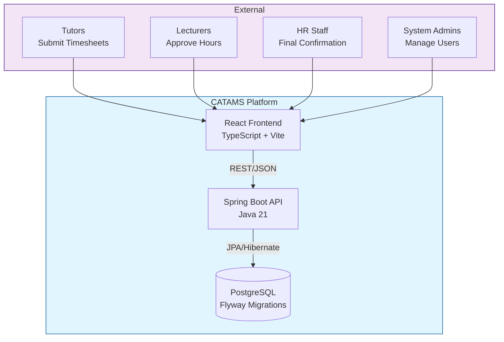
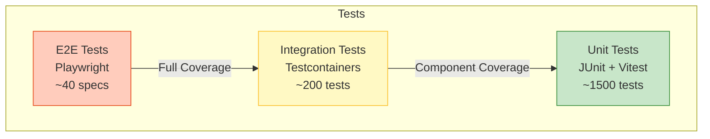

# CATAMS（简体中文）

> **Casual Academic Time Allocation Management System**

面向高校 Casual Academic 工时申报与审批的全栈系统，业务规则对齐 University of Sydney Enterprise Agreement 2023-2026。

[English](README.md) | [简体中文](README.zh-CN.md)

---

## 目录

- [项目概览](#项目概览)
- [系统架构](#系统架构)
- [本地开发](#本地开发)
- [测试](#测试)
- [最新 Playwright 验证（2026-03-19）](#latest-playwright-verification-2026-03-19-zh)
- [文档索引](#文档索引)
- [许可证](#许可证)

---

## 项目概览

CATAMS 提供以下核心能力：

- 工时单创建、编辑、提交与审批全流程（Tutor -> Lecturer -> HR/Admin）
- 基于 EA Schedule 1 的计费与工时计算
- Tutor / Lecturer / Admin 分角色仪表盘
- 全流程审计追踪与策略化规则管理

英文完整版说明请见 [README.md](README.md)。

---

## 系统架构

### High-Level Architecture (C4 Context)



---

## 本地开发

快速启动：

```bash
# 1) 安装前端依赖
npm --prefix frontend install

# 2) 启动后端（e2e-local, 8084）
./gradlew bootRun --args="--spring.profiles.active=e2e-local --server.port=8084"

# 3) 启动前端（e2e 模式, 5174）
npm --prefix frontend run dev:e2e
```

访问地址：`http://localhost:5174`

---

## 测试

### Test Pyramid



常用命令：

```bash
# 后端单元+集成
./gradlew cleanTest test

# 前端单测
npm --prefix frontend test -- --reporter=verbose

# E2E（项目脚本）
node scripts/e2e-runner.js --project=real

# PowerShell 单标签写法
node scripts/e2e-runner.js --project=real --grep "@p0"
```

---

<a id="latest-playwright-verification-2026-03-19-zh"></a>

## 最新 Playwright 验证（2026-03-19）

本次基于本地 `5174/8084` 栈完成了 Playwright 全量自动化验证，并对关键角色页面做了手工浏览器复核：

环境：
- 前端：`http://localhost:5174`
- 后端：`http://127.0.0.1:8084`
- 数据重置：`node scripts/e2e-reset-seed.js --url http://127.0.0.1:8084 --token local-e2e-reset`
- 账号：`admin@example.com`、`lecturer@example.com`、`tutor@example.com`
- 全量命令：`node scripts/e2e-runner.js --project=real`
- 结果文件：`frontend/playwright-report/results.json`、`frontend/playwright-report/junit.xml`

覆盖范围：
1. 未登录访问受保护路由重定向（`/dashboard`、`/admin/users` -> `/login`）
2. Tutor：四个标签页切换 + `Confirm` 动作
3. Lecturer：timesheet 创建与 lecturer 审批链路由全量 `real` 套件覆盖；仪表盘渲染额外人工复核
4. Admin：Pending Approvals 中 `Final Approve` 动作
5. Admin Users：新增用户 + Deactivate/Reactivate 状态切换

结论：
- PASS：2026 年 3 月 19 日执行 `real` 全量套件，`121` 个用例全部通过，`0 failed / 0 flaky / 0 skipped`。
- PASS：手工浏览器复核确认 `/login`、`/dashboard`（Tutor、Lecturer、Admin）与 `/admin/users` 无阻断级显示异常。
- 备注：套件中的 `400/401/409` 为负向合同测试和业务规则校验的预期响应。

截图证据：

| 登录页 | Tutor 仪表盘 |
|---|---|
|  |  |

| Lecturer 仪表盘 | Admin 仪表盘 |
|---|---|
|  |  |

| Admin 用户管理 |
|---|
|  |

---

## 文档索引

- 英文完整文档： [README.md](README.md)
- OpenAPI：`docs/openapi.yaml`
- 架构文档：`docs/architecture/overview.md`
- 测试文档：`docs/testing/README.md`

---

## 许可证

本项目为 University of Sydney 专有软件。

---

*最后更新：2026-03-19*
