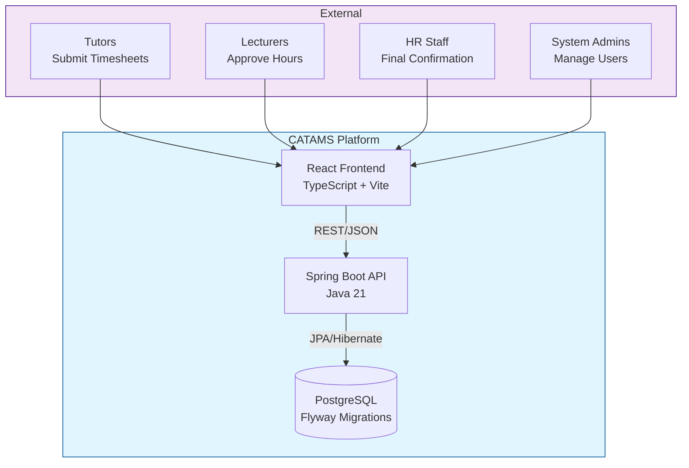
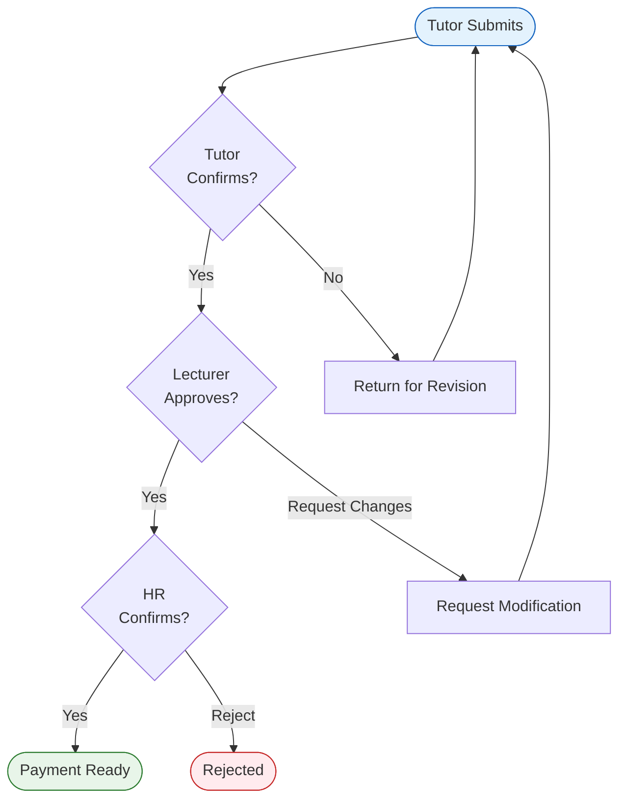

# CATAMS（中文归档入口）

> **Casual Academic Time Allocation Management System**

面向高校 Casual Academic 工时申报与审批的全栈系统，业务规则对齐 University of Sydney Enterprise Agreement 2023-2026。

[English](README.md) | [简体中文](README.zh-CN.md) | [中文 PDF 手册](docs/archive/archive-handbook.zh-CN.pdf)

> **Archive / Reference Project**
> - 仓库状态：冻结快照，面向作品展示、学习参考、复现实验与课程项目研究。
> - 当前基线：本地验证基于 `http://localhost:5174` + `http://127.0.0.1:8084`。
> - 不适用：直接作为个人原创本科毕业设计提交。
> - 许可边界：当前 [LICENSE](LICENSE) 仍是 University of Sydney 专有许可，公开可读不等于可自由复制、修改或再分发。
> - 推荐入口：[`docs/archive/START-HERE.zh-CN.md`](docs/archive/START-HERE.zh-CN.md)、[`docs/archive/RUN-LOCALLY.zh-CN.md`](docs/archive/RUN-LOCALLY.zh-CN.md)、[`docs/archive/archive-handbook.zh-CN.pdf`](docs/archive/archive-handbook.zh-CN.pdf)

---

## 目录

- [归档说明](#archive-notice)
- [项目简介](#project-overview)
- [这是什么 / 不是什么](#what-it-is)
- [3 分钟快速运行](#quick-run)
- [技术栈与系统架构](#architecture)
- [角色与核心流程](#roles-and-flows)
- [本地开发与测试](#local-dev-and-test)
- [常见踩坑](#common-pitfalls)
- [测试与验证证据](#verification)
- [文档导航](#docs-nav)
- [学习 / 改造建议](#adaptation)
- [归档与许可说明](#license-archive)

---

<a id="archive-notice"></a>

## 归档说明

这个仓库现在按“归档参考项目”维护，而不是按持续迭代中的产品仓库维护。

- 当前用途：学习系统设计、复现本地环境、参考 E2E / CI / 文档组织方式。
- 当前状态：`main` 是唯一保留分支，仓库准备进入 GitHub Archive 状态。
- 支持范围：仅覆盖当前文档记录的 `5174/8084` 本地基线与现有测试报告。
- 非目标：不提供“直接改个名字就能交差”的包装，也不把它描述成任何人的完整原创毕业设计材料。

如果你是第一次打开这个仓库，先读 [`docs/archive/START-HERE.zh-CN.md`](docs/archive/START-HERE.zh-CN.md)。如果你想离线转发完整材料，直接看 [`docs/archive/archive-handbook.zh-CN.pdf`](docs/archive/archive-handbook.zh-CN.pdf)。

---

<a id="project-overview"></a>

## 项目简介

CATAMS 的目标是把 Casual Academic 工时申报、计费计算和审批流程放到一个统一系统里，核心特点是“前端只收集教学事实，后端依据 EA Schedule 1 统一计算应付工时与金额”。

核心能力：

- 工时单创建、编辑、提交、确认、审批、最终确认全流程。
- Tutor / Lecturer / Admin 三类角色的差异化仪表盘。
- 基于 `Schedule1Calculator` 的统一计费逻辑与条款引用。
- 审批历史、状态迁移与管理员用户管理。
- Playwright 全量 E2E、前端单测、后端测试和本地 pre-push gate。

如果你需要英文展示版概览，请看 [README.md](README.md)。如果你需要更完整的中文离线材料，请看 [`docs/archive/archive-handbook.zh-CN.md`](docs/archive/archive-handbook.zh-CN.md)。

---

<a id="what-it-is"></a>

## 这是什么 / 不是什么

这是什么：

- 一个完成度较高的全栈课程项目 / 毕设作品快照。
- 一个可以本地跑通、带测试、带截图证据、带架构文档的参考仓库。
- 一个适合学习“角色权限 + 业务规则 + 端到端验证 + 文档归档”怎么组织的案例。

这不是什么：

- 不是可以直接当作你本人原创毕业设计提交的现成材料。
- 不是开源许可下的模板项目。
- 不是持续维护、持续发布新功能的产品仓库。

如果你只是想“先跑起来再慢慢看”，直接跳到 [3 分钟快速运行](#quick-run)。如果你想基于它诚实地重做一个自己的课题，先看 [`docs/archive/ADAPTATION-GUIDE.zh-CN.md`](docs/archive/ADAPTATION-GUIDE.zh-CN.md)。

---

<a id="quick-run"></a>

## 3 分钟快速运行

只想跑起来，看这三段：

1. 环境前置：Java 21、Node.js 20+、Docker Desktop。
2. 默认走最快路径：`docker compose up -d db api` + 前端 `5174`。
3. 执行 reset/seed，然后用种子账号登录。

```bash
# 1) 安装前端依赖
npm --prefix frontend install

# 2) 启动数据库和 API（最快路径）
docker compose up -d db api

# 3) 启动前端（e2e 模式, 5174）
npm --prefix frontend run dev:e2e

# 4) 重置并写入测试数据
node scripts/e2e-reset-seed.js --url http://127.0.0.1:8084 --token local-e2e-reset
```

如果你需要本地源码调试后端，再改走下面这条路径：

```bash
docker compose up -d db
./gradlew --no-configuration-cache bootRun --args="--spring.profiles.active=e2e-local --server.port=8084"
```

默认登录账号：

- `admin@example.com`
- `lecturer@example.com`
- `tutor@example.com`

推荐先访问：

- 登录页：`http://localhost:5174/login`
- Tutor / Lecturer / Admin 仪表盘：`/dashboard`
- 管理员用户管理：`/admin/users`

更详细的逐步说明见 [`docs/archive/RUN-LOCALLY.zh-CN.md`](docs/archive/RUN-LOCALLY.zh-CN.md)。

---

<a id="architecture"></a>

## 技术栈与系统架构

技术栈速览：

| 层 | 技术 | 说明 |
|---|---|---|
| 前端 | React 19, TypeScript, Vite | 角色化仪表盘与表单交互 |
| 后端 | Java 21, Spring Boot 3.x | REST API、认证、审批与业务编排 |
| 规则计算 | Schedule1Calculator + PolicyProvider | EA Schedule 1 计费与规则解析 |
| 数据层 | PostgreSQL, Flyway | 业务数据与政策表 |
| 测试 | JUnit, Vitest, Playwright | 后端、前端、E2E 分层验证 |
| 交付 | GitHub Actions, 本地 hooks | CI 与本地 gate 对齐 |

### High-Level Architecture (C4 Context)



架构解读：

- 前端负责采集教学事实和展示状态，不自行计算金额。
- 后端在 quote、create、update 路径上都会重新计算财务字段。
- 数据库存储 timesheet、approval，以及政策版本、rate code、rate amount 等规则表。
- 关键设计重点不是“技术栈新”，而是“业务规则单点收口 + 全链路可验证”。

更完整的结构说明见 [`docs/architecture/overview.md`](docs/architecture/overview.md)。

---

<a id="roles-and-flows"></a>

## 角色与核心流程

角色视角：

- `Tutor`：创建和确认自己的 timesheet。
- `Lecturer`：查看课程相关待审批项并做 lecturer 级审批。
- `Admin`：做最终审批、查看总览、管理用户状态。

### Approval Workflow



建议你在本地按这个顺序看页面：

1. `/login` 看登录与受保护路由重定向。
2. Tutor 仪表盘看列表标签切换和确认动作。
3. Lecturer 仪表盘看 Create Timesheet 和 Pending Approvals。
4. Admin 仪表盘看 Overview / Pending Approvals。
5. `/admin/users` 看用户创建和激活状态切换。

---

<a id="local-dev-and-test"></a>

## 本地开发与测试

最小成功闭环：

1. 启动数据库和 API：`docker compose up -d db api`
2. 启动前端：`5174`
3. reset/seed 数据
4. 登录种子账号
5. 打开 `/dashboard`
6. 执行一条 E2E 命令

常用命令：

```bash
# 后端单元 + 集成
./gradlew cleanTest test

# 前端单测
npm --prefix frontend test -- --reporter=verbose

# E2E 全量
node scripts/e2e-runner.js --project=real

# PowerShell 安全写法
node scripts/e2e-runner.js --project=real --grep "@p0"

# 生成中文 PDF 手册
npm run docs:archive:pdf
```

当前文档默认的本地测试基线：

- 前端：`http://localhost:5174`
- 后端：`http://127.0.0.1:8084`
- Docker PostgreSQL 端口：`localhost:55433`
- 数据重置：`node scripts/e2e-reset-seed.js --url http://127.0.0.1:8084 --token local-e2e-reset`

详细运行步骤见 [`docs/archive/RUN-LOCALLY.zh-CN.md`](docs/archive/RUN-LOCALLY.zh-CN.md)，测试细节见 [`docs/testing/README.md`](docs/testing/README.md)。

---

<a id="common-pitfalls"></a>

## 常见踩坑

- 端口漂移：本仓库现在所有 E2E 与文档都按 `8084` 后端基线编写，不再按 `8080`。
- 数据库端口：仓库默认已经按 `55433:5432` 对齐；如果你本机改过 datasource 环境变量，记得确认没有把它重新指回旧端口。
- Docker 未启动：默认快速路径依赖 `docker compose up -d db api`，没有 Docker 时本地基线通常直接起不来。
- 没做 reset/seed：很多角色链路依赖种子数据，不先 reset/seed 容易误判页面空态。
- PowerShell `--grep`：带标签筛选时要写成 `--grep "@p0"`，不要省略引号。
- Playwright 浏览器未安装：执行 `npm --prefix frontend exec playwright install chromium`。
- 负向合同测试误读：套件中的 `400 / 401 / 409` 并不自动等于失败，有些是预期的规则校验。
- 历史过程文档混淆：`docs/archive/2025-11/` 和 `docs/archive/2026-03/process-reports/` 是历史记录，不是当前上手入口。

---

<a id="verification"></a>

## 测试与验证证据

### 最新 Playwright 验证（2026-03-19）

本次基于本地 `5174/8084` 栈完成了 Playwright 全量自动化验证，并对关键角色页面做了手工浏览器复核。

环境：

- 前端：`http://localhost:5174`
- 后端：`http://127.0.0.1:8084`
- 数据重置：`node scripts/e2e-reset-seed.js --url http://127.0.0.1:8084 --token local-e2e-reset`
- 账号：`admin@example.com`、`lecturer@example.com`、`tutor@example.com`
- 全量命令：`node scripts/e2e-runner.js --project=real`
- 结果文件：`frontend/playwright-report/results.json`、`frontend/playwright-report/junit.xml`

覆盖范围：

1. 未登录访问受保护路由重定向：`/dashboard`、`/admin/users` 会回到 `/login`
2. Tutor：四个标签切换和 `Confirm` 动作成功
3. Lecturer：timesheet 创建与 lecturer 审批链路由 `real` 套件覆盖，仪表盘渲染额外人工复核
4. Admin：`Pending Approvals` 中最终审批成功
5. Admin Users：新增用户以及 `Deactivate / Reactivate` 状态切换成功

结论：

- PASS：2026 年 3 月 19 日执行 `real` 全量套件，`121` 个用例全部通过，`0 failed / 0 flaky / 0 skipped`
- PASS：手工浏览器复核确认 `/login`、`/dashboard`（Tutor、Lecturer、Admin）与 `/admin/users` 无阻断级显示异常
- 备注：套件中的 `400 / 401 / 409` 为负向合同测试和业务规则校验的预期响应

截图证据：

| 登录页 | Tutor 仪表盘 |
|---|---|
|  |  |

| Lecturer 仪表盘 | Admin 仪表盘 |
|---|---|
|  |  |

| Admin 用户管理 |
|---|
|  |

更适合离线分发的版本见 [`docs/archive/archive-handbook.zh-CN.pdf`](docs/archive/archive-handbook.zh-CN.pdf)。

---

<a id="docs-nav"></a>

## 文档导航

推荐阅读顺序：

1. [`README.zh-CN.md`](README.zh-CN.md)：中文总入口
2. [`docs/archive/START-HERE.zh-CN.md`](docs/archive/START-HERE.zh-CN.md)：新读者入口
3. [`docs/archive/RUN-LOCALLY.zh-CN.md`](docs/archive/RUN-LOCALLY.zh-CN.md)：从克隆到跑通
4. [`docs/product/user-guide.md`](docs/product/user-guide.md)：角色使用说明
5. [`docs/testing/README.md`](docs/testing/README.md)：测试与报告
6. [`docs/architecture/overview.md`](docs/architecture/overview.md)：系统架构
7. [`docs/archive/ARCHIVE-NOTICE.zh-CN.md`](docs/archive/ARCHIVE-NOTICE.zh-CN.md)：归档和许可边界

当前有效文档：

| 文档 | 用途 |
|---|---|
| [`docs/index.md`](docs/index.md) | 文档中心与 SSOT 导航 |
| [`docs/archive/archive-handbook.zh-CN.md`](docs/archive/archive-handbook.zh-CN.md) | 中文手册源文件 |
| [`docs/archive/archive-handbook.zh-CN.pdf`](docs/archive/archive-handbook.zh-CN.pdf) | 中文离线交付版 |
| [`docs/archive/ADAPTATION-GUIDE.zh-CN.md`](docs/archive/ADAPTATION-GUIDE.zh-CN.md) | 诚实改造与引用建议 |

历史过程记录：

- `docs/archive/2025-11/`
- `docs/archive/2026-03/process-reports/`

这些目录保留过程证据，但不建议作为第一次阅读入口。

---

<a id="adaptation"></a>

## 学习 / 改造建议

如果你想把它当学习案例：

- 先理解角色流转和 `Schedule1Calculator` 为什么要收口到后端。
- 再看 E2E、pre-push 和文档如何围绕“单一基线”组织。
- 最后再决定你要复用的是“架构思路”，还是“测试与交付方法”。

如果你想基于这个项目做诚实改造：

- 先读 [`docs/archive/ADAPTATION-GUIDE.zh-CN.md`](docs/archive/ADAPTATION-GUIDE.zh-CN.md)。
- 改题目、改命名、改业务背景、改截图、改说明，而不是只改封面。
- 保留原仓库引用与致谢。
- 在未确认许可之前，不要直接复制代码、截图和文档去再分发或交作业。

---

<a id="license-archive"></a>

## 归档与许可说明

- 仓库准备作为“毕业设计作品归档快照”保留。
- 当前 `LICENSE` 保持不变：University of Sydney 专有许可。
- 对外公开仓库不意味着自动获得复制、修改、商用或再分发权利。
- 想了解更明确的边界，请看 [`docs/archive/ARCHIVE-NOTICE.zh-CN.md`](docs/archive/ARCHIVE-NOTICE.zh-CN.md)。
- 想离线分享完整说明材料，请直接使用 [`docs/archive/archive-handbook.zh-CN.pdf`](docs/archive/archive-handbook.zh-CN.pdf)。

---

*最后更新：2026-03-23*
