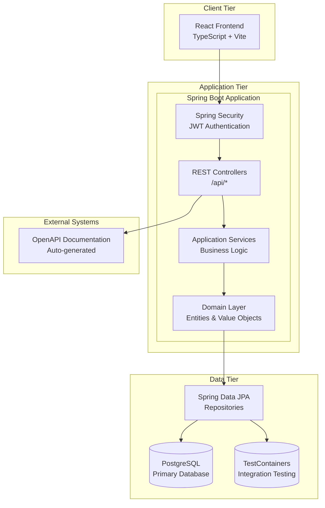
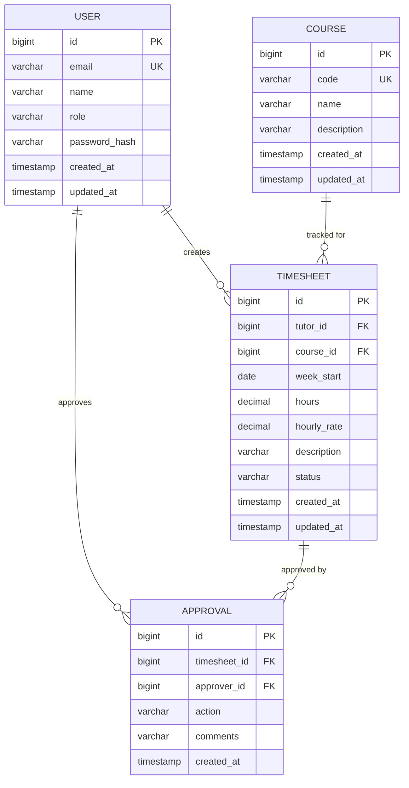
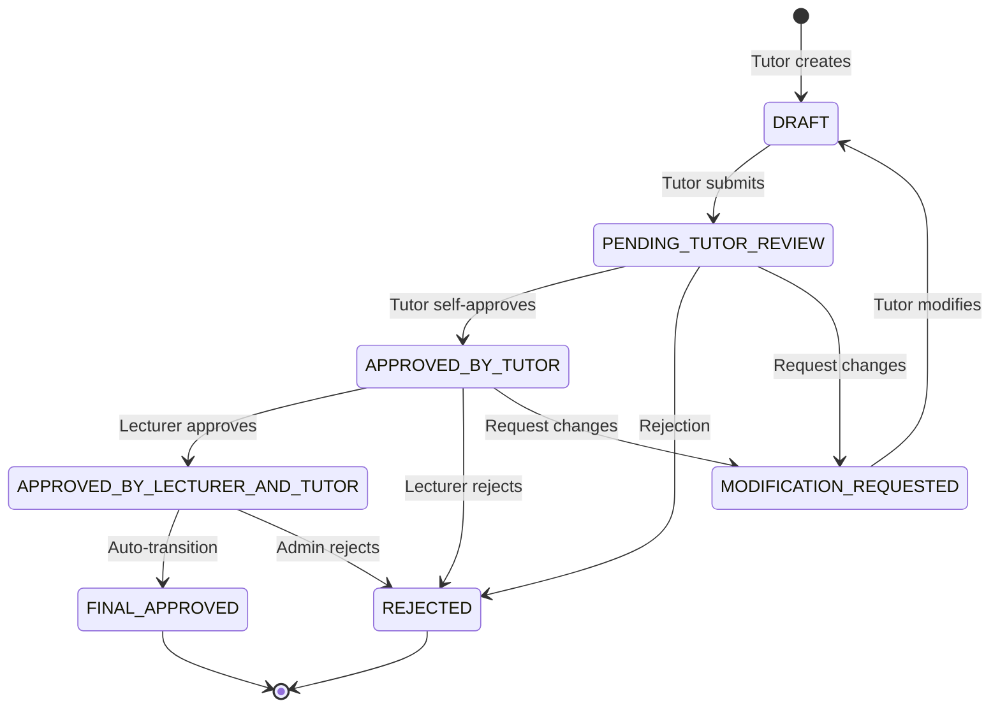
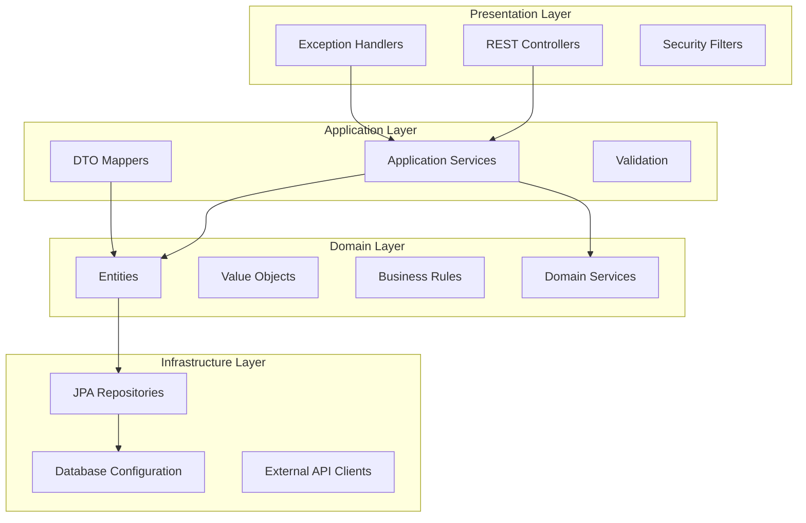
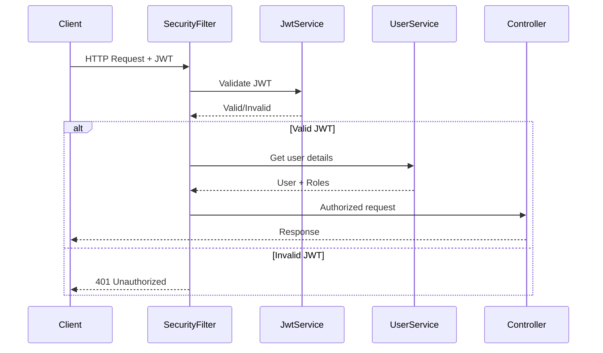
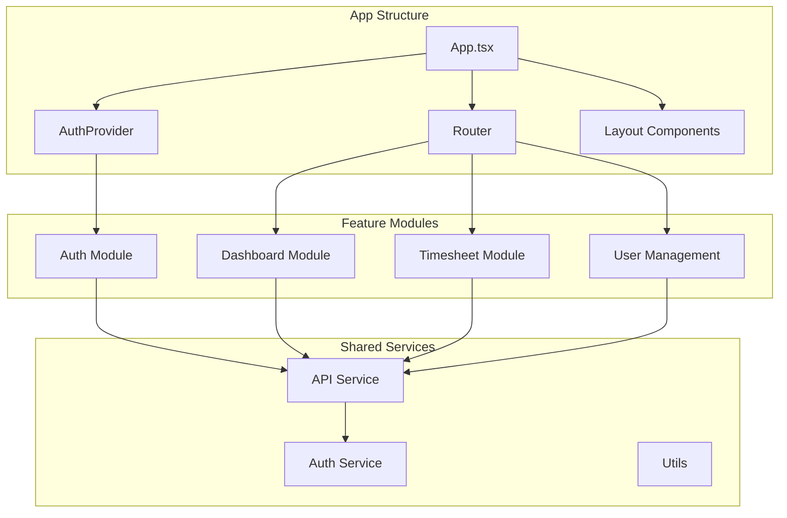
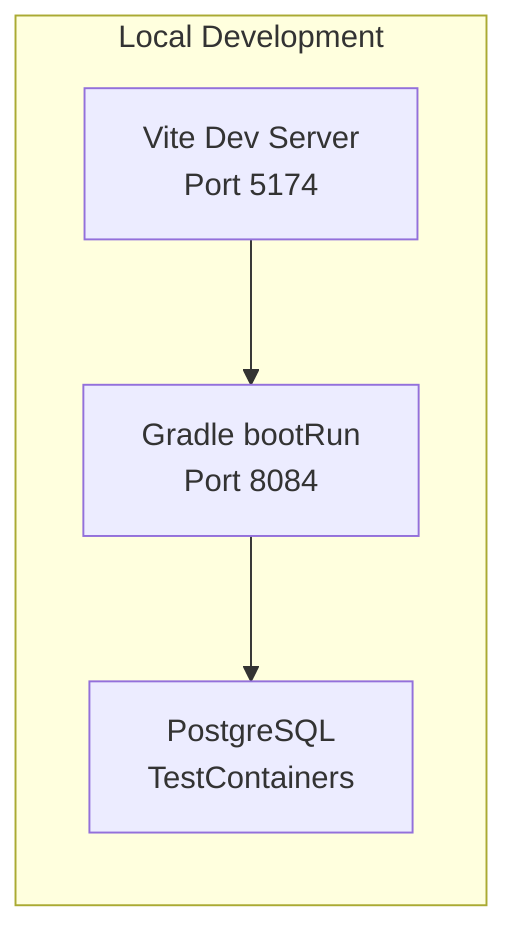
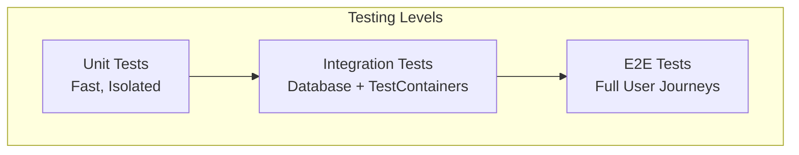

# CATAMS Architecture Documentation

## System Overview

CATAMS (Casual Academic Time Allocation Management System) is a comprehensive web application for managing academic timesheet workflows across multiple user roles (ADMIN, LECTURER, TUTOR). The system follows Domain-Driven Design principles with a Spring Boot monolith backend and React frontend.

## High-Level Architecture



## Technology Stack (Actual)

| Layer | Technology | Version | Purpose |
|-------|------------|---------|---------|
| **Language** | Java | 21 (LTS) | Backend development with modern language features |
| **Build System** | Gradle | 8.7 | Dependency management and build automation |
| **Framework** | Spring Boot | 3.2.0 | Core application framework |
| **Security** | Spring Security | 3.2.x | JWT authentication and authorization |
| **Data Access** | Spring Data JPA | 3.2.x | ORM and repository pattern |
| **Database** | PostgreSQL | 13+ | Primary database |
| **Frontend Framework** | React | 18+ | User interface |
| **Frontend Language** | TypeScript | 5.x | Type-safe frontend development |
| **Build Tool (Frontend)** | Vite | 5.x | Fast development and build |
| **Testing (Backend)** | JUnit 5 | 5.x | Unit and integration testing |
| **Testing (Database)** | TestContainers | 1.x | Integration testing with real databases |
| **Testing (Frontend)** | Vitest | 1.x | Unit testing |
| **Testing (E2E)** | Playwright | 1.x | End-to-end testing |
| **Documentation** | OpenAPI | 3.x | API documentation generation |

## Domain Model

### Core Entities



### Business Logic Flow



## Application Architecture

### Package Structure

```
src/main/java/com/usyd/catams/
├── controller/          # REST API endpoints
├── application/         # Application services (business logic)
├── domain/             # Domain entities, value objects, enums
├── infrastructure/     # External concerns (repositories, config)
├── security/           # Security configuration and filters
├── exception/          # Global exception handling
└── config/            # Application configuration
```

### Layered Architecture



## Security Architecture

### Authentication & Authorization



### Role-Based Access Control

| Role | Permissions |
|------|-------------|
| **TUTOR** | Create/edit own timesheets, view own data, self-approve |
| **LECTURER** | View/approve timesheets for assigned courses, lecturer-level approvals |
| **ADMIN** | Full system access, user management, final approvals, system configuration |

## Data Architecture

### Database Schema Strategy

- **Single Database**: PostgreSQL for all persistent data
- **JPA/Hibernate**: ORM with entity relationships
- **Migration Strategy**: Flyway for schema versioning
- **Connection Pooling**: HikariCP for performance
- **Testing**: TestContainers for integration tests

### Performance Considerations

- **Indexing**: Primary keys, foreign keys, and query-optimized indexes
- **Connection Management**: Connection pooling with appropriate sizing
- **Transaction Management**: Declarative transactions with proper isolation
- **Caching**: JPA second-level cache where appropriate

## API Architecture

### REST API Design

- **Base Path**: `/api/v1/`
- **Authentication**: Bearer token (JWT)
- **Content Type**: `application/json`
- **Error Handling**: Standardized error responses
- **Documentation**: Auto-generated OpenAPI specs

### API Endpoints Structure

```
/api/v1/
├── /auth              # Authentication endpoints
├── /users             # User management
├── /timesheets        # Timesheet CRUD operations
├── /approvals         # Approval workflow
├── /dashboard         # Dashboard data
└── /courses           # Course management
```

## Frontend Architecture

### Component Architecture



### State Management

- **Authentication State**: React Context
- **Form State**: Local component state
- **Server State**: React Query/SWR pattern
- **Global UI State**: Context/useReducer pattern

## Deployment Architecture

### Development Environment



### Production Considerations

- **Containerization**: Docker for consistent deployment
- **Environment Configuration**: Profile-based configuration
- **Health Checks**: Spring Boot Actuator endpoints
- **Monitoring**: Application metrics and logging
- **Security**: HTTPS, secure headers, input validation

## Testing Strategy

### Test Pyramid



### Test Infrastructure

- **Backend Unit**: JUnit 5 + Mockito
- **Backend Integration**: Spring Boot Test + TestContainers
- **Frontend Unit**: Vitest + Testing Library
- **E2E**: Playwright (multi-browser)
- **Test Orchestration**: Node.js scripts for cross-platform execution

## Configuration Management

### Application Profiles

| Profile | Purpose | Database | Security |
|---------|---------|----------|----------|
| `default` | Development | H2/PostgreSQL | Relaxed |
| `integration-test` | Testing | TestContainers | Test config |
| `production` | Production | PostgreSQL | Full security |

### Environment Variables

```properties
# Database
DB_URL=jdbc:postgresql://localhost:5432/catams
DB_USERNAME=catams_user
DB_PASSWORD=${DB_PASSWORD}

# JWT
JWT_SECRET=${JWT_SECRET}
JWT_EXPIRATION=86400

# Application
SERVER_PORT=8084
FRONTEND_URL=http://localhost:5174
```

## Monitoring & Observability

### Application Metrics

- **Spring Boot Actuator**: Health, metrics, info endpoints
- **Custom Metrics**: Business logic metrics
- **Database Monitoring**: Connection pool, query performance
- **Security Monitoring**: Authentication events, authorization failures

### Logging Strategy

```json
{
  "timestamp": "2025-08-12T12:00:00Z",
  "level": "INFO",
  "logger": "com.usyd.catams.application.TimesheetApplicationService",
  "message": "Timesheet created",
  "mdc": {
    "userId": "123",
    "timesheetId": "456",
    "traceId": "abc123"
  }
}
```

## Security Considerations

### Security Measures

- **Authentication**: JWT with secure signing
- **Authorization**: Role-based access control
- **Data Protection**: Password hashing (BCrypt)
- **Transport Security**: HTTPS enforcement
- **Input Validation**: Server-side validation
- **CSRF Protection**: Spring Security CSRF tokens
- **XSS Protection**: Content Security Policy headers

### Security Testing

- **Authentication Tests**: JWT validation, session management
- **Authorization Tests**: Role-based access verification
- **Input Validation Tests**: SQL injection, XSS prevention
- **Security Headers Tests**: HTTPS, CSP, HSTS validation

## Performance Characteristics

### Measured Performance

- **Test Suite**: 993 tests total
- **Unit Tests**: ~33 seconds execution
- **Integration Tests**: ~3 minutes with TestContainers
- **Build Time**: < 5 minutes full build
- **Memory Usage**: JVM tuned for development (~2GB max)

### Scalability Considerations

- **Database Connection Pooling**: HikariCP optimization
- **JPA Performance**: Lazy loading, query optimization
- **Frontend Bundling**: Vite optimization
- **Test Parallelization**: Multi-threaded test execution

---

**Document Version**: 2.0  
**Last Updated**: 2025-08-12  
**Maintainers**: Development Team  
**Related Documents**: [README.md](../README.md), [Tech Stack](tech-stack.md), [API Documentation](../openapi.yaml)