# CATAMS System Architecture Whitepaper

**Casual Academic Time Allocation Management System - Core Architecture Design**

---

## Abstract

This whitepaper outlines the system design of the CATAMS project through three core architectural diagrams, providing a multi-dimensional view from macro to micro. The design strictly adheres to Domain-Driven Design (DDD) principles and is founded on a "microservices-ready" modular monolith, ensuring project deliverability, high quality, and future evolvability.

---

## 1. Macro Blueprint: System Layered Architecture Overview

**Design Annotation:**

This diagram illustrates the classic Layered Architecture of CATAMS, guided by DDD principles. We have enforced a strict separation of concerns: the Frontend Layer handles user interaction; the API Layer acts as an Anti-Corruption Layer, managing security, routing, and DTO transformation; the Application Service Layer orchestrates business workflows and transactions; and all core, immutable business rules and invariants are encapsulated within the central Domain Layer. This clear separation is fundamental to achieving high cohesion, low coupling, and enabling a smooth future evolution towards microservices.

```mermaid
graph TD
    %% User Layer
    U["👥 Users<br/>(Tutor / Lecturer / Admin)"] --> FE["🌐 Frontend Layer<br/>(React + TypeScript)"]
    
    %% Frontend Components
    FE --> AUTH["🔐 Authentication<br/>(AuthContext, ProtectedRoute)"]
    FE --> DASH["📊 Dashboards<br/>(Role-based: Tutor/Lecturer/Admin)"]
    FE --> COMP["🧩 Components<br/>(ErrorBoundary, LoginPage)"]
    
    %% Frontend to Backend API
    FE --> API["🚀 Backend API<br/>(Spring Boot Monolith)"]
    
    %% API Gateway & Security Layer
    API --> SEC["🛡️ Security Layer<br/>(JWT + Spring Security)"]
    API --> FILTER["🔍 Request Processing<br/>(GlobalExceptionHandler)"]
    
    %% Controller Layer
    SEC --> CTRL["🎯 Controller Layer"]
    CTRL --> TCTRL["TimesheetController<br/>(/api/timesheets)"]
    CTRL --> ACTRL["ApprovalController<br/>(/api/confirmations)"]
    CTRL --> UCTRL["UserController<br/>(/api/users)"]
    
    %% Application Service Layer
    TCTRL --> TAPP["📋 Application Services"]
    ACTRL --> TAPP
    TAPP --> TAS["TimesheetApplicationService<br/>(Business Orchestration)"]
    TAPP --> AAS["ApprovalApplicationService<br/>(Workflow Management)"]
    
    %% Mapping Layer
    TAS --> MAP["🔄 Mapping Layer<br/>(DTO ↔ Entity)"]
    MAP --> TMAP["TimesheetMapper"]
    MAP --> AMAP["ApprovalMapper"]
    
    %% Domain Layer
    TAS --> DOM["🏛️ Domain Layer<br/>(DDD Core)"]
    AAS --> DOM
    DOM --> ENT["📦 Entities & Aggregates"]
    DOM --> VO["💎 Value Objects"]
    DOM --> DS["⚙️ Domain Services"]
    
    %% Specific Domain Objects
    ENT --> TS["Timesheet (Aggregate Root)"]
    ENT --> USER["User"]
    ENT --> COURSE["Course"]
    ENT --> APPROVAL["Approval"]
    
    VO --> WP["WeekPeriod"]
    VO --> MONEY["Money"]
    
    DS --> TDS["TimesheetDomainService"]
    DS --> ADS["ApprovalDomainService"]
    DS --> VST["ValidationService"]
    DS --> ASM["ApprovalStateMachine"]
    
    %% Data Access Layer
    DOM --> REPO["🗄️ Repository Layer<br/>(Spring Data JPA)"]
    REPO --> TREPO["TimesheetRepository"]
    REPO --> UREPO["UserRepository"]
    REPO --> CREPO["CourseRepository"]
    
    %% Database
    REPO --> DB["🐘 PostgreSQL Database<br/>(Production + Testcontainers for IT)"]
    
    %% Configuration & Policy
    TAS --> POL["📜 Policy Layer"]
    POL --> TPOL["TimesheetPermissionPolicy"]
    POL --> AUTHFAC["AuthenticationFacade"]
    
    %% Styling
    classDef userLayer fill:#e1f5fe
    classDef frontendLayer fill:#f3e5f5
    classDef apiLayer fill:#e8f5e8
    classDef domainLayer fill:#fff3e0
    classDef dataLayer fill:#fce4ec
    
    class U userLayer
    class FE,AUTH,DASH,COMP frontendLayer
    class API,SEC,FILTER,CTRL,TCTRL,ACTRL,UCTRL,TAPP,TAS,AAS,MAP,TMAP,AMAP apiLayer
    class DOM,ENT,VO,DS,TS,USER,COURSE,APPROVAL,WP,MONEY,TDS,ADS,VST,ASM,POL,TPOL,AUTHFAC domainLayer
    class REPO,TREPO,UREPO,CREPO,DB dataLayer
```

### Architecture Layer Analysis

| Layer | Responsibilities | Key Components | Design Principles |
|-------|-----------------|----------------|-------------------|
| **User Layer** | Role-based access and interaction | Tutor, Lecturer, Admin personas | Clean separation of user concerns |
| **Frontend Layer** | React SPA with TypeScript | Authentication, Dashboards, Error Boundaries | Component-based architecture |
| **API Layer** | RESTful endpoints, security, validation | Controllers, Security, Exception Handling | Anti-corruption layer pattern |
| **Application Service Layer** | Business process orchestration | TimesheetApplicationService, ApprovalApplicationService | Transaction boundaries |
| **Domain Layer** | Core business logic and rules | Aggregates, Value Objects, Domain Services | DDD tactical patterns |
| **Data Access Layer** | Persistence abstraction | Spring Data JPA Repositories | Repository pattern |
| **Database Layer** | Data storage and integrity | PostgreSQL with Testcontainers | ACID compliance |

---

## 2. Process Blueprint: Core Approval Sequence Diagram

**Design Annotation:**

This diagram details the most critical business process in CATAMS: the timesheet approval workflow. It clearly illustrates how a user action initiates a request that flows through our layered architecture. Note that all business rule decisions (like state transitions) are made exclusively by the Domain Layer, while the Application Service Layer is responsible only for orchestration. This enforces a Single Source of Truth (SSOT) for our business logic, significantly enhancing system robustness and maintainability.

```mermaid
sequenceDiagram
    participant L as 👩‍🏫 Lecturer
    participant FE as 🌐 Frontend
    participant API as 🚀 Backend API
    participant TC as 🎯 TimesheetController
    participant TAS as 📋 TimesheetApplicationService
    participant POL as 📜 PermissionPolicy
    participant DOM as 🏛️ Domain Layer<br/>(Timesheet + ApprovalStateMachine)
    participant REPO as 🗄️ Repository
    participant DB as 🐘 PostgreSQL
    
    %% Phase 1: Timesheet Creation
    Note over L,DB: 📝 Phase 1: Timesheet Creation
    L->>FE: Fills out timesheet information
    FE->>API: POST /api/timesheets<br/>{tutorId, courseId, weekStartDate, hours, hourlyRate, description}
    API->>TC: createTimesheet()
    TC->>TAS: createTimesheet(params, creatorId)
    TAS->>POL: canCreateTimesheetFor(lecturer, tutor, course)
    POL-->>TAS: ✅ Authorized
    TAS->>DOM: new Timesheet() + validateBusinessRules()
    DOM-->>TAS: Timesheet(status=DRAFT)
    TAS->>REPO: save(timesheet)
    REPO->>DB: INSERT timesheet
    DB-->>REPO: success
    REPO-->>TAS: Timesheet(id=123)
    TAS-->>TC: TimesheetEntity
    TC-->>API: 201 Created
    API-->>FE: TimesheetResponse(status=DRAFT)
    
    %% Phase 2: Submit for Approval
    Note over L,DB: 🚀 Phase 2: Submit for Approval
    L->>FE: Clicks "Submit for Approval"
    FE->>API: POST /api/confirmations<br/>{timesheetId=123, action=SUBMIT_FOR_APPROVAL}
    API->>+TC: ApprovalController.performConfirmationAction()
    TC->>AAS: ApprovalApplicationService.performApprovalAction()
    AAS->>DOM: timesheet.submitForApproval(lecturerId)
    DOM->>DOM: ApprovalStateMachine.validateTransition(DRAFT → PENDING_TUTOR_CONFIRMATION)
    DOM->>DOM: addApproval(lecturerId, SUBMIT_FOR_APPROVAL, DRAFT, PENDING_TUTOR_CONFIRMATION)
    DOM-->>AAS: Approval + Timesheet(status=PENDING_TUTOR_CONFIRMATION)
    AAS->>REPO: save(timesheet)
    REPO->>DB: UPDATE timesheet SET status='PENDING_TUTOR_CONFIRMATION'
    DB-->>REPO: success
    REPO-->>AAS: saved
    AAS-->>TC: Approval
    TC-->>API: 200 OK
    API-->>FE: ApprovalActionResponse(status=PENDING_TUTOR_CONFIRMATION)
    
    %% Phase 3: Tutor Confirmation
    Note over L,DB: ✅ Phase 3: Tutor Confirmation
    participant T as 👨‍🎓 Tutor
    T->>FE: Views pending timesheets
    FE->>API: GET /api/timesheets/pending-approval
    API-->>FE: PagedTimesheetResponse(items with PENDING_TUTOR_CONFIRMATION)
    T->>FE: Clicks "Confirm" button
    FE->>API: POST /api/confirmations<br/>{timesheetId=123, action=TUTOR_CONFIRM, comment="Confirmed accurate hours"}
    API->>TC: ApprovalController.performConfirmationAction()
    TC->>AAS: performApprovalAction(123, TUTOR_CONFIRM, comment, tutorId)
    AAS->>DOM: timesheet.confirmByTutor(tutorId, comment)
    DOM->>DOM: ApprovalStateMachine.getNextStatus(PENDING_TUTOR_CONFIRMATION, TUTOR_CONFIRM)
    DOM->>DOM: addApproval(tutorId, TUTOR_CONFIRM, PENDING_TUTOR_CONFIRMATION, TUTOR_CONFIRMED)
    DOM-->>AAS: Approval + Timesheet(status=TUTOR_CONFIRMED)
    AAS->>REPO: save(timesheet)
    REPO->>DB: UPDATE timesheet SET status='TUTOR_CONFIRMED'
    DB-->>REPO: success
    AAS-->>TC: Approval
    TC-->>API: 200 OK
    API-->>FE: ApprovalActionResponse(status=TUTOR_CONFIRMED)
    
    %% Phase 4: Lecturer Confirmation
    Note over L,DB: 🎯 Phase 4: Lecturer Confirmation
    L->>FE: Views queue for final confirmation
    FE->>API: GET /api/timesheets/pending-final-approval
    API-->>FE: Returns timesheets with TUTOR_CONFIRMED status
    L->>FE: Clicks "Lecturer Confirm"
    FE->>API: POST /api/confirmations<br/>{timesheetId=123, action=LECTURER_CONFIRM, comment="Approved for payroll"}
    API->>TC: ApprovalController.performConfirmationAction()
    TC->>AAS: performApprovalAction(123, LECTURER_CONFIRM, comment, lecturerId)
    AAS->>DOM: timesheet.confirmByLecturer(lecturerId, comment)
    DOM->>DOM: ApprovalStateMachine.validateTransition(TUTOR_CONFIRMED → LECTURER_CONFIRMED)
    DOM->>DOM: addApproval(lecturerId, LECTURER_CONFIRM, TUTOR_CONFIRMED, LECTURER_CONFIRMED)
    DOM-->>AAS: Approval + Timesheet(status=LECTURER_CONFIRMED)
    AAS->>REPO: save(timesheet)
    REPO->>DB: UPDATE timesheet SET status='LECTURER_CONFIRMED'
    DB-->>REPO: success
    AAS-->>TC: Approval
    TC-->>API: 200 OK
    API-->>FE: ApprovalActionResponse(status=LECTURER_CONFIRMED)
    
    %% Phase 5: HR Final Confirmation
    Note over L,DB: 🏁 Phase 5: HR Final Confirmation
    participant A as 👩‍💼 Admin/HR
    A->>FE: Views HR confirmation queue
    FE->>API: GET /api/timesheets?status=LECTURER_CONFIRMED
    API-->>FE: Returns timesheets with LECTURER_CONFIRMED status
    A->>FE: Clicks "HR Final Confirm"
    FE->>API: POST /api/confirmations<br/>{timesheetId=123, action=HR_CONFIRM, comment="Final approval for payroll processing"}
    API->>TC: ApprovalController.performConfirmationAction()
    TC->>AAS: performApprovalAction(123, HR_CONFIRM, comment, adminId)
    AAS->>DOM: timesheet.confirmByHR(adminId, comment)
    DOM->>DOM: ApprovalStateMachine.validateTransition(LECTURER_CONFIRMED → FINAL_CONFIRMED)
    DOM->>DOM: addApproval(adminId, HR_CONFIRM, LECTURER_CONFIRMED, FINAL_CONFIRMED)
    DOM-->>AAS: Approval + Timesheet(status=FINAL_CONFIRMED)
    AAS->>REPO: save(timesheet)
    REPO->>DB: UPDATE timesheet SET status='FINAL_CONFIRMED'
    DB-->>REPO: success
    AAS-->>TC: Approval
    TC-->>API: 200 OK
    API-->>FE: ApprovalActionResponse(status=FINAL_CONFIRMED)
    
    Note over L,DB: 🎉 Timesheet Ready for Payroll Processing
```

### Workflow State Transition Table

| From Status | Action | To Status | Authorized Roles | Business Rules |
|-------------|--------|-----------|------------------|----------------|
| `DRAFT` | `SUBMIT_FOR_APPROVAL` | `PENDING_TUTOR_CONFIRMATION` | LECTURER, TUTOR | Must pass validation rules |
| `PENDING_TUTOR_CONFIRMATION` | `TUTOR_CONFIRM` | `TUTOR_CONFIRMED` | TUTOR | Comment optional |
| `PENDING_TUTOR_CONFIRMATION` | `REJECT` | `REJECTED` | LECTURER, ADMIN | Comment required |
| `PENDING_TUTOR_CONFIRMATION` | `REQUEST_MODIFICATION` | `MODIFICATION_REQUESTED` | LECTURER, ADMIN | Comment required |
| `TUTOR_CONFIRMED` | `LECTURER_CONFIRM` | `LECTURER_CONFIRMED` | LECTURER | Comment optional |
| `TUTOR_CONFIRMED` | `REJECT` | `REJECTED` | LECTURER, ADMIN | Comment required |
| `TUTOR_CONFIRMED` | `REQUEST_MODIFICATION` | `MODIFICATION_REQUESTED` | LECTURER, ADMIN | Comment required |
| `LECTURER_CONFIRMED` | `HR_CONFIRM` | `FINAL_CONFIRMED` | ADMIN | Comment optional |
| `LECTURER_CONFIRMED` | `REJECT` | `REJECTED` | ADMIN | Comment required |
| `LECTURER_CONFIRMED` | `REQUEST_MODIFICATION` | `MODIFICATION_REQUESTED` | ADMIN | Comment required |
| `MODIFICATION_REQUESTED` | `SUBMIT_FOR_APPROVAL` | `PENDING_TUTOR_CONFIRMATION` | LECTURER, TUTOR | After corrections |

---

## 3. Micro Blueprint: Domain Model Class Diagram

**Design Annotation:**

This diagram provides a detailed view into the heart of our system, showcasing the core domain objects. Timesheet is designed as an Aggregate Root, which owns and manages its internal list of Approval entities, ensuring the strong consistency of its business invariants. We make extensive use of Value Objects like WeekPeriod and Money to encapsulate concepts that have business logic but no unique identity. This design makes the code more expressive and significantly improves the system's robustness.

### Domain Object Analysis Table

| Type | Object | Purpose | Key Invariants |
|------|--------|---------|----------------|
| **Aggregate Root** | `Timesheet` | Core business entity managing timesheet lifecycle | Week starts on Monday, positive hours/rates, status consistency |
| **Value Object** | `WeekPeriod` | Encapsulates work week concept | Always Monday-Sunday, immutable, rich behavior |
| **Value Object** | `Money` | Represents monetary amounts | Non-negative amounts, currency consistency, precision |
| **Entity** | `Approval` | Records approval history | Non-null approver, valid status transitions, timestamped |
| **Enumeration** | `ApprovalStatus` | Defines workflow states | 7 states, explicit transition rules, terminal states |
| **Enumeration** | `ApprovalAction` | Defines user operations | 6 actions, role-based authorization, state-dependent |
| **Enumeration** | `CurrencyCode` | Supported currencies | AUD primary, extensible, symbol mapping |
| **Domain Service** | `ApprovalStateMachine` | Centralized state logic | Single source of truth, exhaustive transitions |
| **Domain Service** | `TimesheetValidationService` | Business rule validation | SSOT for thresholds, configurable limits |

---

## Implementation Roadmap

### Phase 1: Foundation (Completed)

- [x] Domain Model Implementation
- [x] Basic CRUD Operations
- [x] Authentication & Authorization
- [x] Core Approval Workflow

### Phase 2: Enhancement (In Progress)

- [x] Advanced Validation Rules
- [x] Comprehensive Testing Suite
- [x] Performance Optimization
- [ ] Advanced Reporting Features

### Phase 3: Future Evolution

- [ ] Microservices Decomposition
- [ ] Event-Driven Architecture
- [ ] Advanced Analytics Dashboard
- [ ] Mobile Application Support

---

## Conclusion

The CATAMS architecture represents a mature, well-structured system that successfully balances immediate business needs with long-term technical evolution. By adhering to DDD principles and implementing a clean layered architecture, we have created a system that is both robust and flexible, capable of supporting the university's timesheet management requirements while remaining adaptable to future changes.

The three-dimensional architectural view provided by these diagrams ensures that all stakeholders—from developers to business analysts—can understand the system at their appropriate level of detail, facilitating better communication, maintenance, and evolution of the system.

---

*This document is maintained by the CATAMS Architecture Team and is updated with each major system evolution.*
