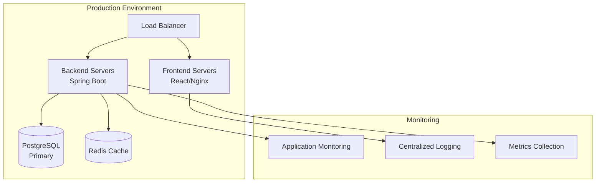

# CATAMS Deployment Guide

## Overview

This guide provides comprehensive instructions for deploying CATAMS (Casual Academic Time Allocation Management System) across different environments, from local development to production deployment.

## Architecture Overview



## Environment Requirements

### Development Environment

| Component | Requirement | Notes |
|-----------|------------|--------|
| **Java** | OpenJDK 21+ | LTS version recommended |
| **Node.js** | 18.x or 20.x | For frontend build and development |
| **Docker** | 20.x+ | For database and integration testing |
| **Memory** | 8GB+ RAM | For running full stack locally |
| **Storage** | 10GB+ free space | For dependencies and build artifacts |

### Staging Environment

| Component | Specification | Purpose |
|-----------|--------------|---------|
| **Application Server** | 4 vCPU, 8GB RAM | Backend application |
| **Database Server** | 2 vCPU, 4GB RAM, 50GB SSD | PostgreSQL |
| **Web Server** | 2 vCPU, 4GB RAM | Frontend and reverse proxy |
| **Network** | Load balancer, SSL termination | Traffic management |

### Production Environment

| Component | Specification | Scaling Notes |
|-----------|--------------|---------------|
| **Application Servers** | 8 vCPU, 16GB RAM (2+ instances) | Horizontal scaling |
| **Database Server** | 8 vCPU, 32GB RAM, 200GB SSD | Vertical scaling, backup replica |
| **Cache Server** | 4 vCPU, 8GB RAM | Redis for session/API caching |
| **Load Balancer** | HA configuration | Multi-AZ deployment |
| **Storage** | 500GB+ for logs and backups | Automated backup retention |

## Local Development Setup

### Quick Start

```bash
# 1. Clone repository
git clone <repository-url>
cd Casual-Academic-Time-Allocation-Management-System

# 2. Start database (Docker)
docker run -d --name catams-postgres \
  -e POSTGRES_DB=catams \
  -e POSTGRES_USER=catams \
  -e POSTGRES_PASSWORD=password \
  -p 5432:5432 \
  postgres:13

# 3. Start backend
./gradlew bootRun

# 4. Start frontend (new terminal)
cd frontend
npm install
npm run dev
```

### Environment Variables

Create `.env` file in project root:

```bash
# Database Configuration
DB_URL=jdbc:postgresql://localhost:5432/catams
DB_USERNAME=catams
DB_PASSWORD=password

# JWT Configuration
JWT_SECRET=your-secret-key-here-at-least-32-characters
JWT_EXPIRATION=86400

# Application Configuration
SERVER_PORT=8084
FRONTEND_URL=http://localhost:5174
LOG_LEVEL=INFO

# Email Configuration (optional for dev)
MAIL_HOST=smtp.gmail.com
MAIL_PORT=587
MAIL_USERNAME=your-email@gmail.com
MAIL_PASSWORD=your-app-password
```

### Development Tools Setup

#### IntelliJ IDEA Configuration
1. Import project as Gradle project
2. Set Project SDK to Java 21
3. Enable annotation processing (for Lombok)
4. Configure code style (import from `docs/ide-settings/`)

#### VS Code Configuration
1. Install Java Extension Pack
2. Install Spring Boot Extension Pack
3. Configure workspace settings:

```json
{
  "java.configuration.updateBuildConfiguration": "automatic",
  "java.compile.nullAnalysis.mode": "automatic",
  "spring-boot.ls.java.home": "/path/to/java21"
}
```

## Docker Deployment

### Development Docker Compose

Create `docker-compose.dev.yml`:

```yaml
version: '3.8'

services:
  postgres:
    image: postgres:13
    environment:
      POSTGRES_DB: catams
      POSTGRES_USER: catams
      POSTGRES_PASSWORD: password
    ports:
      - "5432:5432"
    volumes:
      - postgres_data:/var/lib/postgresql/data
      - ./scripts/init-db.sql:/docker-entrypoint-initdb.d/init.sql

  redis:
    image: redis:7-alpine
    ports:
      - "6379:6379"
    command: redis-server --appendonly yes
    volumes:
      - redis_data:/data

  backend:
    build: 
      context: .
      dockerfile: Dockerfile.backend
    environment:
      - SPRING_PROFILES_ACTIVE=docker
      - DB_URL=jdbc:postgresql://postgres:5432/catams
      - DB_USERNAME=catams
      - DB_PASSWORD=password
      - REDIS_URL=redis://redis:6379
    ports:
      - "8084:8084"
    depends_on:
      - postgres
      - redis
    volumes:
      - ./logs:/app/logs

  frontend:
    build:
      context: ./frontend
      dockerfile: Dockerfile
    ports:
      - "5174:80"
    environment:
      - VITE_API_URL=http://localhost:8084/api/v1
    depends_on:
      - backend

volumes:
  postgres_data:
  redis_data:
```

### Production Docker Configuration

#### Backend Dockerfile
```dockerfile
# Multi-stage build for optimized production image
FROM gradle:8.7-jdk21-alpine AS builder

WORKDIR /app
COPY build.gradle.kts settings.gradle.kts ./
COPY gradle gradle
COPY src src

RUN gradle clean build -x test --no-daemon

FROM openjdk:21-jre-slim

RUN apt-get update && apt-get install -y curl && rm -rf /var/lib/apt/lists/*

WORKDIR /app

COPY --from=builder /app/build/libs/catams-*.jar app.jar

# Create non-root user
RUN groupadd -r catams && useradd -r -g catams catams
RUN chown -R catams:catams /app
USER catams

EXPOSE 8084

HEALTHCHECK --interval=30s --timeout=3s --start-period=5s --retries=3 \
  CMD curl -f http://localhost:8084/actuator/health || exit 1

CMD ["java", "-Djava.security.egd=file:/dev/./urandom", "-jar", "app.jar"]
```

#### Frontend Dockerfile
```dockerfile
# Build stage
FROM node:18-alpine AS builder

WORKDIR /app
COPY package*.json ./
RUN npm ci --only=production

COPY . .
RUN npm run build

# Production stage
FROM nginx:alpine

COPY --from=builder /app/dist /usr/share/nginx/html
COPY nginx.conf /etc/nginx/nginx.conf

EXPOSE 80

CMD ["nginx", "-g", "daemon off;"]
```

#### Nginx Configuration
```nginx
events {
    worker_connections 1024;
}

http {
    include       /etc/nginx/mime.types;
    default_type  application/octet-stream;

    # Logging
    log_format main '$remote_addr - $remote_user [$time_local] "$request" '
                   '$status $body_bytes_sent "$http_referer" '
                   '"$http_user_agent" "$http_x_forwarded_for"';

    access_log /var/log/nginx/access.log main;
    error_log /var/log/nginx/error.log warn;

    # Gzip compression
    gzip on;
    gzip_vary on;
    gzip_min_length 1024;
    gzip_types text/plain text/css text/xml text/javascript 
               application/x-javascript application/xml+rss 
               application/javascript application/json;

    server {
        listen 80;
        server_name localhost;

        # Security headers
        add_header X-Frame-Options "SAMEORIGIN" always;
        add_header X-XSS-Protection "1; mode=block" always;
        add_header X-Content-Type-Options "nosniff" always;
        add_header Referrer-Policy "no-referrer-when-downgrade" always;

        # Frontend
        location / {
            root /usr/share/nginx/html;
            index index.html index.htm;
            try_files $uri $uri/ /index.html;
            
            # Cache static assets
            location ~* \.(js|css|png|jpg|jpeg|gif|ico|svg)$ {
                expires 1y;
                add_header Cache-Control "public, immutable";
            }
        }

        # API proxy
        location /api/ {
            proxy_pass http://backend:8084/api/;
            proxy_set_header Host $host;
            proxy_set_header X-Real-IP $remote_addr;
            proxy_set_header X-Forwarded-For $proxy_add_x_forwarded_for;
            proxy_set_header X-Forwarded-Proto $scheme;
            
            # Timeout settings
            proxy_connect_timeout 30s;
            proxy_send_timeout 30s;
            proxy_read_timeout 30s;
        }

        # Health check endpoint
        location /health {
            access_log off;
            return 200 "healthy\n";
            add_header Content-Type text/plain;
        }
    }
}
```

## Cloud Deployment (AWS)

### Infrastructure as Code (Terraform)

#### VPC and Network Configuration
```hcl
# vpc.tf
resource "aws_vpc" "catams" {
  cidr_block           = "10.0.0.0/16"
  enable_dns_hostnames = true
  enable_dns_support   = true

  tags = {
    Name = "catams-vpc"
    Environment = var.environment
  }
}

resource "aws_subnet" "public" {
  count = 2
  
  vpc_id                  = aws_vpc.catams.id
  cidr_block             = "10.0.${count.index + 1}.0/24"
  availability_zone      = data.aws_availability_zones.available.names[count.index]
  map_public_ip_on_launch = true

  tags = {
    Name = "catams-public-${count.index + 1}"
    Type = "Public"
  }
}

resource "aws_subnet" "private" {
  count = 2
  
  vpc_id            = aws_vpc.catams.id
  cidr_block        = "10.0.${count.index + 10}.0/24"
  availability_zone = data.aws_availability_zones.available.names[count.index]

  tags = {
    Name = "catams-private-${count.index + 1}"
    Type = "Private"
  }
}
```

#### Application Load Balancer
```hcl
# alb.tf
resource "aws_lb" "catams" {
  name               = "catams-alb"
  internal           = false
  load_balancer_type = "application"
  security_groups    = [aws_security_group.alb.id]
  subnets           = aws_subnet.public[*].id

  enable_deletion_protection = var.environment == "production"

  tags = {
    Name = "catams-alb"
    Environment = var.environment
  }
}

resource "aws_lb_target_group" "backend" {
  name     = "catams-backend-tg"
  port     = 8084
  protocol = "HTTP"
  vpc_id   = aws_vpc.catams.id

  health_check {
    enabled             = true
    healthy_threshold   = 2
    interval            = 30
    matcher             = "200"
    path                = "/actuator/health"
    port                = "traffic-port"
    protocol            = "HTTP"
    timeout             = 5
    unhealthy_threshold = 2
  }

  tags = {
    Name = "catams-backend-tg"
  }
}

resource "aws_lb_listener" "frontend" {
  load_balancer_arn = aws_lb.catams.arn
  port              = "443"
  protocol          = "HTTPS"
  ssl_policy        = "ELBSecurityPolicy-TLS-1-2-2017-01"
  certificate_arn   = aws_acm_certificate.catams.arn

  default_action {
    type             = "forward"
    target_group_arn = aws_lb_target_group.frontend.arn
  }
}
```

#### ECS Configuration
```hcl
# ecs.tf
resource "aws_ecs_cluster" "catams" {
  name = "catams-cluster"

  setting {
    name  = "containerInsights"
    value = "enabled"
  }

  tags = {
    Name = "catams-cluster"
    Environment = var.environment
  }
}

resource "aws_ecs_task_definition" "backend" {
  family                   = "catams-backend"
  network_mode            = "awsvpc"
  requires_compatibilities = ["FARGATE"]
  cpu                     = 1024
  memory                  = 2048
  execution_role_arn      = aws_iam_role.ecs_execution_role.arn
  task_role_arn           = aws_iam_role.ecs_task_role.arn

  container_definitions = jsonencode([
    {
      name  = "backend"
      image = "${aws_ecr_repository.backend.repository_url}:latest"
      
      portMappings = [
        {
          containerPort = 8084
          protocol      = "tcp"
        }
      ]

      environment = [
        {
          name  = "SPRING_PROFILES_ACTIVE"
          value = var.environment
        },
        {
          name  = "DB_URL"
          value = "jdbc:postgresql://${aws_rds_cluster.catams.endpoint}:5432/${aws_rds_cluster.catams.database_name}"
        }
      ]

      secrets = [
        {
          name      = "DB_PASSWORD"
          valueFrom = aws_secretsmanager_secret.db_password.arn
        },
        {
          name      = "JWT_SECRET"
          valueFrom = aws_secretsmanager_secret.jwt_secret.arn
        }
      ]

      logConfiguration = {
        logDriver = "awslogs"
        options = {
          awslogs-group         = aws_cloudwatch_log_group.backend.name
          awslogs-region        = var.aws_region
          awslogs-stream-prefix = "ecs"
        }
      }

      healthCheck = {
        command = ["CMD-SHELL", "curl -f http://localhost:8084/actuator/health || exit 1"]
        interval = 30
        timeout = 5
        retries = 3
        startPeriod = 60
      }
    }
  ])
}
```

#### RDS Configuration
```hcl
# rds.tf
resource "aws_rds_subnet_group" "catams" {
  name       = "catams-db-subnet-group"
  subnet_ids = aws_subnet.private[*].id

  tags = {
    Name = "catams-db-subnet-group"
  }
}

resource "aws_rds_cluster" "catams" {
  cluster_identifier      = "catams-cluster"
  engine                 = "aurora-postgresql"
  engine_version         = "13.13"
  database_name          = "catams"
  master_username        = "catams"
  master_password        = random_password.db_password.result
  backup_retention_period = var.environment == "production" ? 30 : 7
  preferred_backup_window = "07:00-09:00"
  preferred_maintenance_window = "sun:05:00-sun:07:00"
  
  vpc_security_group_ids = [aws_security_group.rds.id]
  db_subnet_group_name   = aws_rds_subnet_group.catams.name
  
  skip_final_snapshot       = var.environment != "production"
  final_snapshot_identifier = var.environment == "production" ? "catams-final-snapshot-${formatdate("YYYY-MM-DD-hhmm", timestamp())}" : null
  
  enabled_cloudwatch_logs_exports = ["postgresql"]
  
  tags = {
    Name = "catams-database"
    Environment = var.environment
  }
}

resource "aws_rds_cluster_instance" "catams_instances" {
  count              = var.environment == "production" ? 2 : 1
  identifier         = "catams-instance-${count.index}"
  cluster_identifier = aws_rds_cluster.catams.id
  instance_class     = var.environment == "production" ? "db.r6g.large" : "db.t4g.medium"
  engine             = aws_rds_cluster.catams.engine
  engine_version     = aws_rds_cluster.catams.engine_version
}
```

### CI/CD Pipeline (GitHub Actions)

```yaml
# .github/workflows/deploy.yml
name: Deploy CATAMS

on:
  push:
    branches: [main, develop]
  pull_request:
    branches: [main]

env:
  AWS_REGION: us-west-2
  ECR_REGISTRY: ${{ secrets.ECR_REGISTRY }}
  
jobs:
  test:
    runs-on: ubuntu-latest
    
    services:
      postgres:
        image: postgres:13
        env:
          POSTGRES_PASSWORD: password
          POSTGRES_DB: catams_test
        options: >-
          --health-cmd pg_isready
          --health-interval 10s
          --health-timeout 5s
          --health-retries 5
        ports:
          - 5432:5432

    steps:
    - uses: actions/checkout@v4
    
    - name: Set up JDK 21
      uses: actions/setup-java@v4
      with:
        java-version: '21'
        distribution: 'temurin'
    
    - name: Set up Node.js
      uses: actions/setup-node@v4
      with:
        node-version: '18'
        cache: 'npm'
        cache-dependency-path: frontend/package-lock.json
    
    - name: Cache Gradle packages
      uses: actions/cache@v4
      with:
        path: |
          ~/.gradle/caches
          ~/.gradle/wrapper
        key: ${{ runner.os }}-gradle-${{ hashFiles('**/*.gradle*', '**/gradle-wrapper.properties') }}
        restore-keys: |
          ${{ runner.os }}-gradle-
    
    - name: Run backend tests
      run: ./gradlew test
      env:
        DB_URL: jdbc:postgresql://localhost:5432/catams_test
        DB_USERNAME: postgres
        DB_PASSWORD: password
        JWT_SECRET: test-secret-key-for-ci-must-be-at-least-32-chars
    
    - name: Run frontend tests
      run: |
        cd frontend
        npm ci
        npm run test:coverage
    
    - name: Upload test results
      uses: actions/upload-artifact@v4
      if: always()
      with:
        name: test-results
        path: |
          build/test-results/
          frontend/coverage/

  build-and-push:
    needs: test
    runs-on: ubuntu-latest
    if: github.ref == 'refs/heads/main' || github.ref == 'refs/heads/develop'
    
    outputs:
      backend-image: ${{ steps.backend-meta.outputs.tags }}
      frontend-image: ${{ steps.frontend-meta.outputs.tags }}
    
    steps:
    - uses: actions/checkout@v4
    
    - name: Configure AWS credentials
      uses: aws-actions/configure-aws-credentials@v4
      with:
        aws-access-key-id: ${{ secrets.AWS_ACCESS_KEY_ID }}
        aws-secret-access-key: ${{ secrets.AWS_SECRET_ACCESS_KEY }}
        aws-region: ${{ env.AWS_REGION }}
    
    - name: Login to Amazon ECR
      id: login-ecr
      uses: aws-actions/amazon-ecr-login@v2
    
    - name: Extract backend metadata
      id: backend-meta
      uses: docker/metadata-action@v5
      with:
        images: ${{ env.ECR_REGISTRY }}/catams-backend
        tags: |
          type=ref,event=branch
          type=sha,prefix={{branch}}-
          type=raw,value=latest,enable={{is_default_branch}}
    
    - name: Build and push backend image
      uses: docker/build-push-action@v5
      with:
        context: .
        file: ./Dockerfile.backend
        push: true
        tags: ${{ steps.backend-meta.outputs.tags }}
        labels: ${{ steps.backend-meta.outputs.labels }}
    
    - name: Extract frontend metadata
      id: frontend-meta
      uses: docker/metadata-action@v5
      with:
        images: ${{ env.ECR_REGISTRY }}/catams-frontend
        tags: |
          type=ref,event=branch
          type=sha,prefix={{branch}}-
          type=raw,value=latest,enable={{is_default_branch}}
    
    - name: Build and push frontend image
      uses: docker/build-push-action@v5
      with:
        context: ./frontend
        file: ./frontend/Dockerfile
        push: true
        tags: ${{ steps.frontend-meta.outputs.tags }}
        labels: ${{ steps.frontend-meta.outputs.labels }}

  deploy:
    needs: build-and-push
    runs-on: ubuntu-latest
    if: github.ref == 'refs/heads/main'
    
    steps:
    - uses: actions/checkout@v4
    
    - name: Configure AWS credentials
      uses: aws-actions/configure-aws-credentials@v4
      with:
        aws-access-key-id: ${{ secrets.AWS_ACCESS_KEY_ID }}
        aws-secret-access-key: ${{ secrets.AWS_SECRET_ACCESS_KEY }}
        aws-region: ${{ env.AWS_REGION }}
    
    - name: Update ECS service
      run: |
        # Update backend service
        aws ecs update-service \
          --cluster catams-cluster \
          --service catams-backend-service \
          --force-new-deployment
        
        # Update frontend service
        aws ecs update-service \
          --cluster catams-cluster \
          --service catams-frontend-service \
          --force-new-deployment
    
    - name: Wait for deployment
      run: |
        aws ecs wait services-stable \
          --cluster catams-cluster \
          --services catams-backend-service catams-frontend-service
```

## Database Management

### Production Database Setup

#### Initial Setup Script
```sql
-- Create database and user
CREATE DATABASE catams;
CREATE USER catams WITH ENCRYPTED PASSWORD 'secure_password_here';
GRANT ALL PRIVILEGES ON DATABASE catams TO catams;

-- Connect to catams database
\c catams

-- Create schema
CREATE SCHEMA IF NOT EXISTS catams;
ALTER USER catams SET search_path = catams;
GRANT ALL ON SCHEMA catams TO catams;

-- Enable required extensions
CREATE EXTENSION IF NOT EXISTS "uuid-ossp";
CREATE EXTENSION IF NOT EXISTS "pg_stat_statements";
```

#### Migration Management
```bash
# Run Flyway migrations
./gradlew flywayMigrate -Dflyway.url=jdbc:postgresql://prod-db:5432/catams \
  -Dflyway.user=catams \
  -Dflyway.password=$DB_PASSWORD

# Check migration status
./gradlew flywayInfo

# Repair migrations if needed (use with caution)
./gradlew flywayRepair
```

### Backup and Recovery

#### Automated Backup Script
```bash
#!/bin/bash
# backup-database.sh

set -e

DB_HOST="${DB_HOST:-localhost}"
DB_PORT="${DB_PORT:-5432}"
DB_NAME="${DB_NAME:-catams}"
DB_USER="${DB_USER:-catams}"
BACKUP_DIR="${BACKUP_DIR:-/var/backups/catams}"
RETENTION_DAYS="${RETENTION_DAYS:-30}"

# Create backup directory
mkdir -p "$BACKUP_DIR"

# Generate backup filename
BACKUP_FILE="$BACKUP_DIR/catams_backup_$(date +%Y%m%d_%H%M%S).sql"

# Create backup
echo "Creating backup: $BACKUP_FILE"
pg_dump -h "$DB_HOST" -p "$DB_PORT" -U "$DB_USER" -d "$DB_NAME" \
  --no-password --verbose --clean --create \
  --format=custom --compress=9 \
  --file="$BACKUP_FILE"

# Compress backup
gzip "$BACKUP_FILE"
BACKUP_FILE="$BACKUP_FILE.gz"

# Verify backup
if [ -f "$BACKUP_FILE" ]; then
    echo "Backup created successfully: $BACKUP_FILE"
    echo "Backup size: $(du -h "$BACKUP_FILE" | cut -f1)"
else
    echo "Backup failed!" >&2
    exit 1
fi

# Clean old backups
find "$BACKUP_DIR" -name "catams_backup_*.sql.gz" -mtime +$RETENTION_DAYS -delete

# Upload to S3 (if configured)
if [ -n "$S3_BUCKET" ]; then
    aws s3 cp "$BACKUP_FILE" "s3://$S3_BUCKET/database-backups/"
    echo "Backup uploaded to S3"
fi

echo "Backup completed successfully"
```

#### Recovery Procedure
```bash
#!/bin/bash
# restore-database.sh

BACKUP_FILE="$1"

if [ -z "$BACKUP_FILE" ]; then
    echo "Usage: $0 <backup_file>"
    exit 1
fi

# Ensure backup file exists
if [ ! -f "$BACKUP_FILE" ]; then
    echo "Backup file not found: $BACKUP_FILE"
    exit 1
fi

# Stop application services
echo "Stopping application services..."
systemctl stop catams-backend
systemctl stop catams-frontend

# Create restore point
echo "Creating current state backup..."
pg_dump -h "$DB_HOST" -p "$DB_PORT" -U "$DB_USER" -d "$DB_NAME" \
  --format=custom --compress=9 \
  --file="/tmp/catams_pre_restore_$(date +%Y%m%d_%H%M%S).backup"

# Restore from backup
echo "Restoring from backup: $BACKUP_FILE"
if [[ "$BACKUP_FILE" == *.gz ]]; then
    gunzip -c "$BACKUP_FILE" | pg_restore -h "$DB_HOST" -p "$DB_PORT" -U "$DB_USER" \
      --dbname="$DB_NAME" --clean --create --verbose
else
    pg_restore -h "$DB_HOST" -p "$DB_PORT" -U "$DB_USER" \
      --dbname="$DB_NAME" --clean --create --verbose "$BACKUP_FILE"
fi

# Start application services
echo "Starting application services..."
systemctl start catams-backend
systemctl start catams-frontend

echo "Database restoration completed"
```

## Monitoring and Logging

### Application Monitoring

#### Spring Boot Actuator Configuration
```yaml
# application-production.yml
management:
  endpoints:
    web:
      exposure:
        include: health,metrics,prometheus,info
      base-path: /actuator
  endpoint:
    health:
      show-details: when-authorized
      group:
        liveness:
          include: livenessState,diskSpace
        readiness:
          include: readinessState,db,redis
  metrics:
    export:
      prometheus:
        enabled: true
      cloudwatch:
        enabled: true
        namespace: CATAMS
        batch-size: 20
  health:
    mail:
      enabled: false
    redis:
      enabled: true
```

#### Prometheus Configuration
```yaml
# prometheus.yml
global:
  scrape_interval: 15s
  evaluation_interval: 15s

rule_files:
  - "catams_rules.yml"

scrape_configs:
  - job_name: 'catams-backend'
    static_configs:
      - targets: ['backend:8084']
    metrics_path: '/actuator/prometheus'
    scrape_interval: 30s

  - job_name: 'catams-frontend'
    static_configs:
      - targets: ['frontend:80']
    metrics_path: '/health'
    scrape_interval: 60s

alerting:
  alertmanagers:
    - static_configs:
        - targets:
          - alertmanager:9093
```

#### Grafana Dashboard Configuration
```json
{
  "dashboard": {
    "title": "CATAMS Application Metrics",
    "panels": [
      {
        "title": "Application Health",
        "type": "stat",
        "targets": [
          {
            "expr": "up{job=\"catams-backend\"}",
            "legendFormat": "Backend Status"
          },
          {
            "expr": "up{job=\"catams-frontend\"}",
            "legendFormat": "Frontend Status"
          }
        ]
      },
      {
        "title": "Request Rate",
        "type": "graph",
        "targets": [
          {
            "expr": "rate(http_requests_total{job=\"catams-backend\"}[5m])",
            "legendFormat": "{{method}} {{uri}}"
          }
        ]
      },
      {
        "title": "Response Time",
        "type": "graph",
        "targets": [
          {
            "expr": "histogram_quantile(0.95, rate(http_request_duration_seconds_bucket{job=\"catams-backend\"}[5m]))",
            "legendFormat": "95th percentile"
          }
        ]
      },
      {
        "title": "Database Connections",
        "type": "graph",
        "targets": [
          {
            "expr": "hikaricp_connections_active{job=\"catams-backend\"}",
            "legendFormat": "Active Connections"
          },
          {
            "expr": "hikaricp_connections_idle{job=\"catams-backend\"}",
            "legendFormat": "Idle Connections"
          }
        ]
      }
    ]
  }
}
```

### Centralized Logging

#### Logback Configuration (Production)
```xml
<!-- logback-spring.xml -->
<configuration>
    <springProfile name="production">
        <!-- JSON structured logging for production -->
        <appender name="STDOUT" class="ch.qos.logback.core.ConsoleAppender">
            <encoder class="net.logstash.logback.encoder.LoggingEventCompositeJsonEncoder">
                <providers>
                    <timestamp>
                        <timeZone>UTC</timeZone>
                    </timestamp>
                    <version/>
                    <logLevel/>
                    <loggerName/>
                    <mdc/>
                    <message/>
                    <stackTrace/>
                </providers>
            </encoder>
        </appender>

        <!-- File appender for persistent logs -->
        <appender name="FILE" class="ch.qos.logback.core.rolling.RollingFileAppender">
            <file>/app/logs/catams.log</file>
            <rollingPolicy class="ch.qos.logback.core.rolling.TimeBasedRollingPolicy">
                <fileNamePattern>/app/logs/catams.%d{yyyy-MM-dd}.%i.log.gz</fileNamePattern>
                <maxFileSize>100MB</maxFileSize>
                <maxHistory>30</maxHistory>
                <totalSizeCap>3GB</totalSizeCap>
            </rollingPolicy>
            <encoder class="net.logstash.logback.encoder.LoggingEventCompositeJsonEncoder">
                <providers>
                    <timestamp/>
                    <version/>
                    <logLevel/>
                    <loggerName/>
                    <mdc/>
                    <message/>
                    <stackTrace/>
                </providers>
            </encoder>
        </appender>

        <root level="INFO">
            <appender-ref ref="STDOUT"/>
            <appender-ref ref="FILE"/>
        </root>

        <!-- Application-specific loggers -->
        <logger name="com.usyd.catams" level="INFO"/>
        <logger name="org.springframework.security" level="WARN"/>
        <logger name="org.springframework.web" level="WARN"/>
        <logger name="org.hibernate.SQL" level="WARN"/>
        <logger name="org.hibernate.type.descriptor.sql.BasicBinder" level="WARN"/>
    </springProfile>
</configuration>
```

#### ELK Stack Configuration

**Filebeat Configuration**:
```yaml
# filebeat.yml
filebeat.inputs:
- type: log
  enabled: true
  paths:
    - /app/logs/*.log
  fields:
    service: catams-backend
    environment: production
  fields_under_root: true
  json.keys_under_root: true
  json.add_error_key: true

output.elasticsearch:
  hosts: ["elasticsearch:9200"]
  index: "catams-logs-%{+yyyy.MM.dd}"
  
setup.template.name: "catams-logs"
setup.template.pattern: "catams-logs-*"

processors:
- add_host_metadata:
    when.not.contains.tags: forwarded
```

**Logstash Configuration**:
```ruby
# logstash.conf
input {
  beats {
    port => 5044
  }
}

filter {
  if [service] == "catams-backend" {
    # Parse JSON logs
    json {
      source => "message"
    }
    
    # Add parsed fields
    mutate {
      add_field => { "log_type" => "application" }
    }
    
    # Parse timestamps
    date {
      match => [ "timestamp", "yyyy-MM-dd'T'HH:mm:ss.SSSZ" ]
    }
  }
}

output {
  elasticsearch {
    hosts => ["elasticsearch:9200"]
    index => "catams-logs-%{+YYYY.MM.dd}"
  }
}
```

## Security Configuration

### SSL/TLS Configuration

#### Certificate Management
```bash
# Generate SSL certificate using Let's Encrypt
certbot certonly --nginx \
  -d catams.university.edu \
  -d api.catams.university.edu \
  --email admin@university.edu \
  --agree-tos \
  --non-interactive

# Set up automatic renewal
echo "0 12 * * * /usr/bin/certbot renew --quiet" | crontab -
```

#### Nginx SSL Configuration
```nginx
server {
    listen 443 ssl http2;
    server_name catams.university.edu;

    # SSL Configuration
    ssl_certificate /etc/letsencrypt/live/catams.university.edu/fullchain.pem;
    ssl_certificate_key /etc/letsencrypt/live/catams.university.edu/privkey.pem;
    
    ssl_protocols TLSv1.2 TLSv1.3;
    ssl_ciphers ECDHE-RSA-AES256-GCM-SHA512:DHE-RSA-AES256-GCM-SHA512:ECDHE-RSA-AES256-GCM-SHA384:DHE-RSA-AES256-GCM-SHA384;
    ssl_prefer_server_ciphers off;
    ssl_session_cache shared:SSL:10m;
    ssl_session_timeout 10m;

    # Security Headers
    add_header Strict-Transport-Security "max-age=63072000; includeSubDomains; preload";
    add_header X-Content-Type-Options nosniff;
    add_header X-Frame-Options DENY;
    add_header X-XSS-Protection "1; mode=block";
    add_header Content-Security-Policy "default-src 'self'; script-src 'self' 'unsafe-inline'; style-src 'self' 'unsafe-inline'; img-src 'self' data: https:; font-src 'self' data:; connect-src 'self'";

    # Application configuration
    location / {
        root /usr/share/nginx/html;
        try_files $uri $uri/ /index.html;
    }

    location /api/ {
        proxy_pass http://backend:8084/api/;
        include /etc/nginx/proxy_params;
        
        # Additional security
        proxy_hide_header X-Powered-By;
    }
}

# Redirect HTTP to HTTPS
server {
    listen 80;
    server_name catams.university.edu;
    return 301 https://$server_name$request_uri;
}
```

### Firewall Configuration

#### UFW (Ubuntu Firewall) Rules
```bash
#!/bin/bash
# setup-firewall.sh

# Reset firewall
ufw --force reset

# Default policies
ufw default deny incoming
ufw default allow outgoing

# SSH access (change port as needed)
ufw allow 22/tcp

# HTTP/HTTPS
ufw allow 80/tcp
ufw allow 443/tcp

# Application ports (restrict to specific IPs in production)
ufw allow from 10.0.0.0/16 to any port 8084
ufw allow from 10.0.0.0/16 to any port 5432

# Monitoring ports (restrict to monitoring servers)
ufw allow from 10.0.1.0/24 to any port 9090  # Prometheus
ufw allow from 10.0.1.0/24 to any port 3000  # Grafana

# Enable firewall
ufw --force enable

# Show status
ufw status verbose
```

## Performance Optimization

### Application Performance

#### JVM Tuning
```bash
# Production JVM settings
JAVA_OPTS="-Xms2g -Xmx4g \
  -XX:+UseG1GC \
  -XX:MaxGCPauseMillis=200 \
  -XX:+UnlockExperimentalVMOptions \
  -XX:+UseCGroupMemoryLimitForHeap \
  -XX:+PrintGCDetails \
  -XX:+PrintGCTimeStamps \
  -Xloggc:/app/logs/gc.log \
  -XX:+UseGCLogFileRotation \
  -XX:NumberOfGCLogFiles=5 \
  -XX:GCLogFileSize=100M"
```

#### Database Performance
```sql
-- PostgreSQL performance tuning
-- Add to postgresql.conf

# Memory settings
shared_buffers = 256MB
effective_cache_size = 1GB
maintenance_work_mem = 64MB
checkpoint_completion_target = 0.9
wal_buffers = 16MB

# Connection settings
max_connections = 100
shared_preload_libraries = 'pg_stat_statements'

# Logging
log_destination = 'stderr'
logging_collector = on
log_directory = 'pg_log'
log_filename = 'postgresql-%Y-%m-%d_%H%M%S.log'
log_statement = 'all'
log_duration = on
log_min_duration_statement = 1000

# Enable pg_stat_statements
pg_stat_statements.max = 10000
pg_stat_statements.track = all
```

### Caching Strategy

#### Redis Configuration
```conf
# redis.conf production settings

# Memory settings
maxmemory 1gb
maxmemory-policy allkeys-lru

# Persistence
save 900 1
save 300 10
save 60 10000

# AOF
appendonly yes
appendfsync everysec

# Security
requirepass your_secure_redis_password

# Networking
bind 127.0.0.1 10.0.0.0/8
timeout 300

# Logging
loglevel notice
logfile /var/log/redis/redis-server.log
```

#### Application Caching Configuration
```java
@Configuration
@EnableCaching
public class CacheConfig {

    @Bean
    @Primary
    public CacheManager cacheManager(RedisConnectionFactory redisConnectionFactory) {
        RedisCacheConfiguration config = RedisCacheConfiguration.defaultCacheConfig()
            .entryTtl(Duration.ofMinutes(30))
            .serializeKeysWith(RedisSerializationContext.SerializationPair
                .fromSerializer(new StringRedisSerializer()))
            .serializeValuesWith(RedisSerializationContext.SerializationPair
                .fromSerializer(new GenericJackson2JsonRedisSerializer()));

        Map<String, RedisCacheConfiguration> cacheConfigurations = new HashMap<>();
        cacheConfigurations.put("users", config.entryTtl(Duration.ofHours(1)));
        cacheConfigurations.put("courses", config.entryTtl(Duration.ofHours(6)));
        cacheConfigurations.put("timesheets", config.entryTtl(Duration.ofMinutes(15)));

        return RedisCacheManager.builder(redisConnectionFactory)
            .cacheDefaults(config)
            .withInitialCacheConfigurations(cacheConfigurations)
            .build();
    }
}
```

## Troubleshooting

### Common Deployment Issues

#### Application Won't Start
```bash
# Check Java version
java -version

# Check environment variables
env | grep -E "(DB_|JWT_|SERVER_)"

# Check database connectivity
pg_isready -h $DB_HOST -p $DB_PORT -U $DB_USER

# Check application logs
tail -f /app/logs/catams.log

# Check system resources
free -h
df -h
top -p $(pgrep java)
```

#### Database Connection Issues
```bash
# Test database connection
psql -h $DB_HOST -p $DB_PORT -U $DB_USER -d $DB_NAME -c "SELECT 1;"

# Check connection pool
curl -s localhost:8084/actuator/metrics/hikaricp.connections.active

# Monitor database logs
tail -f /var/log/postgresql/postgresql-*.log
```

#### Performance Issues
```bash
# Check JVM memory usage
jstat -gc $(pgrep java) 5s

# Monitor application metrics
curl -s localhost:8084/actuator/metrics/jvm.memory.used

# Check database performance
psql -c "SELECT * FROM pg_stat_statements ORDER BY total_time DESC LIMIT 10;"

# Monitor system resources
htop
iotop
```

### Recovery Procedures

#### Application Recovery
```bash
#!/bin/bash
# emergency-restart.sh

echo "Starting emergency recovery procedure..."

# Stop services
systemctl stop catams-frontend
systemctl stop catams-backend

# Clear temporary files
rm -rf /tmp/catams-*
rm -rf /app/logs/gc.log*

# Check database connectivity
if ! pg_isready -h $DB_HOST -p $DB_PORT -U $DB_USER; then
    echo "Database not available!"
    exit 1
fi

# Start backend
systemctl start catams-backend

# Wait for backend to be ready
timeout=60
while [ $timeout -gt 0 ]; do
    if curl -f localhost:8084/actuator/health > /dev/null 2>&1; then
        break
    fi
    sleep 2
    timeout=$((timeout - 2))
done

if [ $timeout -le 0 ]; then
    echo "Backend failed to start!"
    exit 1
fi

# Start frontend
systemctl start catams-frontend

echo "Recovery completed successfully"
```

---

**Deployment Guide Version**: 1.0  
**Last Updated**: 2025-08-12  
**Maintainers**: DevOps Team  
**Support**: devops@university.edu