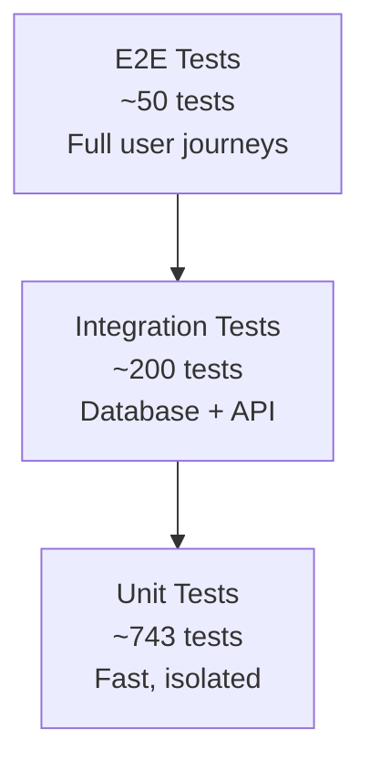

# CATAMS Developer Guide

## Welcome to CATAMS Development

This guide will help you get up and running as a contributor to the CATAMS (Casual Academic Time Allocation Management System) project. Whether you're a new team member or an external contributor, this document provides everything you need to start contributing effectively.

## Quick Start (5 Minutes)

### Prerequisites Checklist

- [ ] **Java 21+** (LTS version recommended)
- [ ] **Node.js 18+** with npm
- [ ] **Docker** (for integration testing)
- [ ] **Git** (latest version)
- [ ] **IDE** (IntelliJ IDEA or VS Code recommended)

### Clone and Setup

```bash
# 1. Clone the repository
git clone <repository-url>
cd Casual-Academic-Time-Allocation-Management-System

# 2. Verify Java version
java -version  # Should show Java 21+

# 3. Backend setup (auto-downloads dependencies)
./gradlew build

# 4. Frontend setup
cd frontend
npm install
cd ..

# 5. Run quick verification
./gradlew test --tests="*UnitTest*"  # Fast unit tests
```

### First Run

```bash
# Terminal 1: Start backend (takes ~30 seconds)
./gradlew bootRun

# Terminal 2: Start frontend (takes ~10 seconds)
cd frontend && npm run dev

# Open browser to http://localhost:5174
# Backend API available at http://localhost:8084
```

## Project Structure Deep Dive

```
CATAMS/
├── 📁 src/main/java/com/usyd/catams/     # Backend source code
│   ├── controller/                       # REST API endpoints
│   ├── application/                      # Business logic services
│   ├── domain/                          # Core domain entities
│   ├── infrastructure/                  # Data access, external services
│   └── security/                        # Authentication & authorization
├── 📁 src/test/java/com/usyd/catams/     # Backend tests
│   ├── unit/                           # Fast, isolated unit tests
│   ├── integration/                    # Database integration tests
│   └── repository/                     # Repository layer tests
├── 📁 frontend/                         # React frontend application
│   ├── src/                           # Frontend source code
│   ├── e2e/                           # Playwright E2E tests
│   └── docs/                          # Frontend-specific documentation
├── 📁 docs/                            # Project documentation
│   ├── architecture/                   # Technical architecture docs
│   ├── openapi/                       # API specifications
│   └── stories/                       # User stories and requirements
├── 📁 tools/scripts/                   # Development and testing scripts
└── 📁 gradle/                          # Gradle wrapper and configuration
```

### Key Directories to Know

| Directory | Purpose | When to Modify |
|-----------|---------|----------------|
| `src/main/java/com/usyd/catams/controller/` | REST API endpoints | Adding new APIs or modifying existing ones |
| `src/main/java/com/usyd/catams/application/` | Business logic | Adding new features or business rules |
| `src/main/java/com/usyd/catams/domain/` | Core entities | Changes to data model or business entities |
| `frontend/src/` | React components | UI changes, new pages, or frontend features |
| `docs/openapi/` | API documentation | API contract changes |
| `tools/scripts/` | Development tools | Build process or testing improvements |

## Development Workflow

### Branch Strategy

```bash
# 1. Create feature branch from main
git checkout main
git pull origin main
git checkout -b feature/your-feature-name

# 2. Make your changes
# ... development work ...

# 3. Run tests before committing
node tools/scripts/test-backend.js unit
cd frontend && npm run test

# 4. Commit with descriptive message
git add .
git commit -m "feat: add timesheet bulk export functionality"

# 5. Push and create pull request
git push origin feature/your-feature-name
```

### Commit Message Convention

We follow [Conventional Commits](https://www.conventionalcommits.org/):

```
<type>[optional scope]: <description>

[optional body]

[optional footer(s)]
```

**Types:**
- `feat:` New feature
- `fix:` Bug fix
- `docs:` Documentation changes
- `style:` Code formatting (no functional changes)
- `refactor:` Code refactoring
- `test:` Adding or updating tests
- `chore:` Maintenance tasks

**Examples:**
```bash
feat(timesheet): add bulk export functionality
fix(auth): resolve JWT expiration handling
docs: update API documentation for approval workflow
test: add integration tests for user management
```

## Testing Guide

### Test Pyramid Overview



### Running Tests

```bash
# Backend Tests
node tools/scripts/test-backend.js unit           # Fast unit tests (~30s)
node tools/scripts/test-backend.js integration    # Full integration tests (~3min)
node tools/scripts/test-backend.js select "Timesheet*"  # Selective testing

# Frontend Tests  
cd frontend
npm run test                    # Unit tests with Vitest
npm run test:coverage          # With coverage report
npm run test:e2e               # Playwright E2E tests

# Full Test Suite (CI-equivalent)
./gradlew test                 # All backend tests
cd frontend && npm run test    # All frontend tests
```

### Test Writing Guidelines

#### Unit Tests (Backend)
```java
@ExtendWith(MockitoExtension.class)
class TimesheetServiceUnitTest {
    
    @Mock
    private TimesheetRepository repository;
    
    @InjectMocks
    private TimesheetService service;
    
    @Test
    @DisplayName("Should create timesheet with valid data")
    void shouldCreateTimesheetWithValidData() {
        // Given
        var createRequest = TimesheetCreateRequest.builder()
            .hours(BigDecimal.valueOf(10))
            .courseId(1L)
            .build();
            
        // When
        var result = service.createTimesheet(createRequest, userId);
        
        // Then
        assertThat(result.getStatus()).isEqualTo(DRAFT);
        verify(repository).save(any(Timesheet.class));
    }
}
```

#### Integration Tests (Backend)
```java
@SpringBootTest
@TestcontainersConfiguration
class TimesheetIntegrationTest {
    
    @Container
    static PostgreSQLContainer<?> postgres = new PostgreSQLContainer<>("postgres:13")
            .withDatabaseName("testdb")
            .withUsername("test")
            .withPassword("test");
    
    @Test
    void shouldCreateAndRetrieveTimesheet() {
        // Integration test with real database
    }
}
```

#### Frontend Tests
```typescript
// Unit test example
import { render, screen } from '@testing-library/react';
import { TimesheetForm } from './TimesheetForm';

describe('TimesheetForm', () => {
  it('should validate required fields', () => {
    render(<TimesheetForm />);
    
    const submitButton = screen.getByRole('button', { name: /submit/i });
    fireEvent.click(submitButton);
    
    expect(screen.getByText(/hours is required/i)).toBeInTheDocument();
  });
});
```

### Test Best Practices

#### ✅ Do's
- Write descriptive test names (`shouldRejectTimesheetWhenNotAuthorized`)
- Use `@DisplayName` for complex scenarios
- Test both happy path and edge cases
- Use `TestContainers` for integration tests requiring database
- Mock external dependencies in unit tests
- Use `AssertJ` for fluent assertions

#### ❌ Don'ts
- Don't test framework code (Spring, React internals)
- Don't write flaky tests that depend on timing
- Don't use real external services in tests
- Don't test implementation details, test behavior
- Don't commit failing tests

## Code Standards

### Java/Backend Standards

#### Code Style
```java
// ✅ Good: Clear naming, proper structure
@RestController
@RequestMapping("/api/v1/timesheets")
@RequiredArgsConstructor
@Slf4j
public class TimesheetController {
    
    private final TimesheetApplicationService timesheetService;
    
    @PostMapping
    public ResponseEntity<TimesheetResponse> createTimesheet(
            @Valid @RequestBody TimesheetCreateRequest request,
            @AuthenticationPrincipal UserDetails userDetails) {
        
        log.info("Creating timesheet for user: {}", userDetails.getUsername());
        
        var response = timesheetService.createTimesheet(request, getCurrentUserId(userDetails));
        return ResponseEntity.status(HttpStatus.CREATED).body(response);
    }
}
```

#### Architectural Guidelines

**Domain-Driven Design Principles:**
- Keep business logic in domain entities and services
- Use value objects for primitive obsession (e.g., `Money`, `WeekPeriod`)
- Maintain clear boundaries between layers
- Use application services for coordinating domain operations

**Dependency Management:**
```java
// ✅ Good: Dependency injection with constructor
@Service
@RequiredArgsConstructor
public class TimesheetApplicationService {
    
    private final TimesheetRepository timesheetRepository;
    private final UserRepository userRepository;
    private final TimesheetMapper timesheetMapper;
    
    // Business logic methods...
}

// ❌ Bad: Field injection
@Service
public class TimesheetApplicationService {
    @Autowired
    private TimesheetRepository timesheetRepository; // Avoid field injection
}
```

### TypeScript/Frontend Standards

#### Component Structure
```typescript
// ✅ Good: Proper component structure
interface TimesheetFormProps {
  initialData?: TimesheetData;
  onSubmit: (data: TimesheetCreateRequest) => void;
  onCancel: () => void;
}

export const TimesheetForm: React.FC<TimesheetFormProps> = ({
  initialData,
  onSubmit,
  onCancel
}) => {
  const [formData, setFormData] = useState<TimesheetFormData>({
    hours: initialData?.hours ?? '',
    description: initialData?.description ?? '',
    courseId: initialData?.courseId ?? ''
  });

  const handleSubmit = useCallback((e: FormEvent) => {
    e.preventDefault();
    onSubmit(formData);
  }, [formData, onSubmit]);

  return (
    <form onSubmit={handleSubmit}>
      {/* Form content */}
    </form>
  );
};
```

#### API Integration
```typescript
// ✅ Good: Proper error handling and typing
interface TimesheetService {
  createTimesheet(data: TimesheetCreateRequest): Promise<TimesheetResponse>;
}

export const useTimesheetService = (): TimesheetService => {
  const apiClient = useApiClient();
  
  return {
    createTimesheet: async (data) => {
      try {
        const response = await apiClient.post<TimesheetResponse>('/timesheets', data);
        return response.data;
      } catch (error) {
        if (error.response?.status === 400) {
          throw new ValidationError('Invalid timesheet data', error.response.data);
        }
        throw new ApiError('Failed to create timesheet', error);
      }
    }
  };
};
```

## Development Tools and Configuration

### IDE Setup (IntelliJ IDEA)

#### Required Plugins
- Lombok Plugin
- Spring Boot Plugin
- Docker Plugin
- Database Tools and SQL

#### Code Style Settings
1. File → Settings → Editor → Code Style → Java
2. Import scheme: [Download from project docs/ide-settings/](docs/ide-settings/)
3. Enable "Optimize imports on the fly"
4. Set line length to 120 characters

#### Live Templates
```java
// Create custom live template for test methods
@Test
@DisplayName("$DESCRIPTION$")
void $METHOD_NAME$() {
    // Given
    $GIVEN$
    
    // When
    $WHEN$
    
    // Then
    $THEN$
}
```

### VS Code Setup

#### Required Extensions
```json
{
  "recommendations": [
    "redhat.java",
    "vscjava.vscode-spring-boot-dashboard",
    "gabrielbb.vscode-lombok",
    "bradlc.vscode-tailwindcss",
    "ms-playwright.playwright",
    "esbenp.prettier-vscode"
  ]
}
```

#### Workspace Settings
```json
{
  "java.configuration.updateBuildConfiguration": "automatic",
  "java.compile.nullAnalysis.mode": "automatic",
  "typescript.preferences.importModuleSpecifier": "relative",
  "editor.formatOnSave": true
}
```

## Debugging Guide

### Backend Debugging

#### Common Issues and Solutions

**Issue: Tests failing with database connection errors**
```bash
# Solution: Ensure Docker is running and TestContainers can start
docker --version
docker run hello-world

# Check if ports are available
netstat -an | grep 5432  # PostgreSQL default port
```

**Issue: Application won't start - port already in use**
```bash
# Find and kill process using port 8084
lsof -ti:8084 | xargs kill -9

# Or use the project cleanup script
node tools/scripts/cleanup.js
```

**Issue: JWT authentication failures**
```bash
# Check JWT configuration in application.yml
# Verify JWT_SECRET environment variable is set
echo $JWT_SECRET

# Check logs for JWT-related errors
./gradlew bootRun --debug | grep -i jwt
```

#### Debugging with IntelliJ

1. Create Run Configuration:
   - Main class: `com.usyd.catams.CatamsApplication`
   - Environment variables: `SPRING_PROFILES_ACTIVE=dev`
   - VM options: `-Dspring.profiles.active=dev`

2. Debug specific tests:
   - Right-click test method → Debug
   - Set breakpoints in service methods
   - Use "Evaluate Expression" for complex debugging

### Frontend Debugging

#### Browser DevTools
```javascript
// Add to component for debugging
useEffect(() => {
  console.log('Component state:', { formData, errors });
}, [formData, errors]);

// Debug API calls
const debugApiCall = async () => {
  try {
    const response = await api.getTimesheets();
    console.log('API Response:', response);
  } catch (error) {
    console.error('API Error:', error.response?.data);
  }
};
```

#### React DevTools
- Install React Developer Tools browser extension
- Use Components tab to inspect React component tree
- Use Profiler tab to identify performance issues

## Performance Guidelines

### Backend Performance

#### Database Optimization
```java
// ✅ Good: Efficient queries with proper joins
@Query("""
    SELECT t FROM Timesheet t 
    JOIN FETCH t.course c 
    JOIN FETCH t.tutor u 
    WHERE t.status = :status 
    AND t.createdAt >= :fromDate
    """)
List<Timesheet> findTimesheetsWithDetailsFromDate(
    @Param("status") ApprovalStatus status,
    @Param("fromDate") LocalDateTime fromDate);

// ❌ Bad: N+1 query problem
// Don't use lazy loading without JOIN FETCH in queries
```

#### Service Layer Optimization
```java
// ✅ Good: Batch operations
@Transactional
public List<TimesheetResponse> createMultipleTimesheets(
        List<TimesheetCreateRequest> requests, Long userId) {
    
    var timesheets = requests.stream()
        .map(request -> createTimesheetEntity(request, userId))
        .collect(toList());
    
    var savedTimesheets = timesheetRepository.saveAll(timesheets);
    return timesheetMapper.toResponseList(savedTimesheets);
}

// ❌ Bad: Individual save operations in loop
public List<TimesheetResponse> createMultipleTimesheets(
        List<TimesheetCreateRequest> requests, Long userId) {
    return requests.stream()
        .map(request -> createTimesheet(request, userId)) // Each call hits DB
        .collect(toList());
}
```

### Frontend Performance

#### Component Optimization
```typescript
// ✅ Good: Memoized expensive computations
const TimesheetSummary: React.FC<Props> = ({ timesheets, filters }) => {
  const filteredTimesheets = useMemo(() => {
    return timesheets.filter(timesheet => 
      timesheet.status === filters.status &&
      timesheet.createdAt >= filters.fromDate
    );
  }, [timesheets, filters]);

  return <SummaryView data={filteredTimesheets} />;
};

// ✅ Good: Memoized components to prevent unnecessary re-renders
export const TimesheetRow = React.memo<TimesheetRowProps>(({ timesheet, onEdit }) => {
  return (
    <tr>
      <td>{timesheet.id}</td>
      <td>{timesheet.hours}</td>
      <td>
        <button onClick={() => onEdit(timesheet.id)}>Edit</button>
      </td>
    </tr>
  );
});
```

#### Bundle Optimization
```typescript
// ✅ Good: Code splitting with lazy loading
const TimesheetManagement = lazy(() => import('./TimesheetManagement'));
const UserManagement = lazy(() => import('./UserManagement'));

function App() {
  return (
    <Suspense fallback={<Loading />}>
      <Routes>
        <Route path="/timesheets" element={<TimesheetManagement />} />
        <Route path="/users" element={<UserManagement />} />
      </Routes>
    </Suspense>
  );
}
```

## Troubleshooting Common Issues

### Build Issues

**Gradle build failing:**
```bash
# Clean build
./gradlew clean build

# Check for dependency conflicts
./gradlew dependencies --configuration runtimeClasspath

# Skip tests if needed for quick build
./gradlew build -x test
```

**Frontend build failing:**
```bash
# Clear node modules and reinstall
rm -rf node_modules package-lock.json
npm install

# Check for TypeScript errors
npm run type-check

# Clear Vite cache
rm -rf node_modules/.vite
```

### Runtime Issues

**Database connection issues:**
```yaml
# Check application.yml database configuration
spring:
  datasource:
    url: jdbc:postgresql://localhost:5432/catams
    username: ${DB_USERNAME:catams}
    password: ${DB_PASSWORD:password}
```

**CORS issues in development:**
```java
// Backend: Check CORS configuration in SecurityConfig
@CrossOrigin(origins = "http://localhost:5174")
@RestController
public class TimesheetController {
    // ...
}
```

**Authentication issues:**
```bash
# Check JWT secret is configured
echo $JWT_SECRET

# Verify token in browser DevTools Application tab
# Check localStorage for 'authToken'
```

## Contributing Guidelines

### Before Submitting a PR

- [ ] All tests pass locally
- [ ] Code follows project style guidelines
- [ ] New functionality includes tests
- [ ] Documentation updated if needed
- [ ] API changes include OpenAPI spec updates
- [ ] No sensitive information in commit history

### Pull Request Template

```markdown
## Description
Brief description of the changes and why they were made.

## Type of Change
- [ ] Bug fix (non-breaking change that fixes an issue)
- [ ] New feature (non-breaking change that adds functionality)
- [ ] Breaking change (fix or feature that would cause existing functionality to not work as expected)
- [ ] Documentation update

## Testing
- [ ] Unit tests added/updated
- [ ] Integration tests added/updated
- [ ] Manual testing completed

## Checklist
- [ ] Code follows the project's coding standards
- [ ] Self-review completed
- [ ] Comments added for hard-to-understand areas
- [ ] Documentation updated
- [ ] No console.log or debug statements left in code
```

### Code Review Guidelines

**For Reviewers:**
- Focus on functionality, security, and maintainability
- Suggest improvements for readability and performance
- Verify test coverage for new functionality
- Check for proper error handling
- Ensure documentation is updated

**For Authors:**
- Respond to all review comments
- Make requested changes or explain why they're not needed
- Update PR description if scope changes
- Rerun tests after making changes

## Resources and References

### Internal Documentation
- [Architecture Overview](docs/ARCHITECTURE.md)
- [API Documentation](docs/openapi.yaml)
- [Testing Guide](docs/testing/README.md)
- [Deployment Guide](docs/DEPLOYMENT.md)

### External References
- [Spring Boot Documentation](https://spring.io/projects/spring-boot)
- [React Documentation](https://reactjs.org/docs)
- [TypeScript Handbook](https://www.typescriptlang.org/docs)
- [Playwright Documentation](https://playwright.dev)
- [TestContainers Documentation](https://www.testcontainers.org)

### Community and Support

**Getting Help:**
1. Check existing documentation first
2. Search closed issues and PRs
3. Ask in team chat/Slack
4. Create an issue if problem persists

**Staying Updated:**
- Subscribe to repository notifications
- Review architectural decision records (ADRs)
- Participate in code review discussions
- Attend team technical discussions

---

**Document Version**: 1.0  
**Last Updated**: 2025-08-12  
**Maintainers**: Development Team  
**Next Review**: 2025-09-12

---

*Happy coding! 🚀*