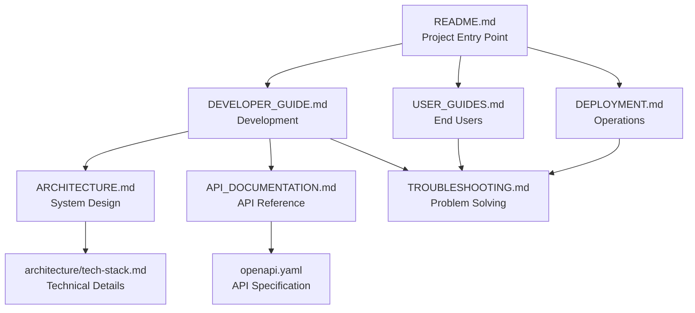

# CATAMS Documentation Index

## 📚 Complete Documentation Overview

Welcome to the comprehensive documentation for CATAMS (Casual Academic Time Allocation Management System). This index provides quick access to all documentation organized by audience and purpose.

---

## 🚀 Quick Start Guides

| Document | Audience | Purpose | Estimated Read Time |
|----------|----------|---------|-------------------|
| [README.md](../README.md) | All users | Project overview & quick setup | 10 minutes |
| [DEVELOPER_GUIDE.md](DEVELOPER_GUIDE.md) | Developers | Comprehensive development guide | 30 minutes |
| [USER_GUIDES.md](USER_GUIDES.md) | End users | Role-specific user instructions | 20 minutes |

---

## 👨‍💻 Developer Documentation

### Core Development
| Document | Purpose | Key Sections |
|----------|---------|-------------|
| **[DEVELOPER_GUIDE.md](DEVELOPER_GUIDE.md)** | Complete developer onboarding | Setup, workflows, standards, debugging |
| **[ARCHITECTURE.md](ARCHITECTURE.md)** | System architecture overview | Tech stack, patterns, data flow |
| **[API_DOCUMENTATION.md](API_DOCUMENTATION.md)** | REST API reference | Endpoints, examples, integration |

### Technical References
| Document | Purpose | When to Use |
|----------|---------|------------|
| [Tech Stack Documentation](architecture/tech-stack.md) | Technology decisions | Architecture planning |
| [Coding Standards](architecture/coding-standards.md) | Code quality guidelines | Code reviews, new features |
| [Project Structure](architecture/project-structure.md) | Codebase organization | Navigation, refactoring |

### Testing & Quality
| Document | Purpose | Coverage |
|----------|---------|----------|
| [Testing Guide](testing/README.md) | Testing strategies | Unit, integration, E2E |
| [Quick Start Testing](testing/QUICK_START.md) | Fast testing setup | Common test commands |

---

## 👥 User Documentation

### Role-Based Guides
| Role | Primary Guide | Key Features |
|------|---------------|-------------|
| **TUTOR** | [USER_GUIDES.md#tutor-guide](USER_GUIDES.md#tutor-guide) | Timesheet creation, submission, self-approval |
| **LECTURER** | [USER_GUIDES.md#lecturer-guide](USER_GUIDES.md#lecturer-guide) | Approval workflows, budget monitoring |
| **ADMIN** | [USER_GUIDES.md#admin-guide](USER_GUIDES.md#admin-guide) | System management, user administration |

### Support Resources
| Document | Purpose | Audience |
|----------|---------|----------|
| [TROUBLESHOOTING.md](TROUBLESHOOTING.md) | Problem resolution | All users |
| [USER_GUIDES.md#support-and-help](USER_GUIDES.md#support-and-help) | Getting help | End users |

---

## 🚀 Operations Documentation

### Deployment & Infrastructure
| Document | Scope | Environment |
|----------|--------|-------------|
| **[DEPLOYMENT.md](DEPLOYMENT.md)** | Complete deployment guide | Development to production |
| [Staging Deployment Checklist](deployment/staging-deployment-checklist.md) | Staging environment | Pre-production |
| [Phase 3B Staging Checklist](deployment/phase3b-staging-checklist.md) | Advanced staging | Production-ready |

### Operations & Maintenance
| Document | Purpose | Frequency |
|----------|---------|-----------|
| [TROUBLESHOOTING.md](TROUBLESHOOTING.md) | Issue resolution | As needed |
| [Performance Optimization](PERFORMANCE_OPTIMIZATION.md) | System tuning | Monthly review |

---

## 📊 Business & Requirements

### Product Documentation
| Document | Audience | Content |
|----------|----------|---------|
| [PRD v0.2](prd-v0.2.md) | Stakeholders | Product requirements |
| [Project Summary](project-summary-policy-implementation.md) | Management | Implementation overview |
| [Stakeholder Validation Report](stakeholder-validation-report.md) | Business users | Validation results |

### User Stories & Requirements
| Document | Purpose | Status |
|----------|---------|--------|
| [Story 1.1](stories/1.1.story.md) | Core functionality | Implemented |
| [Story 1.2](stories/1.2.story.md) | User management | Implemented |
| [Story 1.3](stories/1.3.story.md) | Approval workflow | Implemented |
| [Story 2.1](stories/2.1.story.md) | Advanced features | In progress |
| [Story 2.2](stories/2.2.story.md) | Reporting | In progress |
| [Story 3.1](stories/3.1.story.md) | Future enhancements | Planned |

---

## 🔧 Technical Specifications

### API & Integration
| Document | Purpose | Format |
|----------|---------|--------|
| **[API_DOCUMENTATION.md](API_DOCUMENTATION.md)** | Human-readable API guide | Markdown |
| [OpenAPI Specification](openapi.yaml) | Machine-readable API spec | YAML |
| [Generated API Examples](generated/openapi/) | Auto-generated examples | YAML |

### Architecture & Design
| Document | Level | Detail |
|----------|-------|--------|
| [Architecture v2.0](architecture-v2.0-microservices-ready.md) | High-level | System design |
| [Core Engineering Principles](architecture/00_core_engineering_principles.md) | Foundation | Design principles |
| [Service Interfaces](architecture/service-interfaces.md) | Implementation | Service contracts |
| [Database Schema](database-schema-microservices-organization.md) | Data layer | Schema design |

---

## 📈 Reports & Analytics

### Test Results
| Report Type | Location | Update Frequency |
|-------------|----------|-----------------|
| Unit Test Results | [test-results/ut-summary.json](test-results/ut-summary.json) | Every test run |
| Integration Test Results | [test-results/it-summary.json](test-results/it-summary.json) | Every test run |
| E2E Test Results | [frontend/docs/reports/](../frontend/docs/reports/) | Daily |

### Quality Reports
| Document | Purpose | Scope |
|----------|---------|-------|
| [AI-Friendly JavaDoc Report](ai-friendly-javadoc-quality-report.md) | Code documentation quality | Backend |
| [Backend Fix Plan](reports/BACKEND_FIX_PLAN.md) | Technical debt tracking | Backend |
| [Test Pyramid](../frontend/docs/reports/TEST_PYRAMID.md) | Testing coverage | Full stack |

---

## 🔄 Workflows & Processes

### Development Workflows
| Document | Purpose | Audience |
|----------|---------|----------|
| [Developer Guide Workflows](DEVELOPER_GUIDE.md#development-workflow) | Development process | Developers |
| [Approval Workflow SSOT](timesheet-approval-workflow-ssot.md) | Business process | All users |
| [Rollback Strategy](rollback-strategy.md) | Emergency procedures | DevOps |

### Quality & Compliance
| Document | Purpose | Frequency |
|----------|---------|-----------|
| [SOLID Compliance Validation](architecture/solid-compliance-validation.md) | Code quality review | Sprint review |
| [Refactoring Checkpoint 1](refactoring-checkpoint-1.md) | Technical debt review | Monthly |

---

## 📋 Quick Reference

### Essential Links
```
🏠 Project Home: README.md
👨‍💻 Developer Setup: DEVELOPER_GUIDE.md → Quick Start
📖 User Guide: USER_GUIDES.md → [Your Role]
🚀 Deployment: DEPLOYMENT.md → [Your Environment]
🔧 Troubleshooting: TROUBLESHOOTING.md → [Your Issue]
📊 API Reference: API_DOCUMENTATION.md → [Your Endpoint]
```

### Command Quick Reference
```bash
# Development
./gradlew bootRun                          # Start backend
cd frontend && npm run dev                 # Start frontend
node tools/scripts/test-backend.js unit    # Run tests

# Documentation
curl localhost:8084/v3/api-docs           # OpenAPI spec
curl localhost:8084/actuator/health       # Health check
```

### File Locations
```
📁 Main Documentation:     docs/
📁 Architecture Docs:      docs/architecture/
📁 API Specifications:     docs/openapi/
📁 User Stories:          docs/stories/
📁 Test Results:          docs/test-results/
📁 Frontend Docs:         frontend/docs/
📁 Generated Schemas:     docs/generated/
```

---

## 🔍 Search & Navigation

### Finding Information
| I want to... | Go to... |
|--------------|----------|
| **Set up development environment** | [DEVELOPER_GUIDE.md#quick-start](DEVELOPER_GUIDE.md#quick-start-5-minutes) |
| **Understand system architecture** | [ARCHITECTURE.md](ARCHITECTURE.md) |
| **Learn API endpoints** | [API_DOCUMENTATION.md](API_DOCUMENTATION.md) |
| **Deploy to production** | [DEPLOYMENT.md#production](DEPLOYMENT.md#cloud-deployment-aws) |
| **Troubleshoot an issue** | [TROUBLESHOOTING.md](TROUBLESHOOTING.md) |
| **Use the system as [role]** | [USER_GUIDES.md#[role]-guide](USER_GUIDES.md) |
| **Contribute to the project** | [DEVELOPER_GUIDE.md#contributing-guidelines](DEVELOPER_GUIDE.md#contributing-guidelines) |
| **Understand business requirements** | [prd-v0.2.md](prd-v0.2.md) |

### Document Relationships


---

## 📅 Documentation Maintenance

### Update Schedule
| Document Type | Review Frequency | Owner | Next Review |
|---------------|------------------|-------|-------------|
| **Core Guides** (README, DEVELOPER_GUIDE) | Monthly | Dev Team | 2025-09-12 |
| **API Documentation** | With each API change | Backend Team | As needed |
| **User Guides** | Quarterly | Product Team | 2025-11-12 |
| **Architecture Docs** | With major changes | Architects | As needed |
| **Deployment Guides** | Monthly | DevOps Team | 2025-09-12 |
| **Troubleshooting** | As issues arise | Support Team | As needed |

### Contributing to Documentation
```bash
# Update documentation
1. Edit relevant .md files in docs/
2. Update this index if adding new documents
3. Test all links and references
4. Submit PR with documentation changes

# Documentation standards
- Use clear, concise language
- Include code examples where helpful
- Update cross-references when moving content
- Follow the existing document structure
```

### Documentation Quality Checklist
- [ ] All links work correctly
- [ ] Code examples are tested and current
- [ ] Screenshots are up-to-date (if applicable)
- [ ] Cross-references are accurate
- [ ] Document is listed in this index
- [ ] Follows project documentation standards

---

## 📞 Documentation Support

**Questions about documentation?**
- **General Questions**: Create issue with `documentation` label
- **API Documentation**: Contact backend team
- **User Guide Issues**: Contact product team
- **Technical Writing**: Contact documentation maintainers

**Contributing to documentation:**
- Follow the same PR process as code changes
- Tag documentation team for review
- Update this index when adding new documents
- Test all links and examples before submitting

---

**Documentation Index Version**: 1.0  
**Last Updated**: 2025-08-12  
**Next Review**: 2025-09-12  
**Maintainers**: Development Team

*This index is automatically updated with each documentation change.*