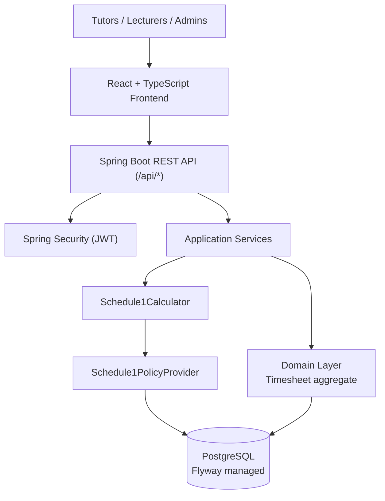
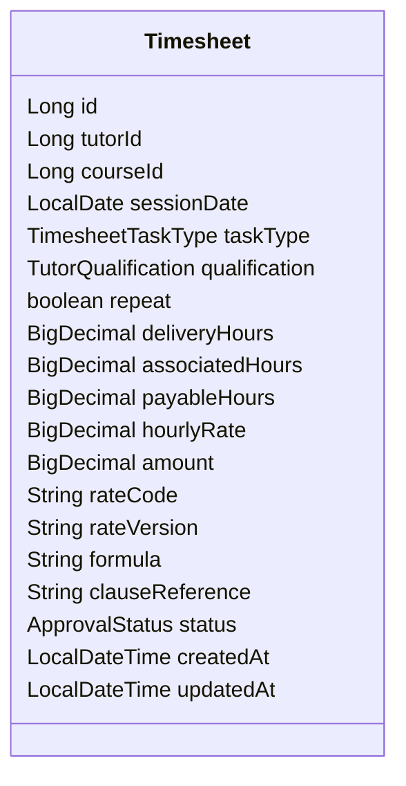

# CATAMS Architecture Overview

## 1. Purpose
This document describes the current Enterprise Agreement (EA) compliant architecture of the Casual Academic Time Allocation Management System (CATAMS). It replaces legacy "baseline" and "microservices-ready" narratives with a concise view of how the monolith enforces Schedule 1 as the backend single source of truth (SSOT).

## 2. System Context

- **Frontend** submits only minimal instructional data (course, task type, qualification, repeat flag, delivery hours, notes) and requests live quotes for display.
- **Backend** recalculates every financial field through `Schedule1Calculator` before persisting to the database.
- **Database** stores EA policy catalogues (`policy_version`, `rate_code`, `rate_amount`) alongside the enriched `timesheets` table and approval history.

## 3. Core Components

| Layer | Responsibilities | Key Modules |
|-------|------------------|-------------|
| Presentation | REST controllers, DTO validation, request authentication | `TimesheetController`, `AuthController` |
| Application | Orchestrates use cases, handles transactions, delegates to calculator | `TimesheetApplicationService`, `ApprovalService` |
| Domain | Aggregates, value objects, domain services, invariants | `Timesheet`, `Schedule1CalculationResult`, `ApprovalStateMachine` |
| Infrastructure | Persistence, policy repositories, Flyway migrations, external integrations | `TimesheetRepository`, `RateCodeRepository`, `RateAmountRepository` |

### Schedule 1 Services
- **Schedule1PolicyProvider** resolves the correct rate (clause reference, default hours, hourly amount) for a task type, qualification, repeat status, and session date. It queries the policy tables and applies effective-date filtering.
- **Schedule1Calculator** converts a minimal quote payload into associated hours, payable hours, hourly rate, and payable amount, applying tutorial repeat rules, lecture multipliers, and marking exclusions.

## 4. Domain Model Snapshot

Financial fields (`associatedHours`, `payableHours`, `hourlyRate`, `amount`) are never accepted from clients; they are populated exclusively by the calculator during quote and persist operations.

## 5. Data Architecture

| Table | Description | Highlights |
|-------|-------------|------------|
| `policy_version` | Tracks EA revisions and effective windows | Non-overlapping `effective_from`/`effective_to` ranges enforced via GiST index |
| `rate_code` | Schedule 1 task catalogue (TU1- TU4, P01- P04, M03- M05, etc.) | Stores default delivery and associated hours, repeat eligibility, clause references |
| `rate_amount` | Monetary rates keyed by policy version, code, qualification, and date | Supports multi-year EA increments; includes caps per rule |
| `timesheets` | Authoritative record for entries | Persists calculator outputs, rate metadata, and formula for transparency |
| `approvals` | Lecturer/admin sign-off states | References timesheet IDs and transition metadata |

Flyway migrations V11- V14 introduced the policy tables, seeded official Schedule 1 rates, and added the EA-compliant columns to `timesheets`.

## 6. Request Lifecycle

1. **Quote** ? `POST /api/timesheets/quote` validates minimal input and invokes `Schedule1Calculator`.
2. **Display** ? The calculator returns read-only totals plus clause references; the frontend renders them without local arithmetic.
3. **Persist** ? `POST /api/timesheets` and `PUT /api/timesheets/{id}` discard incoming financial data, rerun the calculator, and save the authoritative state.
4. **Audit** ? Approval workflows and calculator metadata (rate code, policy version, formula) are retained for reporting and demos.

## 7. Deployment & Operations

- **Build**: Gradle orchestrates backend builds/tests; Node handles frontend bundling.
- **Migrations**: Flyway runs on startup; ops teams confirm seed rows before releases.
- **Testing**: JUnit (unit + integration with Testcontainers) and Playwright suites verify calculator correctness end-to-end.
- **Observability**: Structured JSON logs include rate identifiers to trace discrepancies; Spring Actuator health checks expose migration status.

## 8. Future Considerations

- Extend policy seeding to cover all EA Schedule 1 task types and remove any fallback catalogues.
- Expose calculator metrics (quote throughput, validation failures) for operational dashboards.
- Evaluate modular boundaries (policy, quoting, approvals) for future service decomposition once EA compliance stabilises.

## 9. Related Documents

- `docs/backend/data-model.md`
- `docs/backend/api-timesheets.md`
- `docs/policy/backend-ssot.md` *(planned)*
- `docs/frontend/architecture.md` *(planned)*
