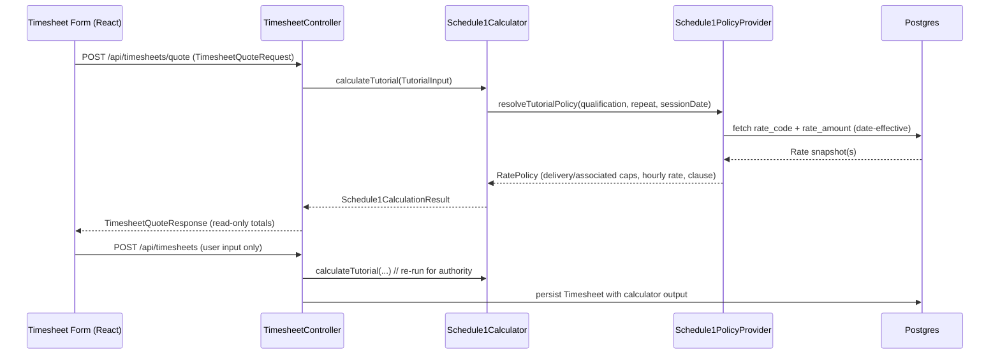

# Schedule 1 Calculator & Policy Provider Design

## 1. Overview
The Schedule 1 rules engine centralises Enterprise Agreement (EA) pay calculations for CATAMS. It comprises two Spring services:

- **Schedule1PolicyProvider** – Loads EA policy data from `policy_version`, `rate_code`, and `rate_amount`, resolves date-effective rate policies, and exposes convenience helpers (repeat windows, clause references).
- **Schedule1Calculator** – Applies policy data to an incoming timesheet quote, returning associated hours, payable hours, hourly rates, and final amounts. The backend uses the calculator for the `/timesheets/quote`, `/timesheets` (create), and `/timesheets/{id}` (update) endpoints.

Together they enforce the backend Single Source of Truth for all financial outputs.

## 2. Data Model

| Table | Purpose | Key Columns / Notes |
|-------|---------|---------------------|
| `policy_version` | Tracks EA versions and effective ranges. | `ea_reference`, `major_version`, `minor_version`, `effective_from`, `effective_to`, `source_document_url`. Non-overlapping date ranges enforced via GiST index. |
| `rate_code` | Catalogue of Schedule 1 codes (tutorials, lectures, marking). | `code`, `task_type`, `description`, `default_delivery_hours`, `default_associated_hours`, `requires_phd`, `is_repeatable`, `ea_clause_reference`. |
| `rate_amount` | Stores per-code amounts and caps per EA year. | FK to `rate_code` and `policy_version`, plus `qualification`, `hourly_amount_aud`, `max_delivery_hours`, `max_associated_hours`, `max_payable_hours`, `effective_from`, `effective_to`. |
| `timesheets` | Persists calculator output for each entry. | `task_type`, `qualification`, `is_repeat`, `delivery_hours`, `associated_hours`, `payable_hours`, `amount`, `rate_code_id`, `policy_version_id`, `calculation_breakdown` (JSON). |

`RateAmountRepository` provides date-effective queries; `RateCodeRepository` supports lookups by task type. The calculator never trusts client-supplied amounts.

## 3. Interaction Flow



## 4. Schedule1PolicyProvider

### Responsibilities
- Resolve tutorial rate policies by qualification, repeat flag, and session date.
- Cache tutorial policies in-memory for fast lookup while honouring effective dates.
- Provide fallback catalogue mirroring the current EA when DB seeding is unavailable (warning logged).
- Expose the repeat eligibility window (`7` days) and clause references for UI transparency.

### Key Methods
```java
RatePolicy resolveTutorialPolicy(TutorQualification qualification,
                                 boolean repeat,
                                 LocalDate sessionDate);

int getRepeatEligibilityWindowDays(); // always 7
```

### RatePolicy Payload
- `taskType`, `qualification`, `repeat`
- `rateCode`, `deliveryHours`, `associatedHoursCap`, `payableHoursCap`
- `sessionAmountAud`, `hourlyRateAud`
- `clauseReference`, `resolvedForDate`
- `determineAssociatedHours(BigDecimal deliveryHours)` helper to clamp EA entitlements

## 5. Schedule1Calculator

### Responsibilities
- Normalise delivery hours (scale 1 decimal, clamp at zero).
- Compute associated hours using the policy cap helper.
- Enforce payable hour caps and round amounts to 2 decimals (HALF_UP).
- Produce a formula string for UI display (`"1h delivery + 2h associated (EA Schedule 1 Item 1)"`).
- Return `Schedule1CalculationResult` used by controllers and persisted within `Timesheet`.

### TutorialInput
```java
new Schedule1Calculator.TutorialInput(
        sessionDate,
        deliveryHours,
        repeat,
        qualification // enum or string code
);
```

### CalculationResult
- `sessionDate`, `rateCode`, `qualification`, `repeat`
- `deliveryHours`, `associatedHours`, `payableHours`
- `hourlyRate`, `amount`, `formula`, `clauseReference`

## 6. Backend Integration

| Endpoint | Behaviour |
|----------|-----------|
| `POST /api/timesheets/quote` | Validates minimal input, invokes calculator, returns quote payload (financial fields read-only). |
| `POST /api/timesheets` | Ignores client financial data, recalculates using calculator, persists authoritative values. |
| `PUT /api/timesheets/{id}` | Loads existing record, recalculates with updated inputs, stores new calculation while preserving history. |

`TimesheetApplicationService` uses `Schedule1Calculator` before mapping entities. `TimesheetMapper` exposes helper methods to apply calculator results to entities and DTOs without trusting request payloads.

## 7. Caching & Performance
- Tutorial policies are grouped by `(taskType, qualification, repeat)` and sorted by `effectiveFrom`.
- Provider refresh occurs on service construction; future enhancement may add scheduled reloads when EA data changes.
- Calculator itself stateless; repeated calls are cheap after policy caching.

## 8. Testing Strategy
- **Unit**: `Schedule1CalculatorTest` (tutorial standard vs repeat), `Schedule1PolicyProviderTest` (database + fallback coverage).
- **Integration**: `TimesheetControllerIntegrationTest` – quote, create, update endpoints recalculate amounts.
- **E2E**: Playwright `quote-calculation-flow.spec.ts` asserts quote endpoint is called and payloads exclude client-calculated amounts.
- **Data Validation**: Flyway seed migration (`V13__Seed_schedule1_rates.sql`) is verified in integration tests to ensure expected rate codes and amounts are accessible.

## 9. Future Enhancements
- Extend policy provider to support lectures, marking, ORAA once rate data is seeded (removing in-memory fallbacks).
- Introduce `active_rate_snapshot` materialised view for reporting and analytics workloads.
- Add REST façade for calculator/policy modules when extracting to dedicated microservice.
- Implement cache invalidation hooks triggered by new policy migrations.
