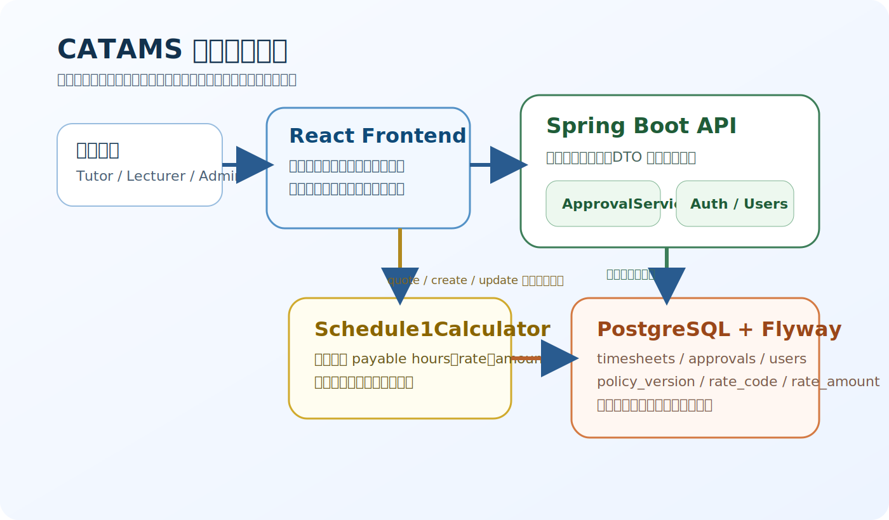
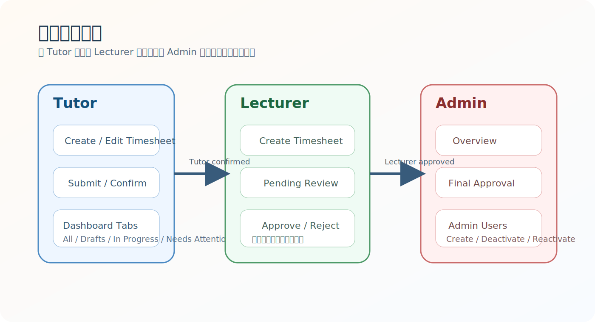

# CATAMS 毕设归档与交付手册

> 版本：2026-03-23  
> 定位：中文学习参考版 / 离线分发版  
> 适用对象：需要快速理解、复现或展示该项目的读者

> 本手册对应仓库当前冻结快照，目标是让读者离线也能看懂项目背景、系统结构、本地运行方式、测试证据和使用边界。它不是“直接拿去当原创作业提交”的说明书。

---

## 1. 项目背景与目标

CATAMS 全称是 Casual Academic Time Allocation Management System，用于管理 Casual Academic 的工时申报、审批与支付计算。项目最核心的目标不是做一个“普通 CRUD 系统”，而是把教学工作量、政策规则和审批流程统一到一条可以验证的业务链路里。

本项目的设计重点：

- 把财务与工时计算统一收口到后端。
- 让 Tutor、Lecturer、Admin 看到各自真正关心的页面和动作。
- 用端到端测试和可复现实验基线来验证“页面能用、链路能跑”。
- 把 README、测试报告、截图和使用手册整理成适合归档的材料。

<!-- pagebreak -->

## 2. 项目摘要

从交付视角看，这个仓库包含四类内容：

- 运行时代码：Spring Boot 后端、React 前端、数据库迁移和策略数据。
- 角色流程：Tutor 创建与确认、Lecturer 审批、Admin 最终审批与用户管理。
- 验证证据：前端单测、后端测试、Playwright `real` 全量验证以及截图。
- 文档材料：中英文 README、架构文档、运行指南、归档说明和本手册。

当前推荐的阅读顺序：

1. `README.zh-CN.md`
2. `docs/archive/START-HERE.zh-CN.md`
3. `docs/archive/RUN-LOCALLY.zh-CN.md`
4. `docs/architecture/overview.md`
5. `docs/testing/README.md`

## 3. 系统架构与核心模块



架构分工可以概括成下面三层：

- 前端：负责身份登录、角色页面、表单交互和结果展示。
- 后端：负责身份校验、审批状态迁移、业务编排和统一计算。
- 数据与政策：负责保存 timesheet、approval 记录以及 EA 规则相关表。

关键模块：

- `Schedule1Calculator`：根据任务类型、资格、重复标记、日期等信息返回应付工时和金额。
- `PolicyProvider`：解析政策版本、rate code、条款引用和金额规则。
- `ApprovalService`：处理 Tutor、Lecturer、Admin 不同层级的动作与状态迁移。
- Role dashboards：让不同角色只看到与自身职责相关的操作入口。

<!-- pagebreak -->

## 4. 角色流程与关键页面



关键页面覆盖：

- 登录页：身份入口、受保护路由重定向。
- Tutor 仪表盘：查看不同状态的 timesheet，执行确认动作。
- Lecturer 仪表盘：创建 timesheet，查看待审批项并执行 lecturer 级审批。
- Admin 仪表盘：查看总览和待最终审批项。
- Admin Users：创建用户、停用和重新启用用户。

页面截图证据：


<!-- pagebreak -->

## 5. 本地运行步骤

当前文档和测试统一按以下本地基线描述：

- Frontend: `http://localhost:5174`
- Backend: `http://127.0.0.1:8084`
- Docker PostgreSQL: `localhost:55433`
- Seed accounts: `admin@example.com`, `lecturer@example.com`, `tutor@example.com`

推荐步骤（最快路径）：

```bash
# 安装前端依赖
npm --prefix frontend install

# 启动数据库和 API
docker compose up -d db api

# 启动前端
npm --prefix frontend run dev:e2e

# 重置和写入测试数据
node scripts/e2e-reset-seed.js --url http://127.0.0.1:8084 --token local-e2e-reset
```

如果需要本地源码调试后端，则只需单独启动数据库容器，再运行本地 `bootRun`：

```bash
docker compose up -d db
./gradlew --no-configuration-cache bootRun --args="--spring.profiles.active=e2e-local --server.port=8084"
```

最小验证路径：

1. 打开 `http://localhost:5174/login`
2. 确认未登录访问 `/dashboard` 会重定向到 `/login`
3. 使用种子账号登录任意角色
4. 打开 `/dashboard`
5. 再执行一次 E2E 命令验证测试基线

## 6. 测试与验证证据

当前可以引用的最新验证结论如下：

- 日期：2026-03-19
- Full-suite command: `node scripts/e2e-runner.js --project=real`
- Result: `121 passed`, `0 failed`, `0 flaky`, `0 skipped`
- Artifact files: `frontend/playwright-report/results.json`, `frontend/playwright-report/junit.xml`

人工复核范围：

- `/login`
- `/dashboard`（Tutor、Lecturer、Admin）
- `/admin/users`

说明：套件中的部分 `400 / 401 / 409` 响应属于负向合同测试和规则校验场景，不等于验证失败。

<!-- pagebreak -->

## 7. 项目结构与关键目录

```text
.
├── src/main/java/com/usyd/catams/        # Spring Boot 后端源码
├── src/main/resources/                   # 配置与 Flyway migration
├── frontend/src/                         # React 前端源码
├── frontend/e2e/                         # Playwright 配置与测试辅助
├── docs/architecture/                    # 架构文档
├── docs/product/                         # 用户指南与产品资料
├── docs/testing/                         # 测试与报告说明
├── docs/archive/                         # 中文归档文档、PDF 与历史过程记录
├── docs/assets/playwright/               # 页面截图证据
├── scripts/                              # 仓库级脚本入口
└── .github/workflows/                    # GitHub Actions CI
```

如果你只关心“怎么跑”，优先看：

- `README.zh-CN.md`
- `docs/archive/RUN-LOCALLY.zh-CN.md`
- `docs/testing/README.md`

## 8. 二次开发入口

如果你是出于学习和研究目的继续扩展这个项目，可以优先关注：

- 业务规则：`Schedule1Calculator` 及其相关测试
- 审批链路：timesheet 状态迁移与审批服务
- 角色页面：Tutor、Lecturer、Admin 仪表盘组件
- 验证链：Playwright `real` 套件、本地 pre-push、GitHub Actions

如果你是学生并且想把它变成自己的课题，请先读 `docs/archive/ADAPTATION-GUIDE.zh-CN.md`。当前许可未明确放开前，不建议直接复制代码和素材再分发。

## 9. 已知限制

- 当前仓库更适合作为“完成快照”和“参考案例”，不是持续演进中的产品。
- 现有许可是专有许可，不是 MIT / Apache 这类开放源码许可。
- 文档里记录的有效基线是本地 `5174/8084`，其他部署方式需要自行验证。
- 历史过程报告很多，第一次阅读时容易混淆；请优先看归档入口文档。

## 10. 许可与学术诚信说明

当前 [LICENSE](../../LICENSE) 写明为 University of Sydney 专有许可。公开仓库并不自动等于可自由复制、修改和再分发。

学术诚信建议：

- 可以学习这个项目如何组织系统设计、测试和文档。
- 不应把它直接包装成自己的完整原创毕业设计提交。
- 如果你的项目参考了它的结构或思路，应在自己的文档中保留必要的来源说明。

本手册源文件位于 `docs/archive/archive-handbook.zh-CN.md`，可通过下面命令重新生成 PDF：

```bash
npm run docs:archive:pdf
```
