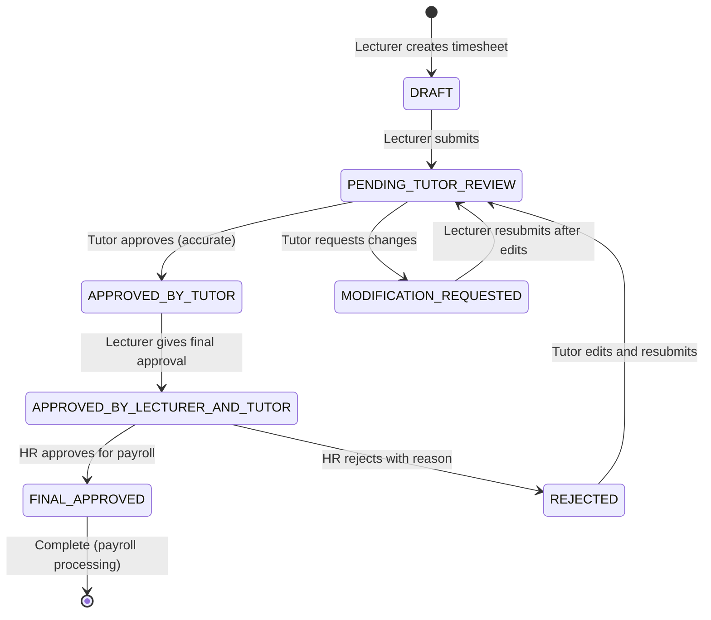

# Timesheet Approval Workflow - Single Source of Truth (SSOT)

This document serves as the definitive reference for the Casual Academic Time Allocation Management System (CATAMS) timesheet approval workflow. It supersedes all previous assumptions and serves as the sole authority for code and test suite implementation.

**Last Updated:** $(date)  
**Version:** 2.0 - Final Workflow Definition  
**Based on:** Final business requirements incorporating "Active Bureaucracy" and "Reduced Cognitive Load" principles

## 1. Roles & Responsibilities

### 1.1 System Roles

| Role | Primary Responsibilities | System Permissions |
|------|-------------------------|-------------------|
| **LECTURER** | • Create timesheets for tutors<br>• Enter hours, rates, and descriptions<br>• Process modification requests from tutors<br>• Provide final approval after tutor confirmation<br>• Submit approved timesheets to HR | • Create timesheets for their courses<br>• View all timesheets for their courses<br>• Submit for tutor review<br>• Process modification requests<br>• Give final approval after tutor acceptance |
| **TUTOR** | • Review and verify timesheet accuracy<br>• Approve correct timesheets<br>• Request modifications for incorrect entries<br>• Edit and resubmit rejected timesheets | • View only their own timesheets<br>• Approve accurate timesheets<br>• Request modifications<br>• Edit and resubmit rejected timesheets |
| **HR** | • Final review of lecturer-and-tutor-approved timesheets<br>• Process for payroll<br>• Handle rejection scenarios | • View all timesheets system-wide<br>• Give final approval for payroll<br>• Reject with reason<br>• Generate reports |
| **ADMIN** | • System administration<br>• User management<br>• Override capabilities | • Full system access<br>• User creation and management<br>• Override any restriction |

### 1.2 Workflow Sequence & Actors

The workflow follows a clear sequential approval process:

1. **Creator**: LECTURER (creates on behalf of tutors)
2. **First-Level Reviewer**: TUTOR (verifies accuracy)
3. **Second-Level Approver**: LECTURER (final academic approval)
4. **Final Processor**: HR (administrative and payroll approval)

## 2. Final Workflow Definition

### 2.1 Complete Workflow Process

#### Step 1: Lecturer Creation and Submission
- **LECTURER** creates new timesheet drafts (DRAFT status)
- **LECTURER** enters work hours, descriptions, hourly rates and compensation standards for each tutor
- **LECTURER** submits draft → status changes to `PENDING_TUTOR_REVIEW`

#### Step 2: Tutor Review and Feedback
- System notifies **TUTOR** for review
- **TUTOR** can view their own timesheets
- **Two possible outcomes:**
  - **If timesheet is accurate**: **TUTOR** approves → status changes to `APPROVED_BY_TUTOR`
  - **If timesheet has errors**: **TUTOR** requests modification → status changes to `MODIFICATION_REQUESTED`

#### Step 3: Lecturer Processing Modification Requests
- System notifies **LECTURER** of modification request
- **LECTURER** reviews tutor feedback and makes corrections
- **LECTURER** resubmits for approval → status returns to `PENDING_TUTOR_REVIEW`
- Process repeats until tutor accepts

#### Step 4: Lecturer Final Approval and HR Submission
- After tutor approval (status: `APPROVED_BY_TUTOR`), system notifies **LECTURER**
- **LECTURER** provides final approval → status changes to `APPROVED_BY_LECTURER_AND_TUTOR`
- **LECTURER** may also reject at this stage with reason → status changes to `REJECTED`
- System automatically notifies **HR team** when entering `APPROVED_BY_LECTURER_AND_TUTOR`

#### Step 5: HR Final Review and Processing
- **HR team** receives notification and conducts final review
- **Two possible outcomes:**
  - **If approved**: HR approves → status changes to `FINAL_APPROVED` → enters payment processing
  - **If rejected**: HR rejects with reason → status changes to `REJECTED`

#### Step 6: Handling Rejected Timesheets
- System notifies both **TUTOR** and **LECTURER** of rejection
- **TUTOR** (as timesheet owner) edits timesheet based on rejection reason
- **TUTOR** resubmits for approval → status returns to `PENDING_TUTOR_REVIEW`
- Process enters new approval cycle

### 2.2 State Definitions

| Status | Description | Allowed Actions | Who Can Act |
|--------|-------------|-----------------|-------------|
| `DRAFT` | Initial state when lecturer creates timesheet | • Submit for approval<br>• Edit<br>• Delete | LECTURER (creator) |
| `PENDING_TUTOR_REVIEW` | Submitted by lecturer, awaiting tutor verification | • Approve (confirm accuracy)<br>• Request modification | TUTOR (timesheet owner) |
| `APPROVED_BY_TUTOR` | Tutor has confirmed accuracy | • Final approval<br>• Edit if needed | LECTURER (creator) |
| `MODIFICATION_REQUESTED` | Tutor has requested changes | • Edit and resubmit<br>• Cancel modification | LECTURER (creator) |
| `APPROVED_BY_LECTURER_AND_TUTOR` | Both lecturer and tutor have approved | • Final HR approval<br>• HR rejection | HR |
| `FINAL_APPROVED` | HR has given final approval for payroll | None (terminal state) | None |
| `REJECTED` | Rejected by HR with reason | • Edit and resubmit | TUTOR (timesheet owner) |

### 2.3 State Transition Diagram



## 3. Detailed Business Rules

### 3.1 Action-Based Permissions

| From Status | Action | To Status | Performed By | Business Rule |
|-------------|--------|-----------|--------------|---------------|
| `DRAFT` | SUBMIT_FOR_APPROVAL | `PENDING_TUTOR_REVIEW` | LECTURER | Only the lecturer who created the timesheet can submit |
| `PENDING_TUTOR_REVIEW` | APPROVE | `APPROVED_BY_TUTOR` | TUTOR | Only the tutor who owns the timesheet can approve |
| `PENDING_TUTOR_REVIEW` | REQUEST_MODIFICATION | `MODIFICATION_REQUESTED` | TUTOR | Tutor can request changes with mandatory comment |
| `MODIFICATION_REQUESTED` | SUBMIT_FOR_APPROVAL | `PENDING_TUTOR_REVIEW` | LECTURER | Lecturer resubmits after making changes |
| `APPROVED_BY_TUTOR` | FINAL_APPROVAL | `APPROVED_BY_LECTURER_AND_TUTOR` | LECTURER | Lecturer gives final academic approval |
| `APPROVED_BY_LECTURER_AND_TUTOR` | HR_APPROVE | `FINAL_APPROVED` | HR | HR gives final approval for payroll |
| `APPROVED_BY_LECTURER_AND_TUTOR` | HR_REJECT | `REJECTED` | HR | HR can reject with mandatory reason |
| `REJECTED` | SUBMIT_FOR_APPROVAL | `PENDING_TUTOR_REVIEW` | TUTOR | Tutor (owner) edits and resubmits |

### 3.2 Additional Business Rules

1. **Creation Rules:**
   - Only LECTURER can create timesheets for their courses
   - Timesheets must be created for valid tutors enrolled in the course
   - All financial information must be provided at creation

2. **Review Rules:**
   - TUTOR can only act on their own timesheets
   - Modification requests require explanatory comments
   - TUTOR must explicitly approve or request modifications

3. **Approval Rules:**
   - LECTURER final approval can only occur after TUTOR approval
   - HR can only act on timesheets approved by both LECTURER and TUTOR
   - All rejections require explanatory reasons

4. **Resubmission Rules:**
   - TUTOR owns rejected timesheets and can edit/resubmit
   - Resubmission starts a complete new approval cycle
   - Previous approval history is maintained for audit

5. **Terminal States:**
   - `FINAL_APPROVED` timesheets enter payroll processing
   - No further modifications allowed on finalized timesheets

## 4. Integration Requirements

### 4.1 System Notifications

- **TUTOR notifications**: When timesheet requires review, when approved/rejected
- **LECTURER notifications**: When modification requested, when tutor approves
- **HR notifications**: When timesheet ready for final processing

### 4.2 API Endpoint Requirements

**POST /api/approvals** supports the following actions:
- `SUBMIT_FOR_APPROVAL` (LECTURER on DRAFT, MODIFICATION_REQUESTED; TUTOR on REJECTED)
- `APPROVE` (TUTOR on PENDING_TUTOR_REVIEW)
- `REQUEST_MODIFICATION` (TUTOR on PENDING_TUTOR_REVIEW)
- `FINAL_APPROVAL` (LECTURER on APPROVED_BY_TUTOR)
- `HR_APPROVE` (HR on APPROVED_BY_LECTURER_AND_TUTOR)
- `HR_REJECT` (HR on APPROVED_BY_LECTURER_AND_TUTOR)

### 4.3 Request/Response Format

```json
{
  "timesheetId": 123,
  "action": "APPROVE|REQUEST_MODIFICATION|SUBMIT_FOR_APPROVAL|FINAL_APPROVAL|HR_APPROVE|HR_REJECT",
  "comment": "Required for modifications and rejections"
}
```

## 5. Business Logic Validation

### 5.1 Pre-Action Validations

Before any action:
1. Verify user has required role for the action
2. Verify timesheet is in correct status for the action
3. Verify user has permission for the specific timesheet
4. Validate required comments are provided

### 5.2 Post-Action Processing

After successful action:
1. Update timesheet status
2. Record approval history
3. Send appropriate notifications
4. Trigger automatic transitions where applicable

## 6. Audit and Compliance

### 6.1 Approval History

All actions must be recorded with:
- User who performed action
- Timestamp
- Previous status and new status
- Comments/reasons provided
- IP address and session information

### 6.2 Business Rule Compliance

The system must enforce:
- Role-based access control
- Sequential approval requirements
- Mandatory comment requirements
- Status transition validity
- User ownership verification

---

**Note:** This document represents the final, authoritative definition of the CATAMS timesheet approval workflow. All code implementation, tests, and documentation must strictly adhere to these specifications. Any deviations require formal approval and documentation updates.